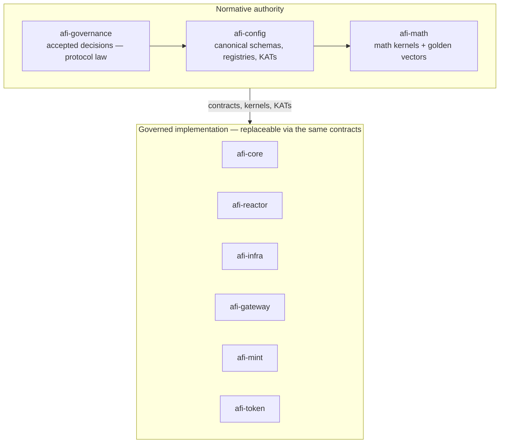
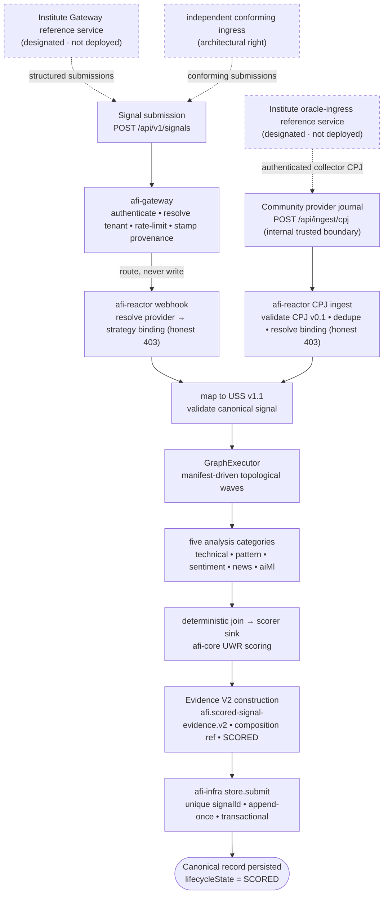

# AFI Protocol — Full Architecture

AFI is an open protocol for turning trading **signals** into **scored, auditable, replayable evidence**. A submission is authenticated at a boundary, validated against a canonical schema, scored by an analyst-configured pipeline of deterministic components, and written once to a canonical evidence store keyed by a stable signal identifier. Authority over what is canonical lives in a small set of governance, contract, and mathematics repositories; everything that executes is a replaceable implementation that must conform to those contracts.

This document describes AFI **as it exists now** — its authority boundaries, its implemented runtime, its authoring and research surfaces, and its known gaps. It is documentation: it explains authority and does not hold it. Where this document and a governed artifact disagree, the governed artifact wins.

---

## Status vocabulary

Every capability below carries one of these tags. They are not synonyms.

| Tag | Meaning |
|---|---|
| **Governed** | An accepted decision in `afi-governance` establishes it as a protocol requirement. |
| **Implemented** | Code exists on a current default branch and tests support the claim. |
| **Deployed** | A running environment or on-chain deployment is proven. |
| **Research** | An experimental or benchmark surface, not runtime law. |
| **Reference** | A governed or technical reference surface not used in the production path. |
| **Reserved** | Named future scope with no current implementation. |
| **Not implemented** | Absent from the current live architecture. |

A governed requirement is not automatically implemented; implemented code is not automatically deployed; documentation is never authority.

---

## The organization

The AFI organization is exactly **18 repositories** — 17 public and 1 private. They fall into five roles.

| Repository | Current role | Authority status | Runtime status |
|---|---|---|---|
| **afi-governance** | Accepted protocol decisions (`decisions/`) | Normative — protocol law | Not runtime |
| **afi-config** | Canonical schemas, registries, conventions, KATs | Normative — canonical contracts | Not runtime |
| **afi-math** | Canonical deterministic math kernels + golden vectors | Normative — mathematical law | Consumed as a pinned library |
| **afi-core** | Scoring library: UWR engine, profile loader, decay surfaces | Governed implementation | Library (in-process) |
| **afi-reactor** | Scoring runtime: validation → configured graph execution → scoring → evidence construction → submission | Governed implementation | Runtime executor (implemented) |
| **afi-infra** | Canonical evidence store on MongoDB (sole writer) | Governed implementation | Persistence service (implemented) |
| **afi-gateway** | Submission boundary: authenticates, authorizes, routes | Governed implementation | Ingress service (implemented) |
| **afi-mint** | Mint/reward orchestration home (off-chain implemented; on-chain not wired) | Governed implementation | Off-chain orchestration (partial) |
| **afi-token** | On-chain token: 86B hard-cap xERC20 | Governed implementation | Deployed on Base Sepolia testnet |
| **afi-factory** | Pipeline **authoring** system + agent capability layer | Support — replaceable authoring | Authoring tool (not the executor) |
| **afi-xerc20** | Vendored xERC20 standard (dependency of afi-token) | Reference | Compiled dependency |
| **afi-docs** | Documentation hub | Reference | Not runtime |
| **afi-tiny-brains** *(private)* | Optional fail-soft ML enrichment sidecar (does not affect UWR scoring) | Support | Optional, fenced enrichment |
| **afi-econ** | Economic research kit (non-canonical) | Research | Not runtime |
| **afi-benchkit** | PoI / PoInsight benchmark + reproducibility harness | Research | Standalone benchmark tool |
| **afi-artifacts** | Frozen, DOI-minted paper reproducibility bundle | Reference | Frozen snapshot |
| **afi-protocol** | Public flagship repository map ("start here") | Reference | Not runtime |
| **.github** | Organization profile and defaults | Reference | Not runtime |

Grouped by role: **3** normative + **6** governed implementation + **4** support/reference (`afi-factory`, `afi-xerc20`, `afi-docs`, `afi-tiny-brains`) + **3** research/records (`afi-econ`, `afi-benchkit`, `afi-artifacts`) + **2** organization surfaces (`afi-protocol`, `.github`) = **18**.

---

## Authority model

Authority is exactly what accepted decisions expressly delegate. Self-labeling confers nothing.



**Normative authority.**
- **afi-governance** holds the accepted decisions — object identity, lifecycle, persistence, scoring pins, math authority, districts, and economic law. Fifteen decision records sit on the current default branch.
- **afi-config** holds the canonical schemas, registries, conventions, and known-answer tests (KATs) that a decision delegates to it.
- **afi-math** holds canonical deterministic kernels (the 86-billion emissions schedule, decay/Greeks surfaces) with golden vectors.

The precedence order is governance → config → math → implementation → tests → public maps → documentation. A conforming implementation honors the accepted decisions, validates against the afi-config contracts and KATs, and matches the afi-math golden vectors; anything else may be replaced.

**Governed implementation** is carried by six repositories — `afi-core`, `afi-reactor`, `afi-infra`, `afi-gateway`, `afi-mint`, `afi-token` — each replaceable by any implementation honoring the same contracts and handoffs.

**Support, research, and reference** repositories (`afi-factory`, `afi-xerc20`, `afi-docs`, `afi-tiny-brains`, `afi-econ`, `afi-benchkit`, `afi-artifacts`, `afi-protocol`, `.github`) never hold normative authority.

### Canonical objects and identity **(Governed)**

- **`signalId`** is the canonical end-to-end join key. Every artifact about a signal — canonical form, score, evidence record — joins on it.
- **Canonical inbound form** is the Universal Signal Schema **USS v1.1** (`afi.usignal.v1.1`).
- **Strategy identity** is the triple `analystId + strategyId + strategyVersion`.
- **The five analysis categories** are exactly `technical`, `pattern`, `sentiment`, `news`, `aiMl` — a governed namespace (aliases such as `social` or `ai-ml` are disallowed).

These are fixed by the `object-identity-v0.1` and `factory-configurable-pipelines-v1` decisions.

---

## System planes

AFI is organized by responsibility, not by repository alone. The planes below describe what runs today and where each responsibility lives.

### 1. Governance and policy plane **(Governed)**

`afi-governance/decisions/` carries the accepted decisions. The load-bearing ones today:

- **object-identity-v0.1** — canonical Signal (USS v1.1), a thin Scored Signal projection, the strategy triple, `signalId` as the join key.
- **factory-configurable-pipelines-v1** — the analyst-configurable pipeline model: the five-category namespace, the composition and executor boundary, delegation of the V1 contract family to afi-config, and the scored-evidence v2 composition reference.
- **provider-byok-foundations-v0.1** — the provider-neutral adapter socket and the secure bring-your-own-key (BYOK) credential boundary: the five categories as open capability lanes, one resolved result per category, the three non-secret objects (Provider, CredentialRef, ProviderInstance), trusted registered adapters, the credential-never-in-artifact and least-privilege runtime-resolution invariants, canonical category-output validation before scoring, and an Evidence V2 freeze with provider-invocation provenance reserved to a later evidence decision (see [`specs/AFI_PROVIDER_BYOK_FOUNDATIONS.v0.1.md`](specs/AFI_PROVIDER_BYOK_FOUNDATIONS.v0.1.md)).
- **lifecycle-v0.1** — the settlement lifecycle up to the off-chain finality writer; it explicitly reserves on-chain settlement, epochs, rewards, claims, and mint to a future chain-governance track.
- **persistence-v0.1** and **persistence-impl-v0.1** — the canonical evidence store and its staged implementation.
- **uwr-profile-pin-v0.1** and **uwr-runtime-consumption-v0.1** — the pinned (testnet-provisional) UWR profile and the rules for consuming it at runtime.
- **math-authority-v0.1** and **mint-formula-bt-86b-alignment-v0.1** — math ownership and the v1 mint-formula interpretation (epoch budget `E_t = B(t) · AIM_t`, with `AIM_t = 1` for v1).
- **authority-districts-v0.1** and **district-2-m2-ratification-v0.1** — the two-District topology and the prospective ratification of District 2's runtime surface.
- **district-surface-consolidation-v0.1** — the clean-cut District surface record (DSC-GOV): one live `GraphExecutor` as the sole signal-evaluation executor, the District-1 implementation record pointing at the live pipeline, the District-2 provenance law homed in `afi-reactor/src/evidence/provenance/`, exactly one provider framework (`afi-reactor/src/providers/`), and the five-category terminology rule.
- **district-one-signal-evaluation-capability-v0.1** — the District One capability record (D1CAP-GOV): District 1 is the **active Signal Evaluation capability and authority domain** (implementation-independent — a conforming future implementation may replace the current one through accepted authority without retiring the district), with its durable responsibility boundary, its exclusions, the descriptive current-implementation mapping, the honest provider-runtime state, and the ruling that Mission A's clean cut was an implementation retirement only — the district endures.

The lifecycle state machine is governed as `INGESTED → VALIDATED → SCORED → CERTIFIED → QUALIFIED → CHALLENGE_OPEN → [CONTESTED →] FINALIZED → EPOCH_ELIGIBLE`. **The implemented lifecycle currently reaches `SCORED`.**

### 2. Contract and registry plane **(Governed)**

`afi-config` is the canonical home for the schemas and registries the runtime consumes:

- the **USS v1.1** signal schema (`schemas/usignal/`);
- the **scored-signal-evidence v2** schema (`afi.scored-signal-evidence.v2`) and its published valid/invalid vectors;
- the pipeline-composition, analysis-plugin, analyst-strategy, and provider-binding registries;
- the **provider / BYOK contract family** — the non-secret `afi.provider.v1`, `afi.credential-ref.v1` (an opaque pointer that never holds a secret), and `afi.provider-instance.v1` (tenant-scoped) schemas, the `registries/providers/` reference records, and the canonical per-category output contracts `afi.enrichment.{technical,pattern,sentiment,news,aiml}.v1` — all five categories have governed contracts (PBF-GOV foundations; the full contract family completed with the enrichment-contract mission);
- the **CPJ v0.1** community-provider-journal schema (`schemas/cpj/v0_1`) and the active oracle provider bindings that consume it;
- the **UWR profile registry** (`registries/uwr-profiles/`), whose pinned profile `uwr-weighted-lifts-v0.1` is testnet-provisional;
- the **provenance (District 2 M1)** schema family (`schemas/provenance/v1`);
- KAT vectors for scoring and time decay;
- a **draft, read-only** vault-address registry (descriptive metadata; not an instruction to move funds).

Analysts may configure and run conforming UWR profiles, decay surfaces, and strategy pipelines without bespoke permission; a profile becomes *protocol-recognized* only when registered and version-pinned in afi-config — a governed registry change.

### 3. Factory authoring plane **(Implemented)**

`afi-factory` is the pipeline **authoring** system. It **produces artifacts; it does not execute the live graph**, load plugin code, or run pipelines.

- An **operation registry** exposes exactly **14** agent-operable authoring operations: `factory.capabilities.list`, `factory.plugins.list`, `factory.templates.list`, `factory.template.create`, `factory.template.validate`, `factory.template.inspect`, `factory.template.instantiate`, `factory.pipeline.validate`, `factory.pipeline.inspect`, `factory.analystConfig.create`, `factory.analystConfig.validate`, `factory.plugin.scaffold`, `factory.artifact.hash`, `factory.artifact.package` (twelve read-only, two mutating).
- **Five surfaces project over the same handlers** through one dispatch path: the TypeScript **SDK**, the **`afi-factory` CLI**, a deterministic **capability catalog**, framework-neutral **tool definitions**, and an **MCP-compatible stdio adapter** (JSON-RPC 2.0, transport-only).
- It implements templates (which parameterize values, never topology), plugin/component and template discovery, analyst-strategy configuration, the governed composition model (plugin-subset selection, repeated same-category nodes, sequential/concurrent ordering via explicit dependencies, bounded declarative conditional branches, deterministic multi-parent joins), **canonical hashing** (`canonical-json-hashing.v1` with domain-tagged manifest/analyst-config/plugin-set hashes, KAT-pinned), and fail-closed artifact packaging.
- It consumes byte-pinned copies of the afi-config schema closure; nothing it emits is canonical until validated against those contracts. Its suite is 189 tests.

Factory is **not** the API Atlas, **not** the Gateway, **not** the Reactor runtime, **not** a District pipehead, and **not** the source of scoring law or finality. It is a library and CLI that produces artifacts; it is **not deployed** as a service.

### 4. Gateway ingress plane **(Implemented)**

`afi-gateway` is the external submission boundary and **routes; it never writes canonical evidence**.

- `POST /api/v1/signals` authenticates the API key, resolves the tenant, and rate-limits; the handler performs a presence-only field check and forwards the payload to the Reactor.
- It stamps provenance (`providerId = gateway:<tenantId>` from the authenticated key) and returns the Reactor's answer verbatim. It never validates payload semantics, scores, resolves UWR, constructs evidence, or writes a store.
- It **fails closed**: without a configured Reactor URL it refuses to start; an unreachable Reactor yields `503 persisted:false`, never a queued/accepted response.
- The routes-not-writes boundary is enforced by executable guardrail tests (no import of the persistence layer, no canonical-evidence tokens, only operational collections).
- **AFI Research Institute is designated to operate the official hosted Gateway reference instance (Reference).** This designation is **non-exclusive**: the MIT-licensed implementation stays usable by independent conforming operators, and any Institute instance policies (quotas, onboarding, tenant isolation) apply only to that hosted instance, not to protocol law. No Institute-hosted deployment is claimed (none exists). The Gateway's endpoint authority is reserved to `ATLAS-GOV`. See `research-institute-reference-services-v0.1` (INST-GOV) and [`specs/AFI_RESEARCH_INSTITUTE_REFERENCE_SERVICES.v0.1.md`](specs/AFI_RESEARCH_INSTITUTE_REFERENCE_SERVICES.v0.1.md).

### 5. Reactor execution plane **(Implemented)**

`afi-reactor` is the **one production graph executor**.

- **Boot is a fail-closed gate**: it loads the afi-config registries (analysis plugins, pipelines, analyst strategies, provider bindings), schema-validates every active entry, recomputes and verifies the manifest / analyst-config / plugin-set hashes, and refuses to start on any invalid entry. There is no lazy request-time discovery.
- **Two live ingress paths reach the executor.** Most submissions arrive routed from the Gateway (`POST /api/v1/signals` → the Reactor webhook). The Reactor also exposes **`POST /api/ingest/cpj`**, a direct community-provider-journal ingest (`afi.cpj.v0.1`, for Telegram/Discord oracle providers) that bypasses the Gateway under an optional shared secret, validates CPJ v0.1, and deduplicates by ingest hash (`409` on a duplicate). Both paths **resolve the provider → strategy binding** against the boot-validated provider-binding registry — an unbound provider is rejected with an honest `403`, never a silent default composition — then map to USS v1.1 and run the identical scoring path.
- **The direct CPJ route is an internal trusted service boundary, not a public API (Reference/Reserved).** Its authentication is optional (a single shared secret) and provider identity is self-asserted, so any future public or partner CPJ access is designated to be mediated by a separate authenticated **Institute oracle-ingress reference service** — designated, **not implemented or deployed** — or another conforming external trust boundary; the route is neither renamed, moved, nor exposed. Provider binding, CPJ validation, and provenance stay mandatory regardless of exposure (ingest dedupe is opt-in, `AFI_INGEST_DEDUPE=1`) (INST-GOV; see [`specs/AFI_RESEARCH_INSTITUTE_REFERENCE_SERVICES.v0.1.md`](specs/AFI_RESEARCH_INSTITUTE_REFERENCE_SERVICES.v0.1.md)).
- The **graph is manifest-driven**, not a hardcoded DAG. The executor runs topological waves (Kahn's algorithm) with bounded concurrency, deterministic ready-sets, per-node timeout and retry, conditional edges, and joins keyed by node id. Graph validation enforces unique ids, acyclicity, reachability, exactly one non-bypassable scorer sink, and declared joins.
- The **five analysis categories** are ordinary registered plugins bound at build time, alongside a join plugin and the scorer. Any registered strategy (for example the "Froggy trend-pullback" scorer) is an ordinary registry entry, not a special path. The `aiMl` category is fed by the optional, fail-soft `afi-tiny-brains` sidecar (the Reactor's client returns nothing when the sidecar URL is unset); its output is read-only context and **does not affect UWR scoring**.
- A **bounded provider-adapter socket** sits inside the Reactor, below the category node (not a second executor). A provider-backed node carries a non-secret `providerInstanceRef`; the runtime resolves the tenant-scoped provider instance, resolves **only** the authorized credential through an injected least-privilege `SecretResolver` (the adapter receives a bounded credential bundle, never a resolver), invokes the trusted registered adapter, and validates the canonical `afi.enrichment.<category>.v1` output before it reaches the scorer — one resolved result per category, fail-closed at every boundary. Three reference adapters are proven: a keyless technical adapter, a credentialed news adapter (BYOK; the key rides in a request header, never a URL), and a keyless local pattern adapter. `sentiment` and `aiMl` have no provider adapter yet, and no registered manifest binds a `providerInstanceRef` today — the socket is a dormant forward surface for all five categories pending the separately-governed Five-Lane Provider Runtime Cutover (not started). Credentials are resolved only at runtime and appear in no artifact, log, hash, or evidence. Deployment-specific secret backends are pending a later staging wave (PBF-GOV; see [`specs/AFI_PROVIDER_BYOK_FOUNDATIONS.v0.1.md`](specs/AFI_PROVIDER_BYOK_FOUNDATIONS.v0.1.md)).
- The scorer node wraps afi-core's analyst, resolves the UWR configuration fail-closed, and emits scores and their resolved source verbatim.
- The Reactor **constructs Evidence V2** (`afi.scored-signal-evidence.v2`) with `lifecycleState = SCORED`, `finalized = false`, the registry-backed UWR-profile stamp, and a required all-or-nothing composition reference. Scores are read verbatim from afi-core and never recomputed.
- The **submitter rejects any non-`SCORED` record**, proves the wrapper, schema, sub-artifact schemas, and identifier continuity before submitting, and surfaces every failure as a typed non-2xx. The Reactor **never touches MongoDB directly**; it consumes afi-infra's store as a typed dependency, and persistence is a required step of the run.

### 6. Core and mathematical computation plane **(Implemented)**

```text
afi-factory  → authors the configured pipeline and composition (authoring)
afi-reactor  → orchestrates execution                          (runtime)
afi-core     → performs canonical deterministic computation    (domain library)
afi-math     → defines canonical mathematical law              (kernel)
```

- **afi-core** performs deterministic domain computation: the UWR aggregator (a weighted combination of structure, execution, risk, and insight axes, clamped to `[0,1]`), the fail-closed UWR profile loader (pinned to `uwr-weighted-lifts-v0.1`), and decay/Greeks templates. Its runtime UWR resolution is registry-backed in the Reactor.
- **afi-math** owns the numeric kernels; afi-core delegates the numeric decay computation to afi-math (consumed as a version-pinned dependency). Core is the domain wrapper; math is the law.

UWR (the Universal Weighting Rule) is the governed scoring mechanism. There is no separate per-signal "PoI" or "PoInsight" score in the runtime — those names belong to the research benchmark plane below.

### 7. Persistence and evidence plane **(Implemented)**

`afi-infra` owns the **sole canonical write path**.

- The store's `submit` is the only first-write path: it requires the record schema to be `afi.scored-signal-evidence.v2`, validates the governed schema and identifier continuity, then inserts into a collection with a **unique `signalId` index**. The default database is `afi_scored_signal_evidence` and the current collection is `scored_signal_evidence` (with a history collection), overridable by environment.
- Persistence is **append-once and idempotent**: an identical re-submission returns an idempotent-duplicate outcome; a differing submission for the same `signalId` is a conflict (`409`). A governed correction must go through `supersede()`, which archives the existing version and installs the new one inside a single transaction with version pinning and refuses to alter a finalized record.
- The Gateway routes and never writes here; the Reactor submits and never writes here; afi-infra is the writer.

Every record persisted today carries `lifecycleState = SCORED` and `finalized = false`. **The correction/versioning path (`supersede`) is implemented and tested but has no live caller** — nothing in the production flow supersedes a record yet.

### 8. Benchmarking and research plane **(Research)**

`afi-benchkit` is a standalone public benchmark and reproducibility harness with no private-repository dependency (a guardrail test enforces this).

- It provides two seeded suites: **PoI** (capability — coverage, vitality, determinism, latency) and **PoInsight** (usefulness — information coefficient, hit rate, Sharpe over 1h/4h horizons).
- It is deterministic and reproducible: fixed seeds, stamped artifacts (data hash + git SHA + timestamp), golden-hash-locked plots, an `afi-bench` CLI, and a hash-locked container **published by CI to `ghcr.io/afi-protocol/afi-benchkit`**.
- Its input is **static CSV fixtures**; it has **no live finalized-receipt feed and no production reputation or incentive integration**. Its composite reputation number (a weighted combination of PoI and PoInsight) is a local research computation over benchmark outputs, **not** the protocol's reputation or incentive law. Fixture-backed PoInsight is not PoInsight computed from finalized live receipts.
- Current test state: outside the pinned container, exactly **two** golden-image plot tests fail (`test_calibration_plot_golden`, `test_poi_capability_golden`) as SHA-256 mismatches from a matplotlib version difference; the remaining benchmark tests pass.

`afi-econ` is a non-canonical economic research kit (its models are self-declared placeholder/toy and are not protocol law unless promoted by governance). `afi-artifacts` is a frozen, DOI-minted paper reproducibility bundle (Zenodo). **AFI Research Institute** is AFI's sole research and legal identity — the copyright holder across the organization's licenses — reflecting an open-protocol, auditable, replayable research posture. Committed to open research, it is **designated to operate AFI's official open reference services (Reference)**: a hosted **Gateway reference service** (§4) and a designated **oracle-ingress / CPJ-normalization reference service** (§5), governed by `research-institute-reference-services-v0.1` (INST-GOV) and specified in [`specs/AFI_RESEARCH_INSTITUTE_REFERENCE_SERVICES.v0.1.md`](specs/AFI_RESEARCH_INSTITUTE_REFERENCE_SERVICES.v0.1.md). These are **non-exclusive** reference instances — operating them confers no protocol authority, no economic or validator privilege, and no exclusive network role; independent conforming operators remain free to run their own ingress and collectors. No Institute-hosted deployment is claimed (none exists).

### 9. On-chain and economic plane

The economic plane separates governed design from implementation from deployment.

- **afi-token (Implemented; Deployed on testnet).** `AFIToken` is an xERC20-based ERC-20 with an on-chain hard cap of **86,000,000,000 AFI**, enforced in its sole mint entrypoint (`mintEmissions`, gated by an emissions role granted to explicit addresses, never the deployer). The contract suite passes its Foundry tests. It is deployed on **Base Sepolia testnet** (chain 84532, symbol `tAFI`), with roles held by a Treasury Safe. **There is no Base mainnet deployment.**
- **afi-xerc20 (Reference).** The vendored defi-wonderland xERC20 standard (`XERC20`, `XERC20Lockbox`, `XERC20Factory`), consumed by afi-token as a pinned submodule. Its multichain deploy artifacts are inherited upstream boilerplate, not AFI deployments.
- **afi-mint (Implemented off-chain; on-chain not wired).** The off-chain orchestration is implemented in TypeScript — signal-state management, a challenge-window/appeal model, dispute resolution, a mint executor, a validator daemon, and a governance client — and the per-signal emission math is implemented and parity-tested against the afi-math 86B schedule. The link to a live on-chain mint is **not wired**: the mint executor targets an abstract contract interface with no concrete binding, the Solidity contracts are stubs, and reputation-weighted emission logic is a placeholder awaiting governed values.
- **Settlement (Governed doctrine; not implemented).** AFI Settlement v1 is accepted doctrine — epoch-settled rewards through a custodial rewards vault with Merkle claims, funded from an epoch settlement manifest, with provenance decoupled from payout and concrete address+chainId as source of truth. It **implements no contracts**: no rewards-vault, receipt, Merkle-claim, or settlement-manifest contract exists in any repository.
- **Participant claim roles (Governed doctrine; closure in draft).** Accepted Settlement v1 doctrine mandates at least three participant reward tracks — **Provider**, **Analyst/Scorer**, and **Validator** — as distinct allocation tracks. The tighter closure to *exactly* these three (barring public goods and governance as claimants) currently lives in draft specs and schema and is not yet accepted governance. Operational overhead and the DAO operations vault are treasury policy administered by governance, not a claim role.
- **Live mint is governance-blocked.** The v1 mint-settlement skeleton is governed (epoch budget → role pools → pro-rata verified credits), but the numeric baseline role weights are not yet governed and are a required decision before any live mint. Mainnet settlement is not yet governed.

### 10. Discovery and documentation plane **(Reference)**

- **`.github`** is the concise public organization front door (profile), routing readers to the map and the docs; it holds no authority.
- **afi-protocol** is the flagship "start here" repository map — deliberately thin, no authority of its own.
- **afi-docs** is the detailed documentation hub (this document). Documentation explains authority; it does not replace it.
- A future external read/API surface — the **API Atlas** — is **reserved for governance and not started**. No `atlas` decision exists, and Factory's capability catalog is authoring metadata, not the Atlas.

---

## The current end-to-end flow

The implemented path from submission through persistence, proven by CI against real infrastructure:



The dotted entry lanes are the **designated** ways to reach the two implemented ingress points: the Institute Gateway and oracle-ingress reference services (designated, not deployed) and independent conforming ingress (an architectural right — independent operators submit to the same implemented boundaries directly). The solid path from the ingress points through persistence is the implemented runtime (INST-GOV; §4–§5).

```text
ingest → USS v1.1 validation → scoring (governed UWR engine, pinned profile)
       → Evidence V2 construction (composition reference)
       → canonical store (unique signalId, append-once, transactional supersession)
       → lifecycleState = SCORED
```

### Not implemented in the current live path

The lifecycle is governed beyond `SCORED`, but the following are **not** implemented today. They are listed as gaps, not designed here.


- **Post-`SCORED` transitions** (`CERTIFIED`, `QUALIFIED`, challenge, `FINALIZED`) — the single finality writer is defined in law but intentionally unimplemented pending new authorization.
- **Market-outcome observation and challenge windows** in the live path.
- **Live PoInsight from finalized receipts** — the benchmark computes PoInsight from fixtures only.
- **Participant reputation updates** in the protocol.
- **Epoch accounting, incentive allocation, reward claims, and claim-root production** — no implemented owner.
- **Live token minting** tied to the settlement design — governance-blocked on ungoverned role weights.
- **Base mainnet settlement** — not yet governed.
- **The API Atlas** — reserved, not started.
- **The Institute Gateway hosted reference deployment** — designated for operation by AFI Research Institute (INST-GOV), not deployed.
- **The Institute oracle-ingress reference service** and any public or partner CPJ API — designated as the authenticated external trust boundary in front of the internal Reactor CPJ route, not implemented or deployed. Reference source collectors beyond an in-repo, undeployed Telegram client are not implemented.
- **A production or staging deployment** — the runtime is implemented and CI-proven against real infrastructure, but no deployment target (container, cloud, or Kubernetes manifest) exists in the runtime repositories, and there is no GCP staging or production deployment.

---

## Districts

Exactly **two** Districts are formally registered (`authority-districts-v0.1`, Part D, as amended by `district-surface-consolidation-v0.1` (DSC-GOV) and `district-one-signal-evaluation-capability-v0.1` (D1CAP-GOV)). Both are **active capability domains**, and both remain **non-production** (nothing is deployed). No other District is created or implied. Districts represent durable capability and authority boundaries: implementations may be replaced through accepted authority without retiring the district they implement.

- **District 1 — Signal Evaluation** — the **active** Signal Evaluation capability and authority domain (D1CAP-GOV). It owns evaluation from canonical signal input through the scorer/UWR seam: evaluation-time validation, execution of the five enrichment categories, explicit provider-instance resolution for provider-backed categories, category-result validation against the governed `afi.enrichment.*.v1` contracts, deterministic fan-out and join (exactly one validated result per category), analyst invocation under accepted authority, canonical scorer/UWR invocation (invoked, never re-implemented), and creation of the scored evaluation result handed to District 2. Its current implementation is the live flow described in "The current end-to-end flow" below: the two ingress paths → the one manifest-driven `GraphExecutor` (`afi-reactor/src/pipeline/`) → category nodes → enrichment join → analyst/scorer/UWR → the District-2 handoff. The district is not any directory, class, manifest, analyst, or provider — the mapping is descriptive, and a conforming future implementation may replace it through accepted authority. Provider-runtime cutover is **partial** (see the category table below). Git history preserves the earlier proof-of-concept implementation record; that record's retirement under DSC-GOV was an implementation retirement only — the district is active.
- **District 2 — Canonical Data & Provenance Boundary.** Active. Its M1 schema family is implemented in `afi-config/schemas/provenance/v1` with validation tests, authorized for **M1 only** ("no runtime wiring") by the D-17 instrument homed in afi-docs. Its live provenance law — CanonicalHash v1 (`afi.hash.v1`), the ScoredSignal v1 projection builders, and the D2 schema validators — is implemented in `afi-reactor/src/evidence/provenance/` and runs as a required step of every scoring run; the prospective, bounded, non-production ratification of `district-2-m2-ratification-v0.1` is recorded at that location by DSC-GOV D-DSC-3 (no canonical-object declaration is made). **It receives the scored evaluation result from District 1 at the scorer/UWR seam** and owns evidence construction, validation, and the canonical handoff to persistence from there.

**Five-category state (District 1, current truth):**

| Category | Governed contract | Provider adapter | Live provider cutover | Affects the analyst score today |
|---|---|---|---|---|
| `technical` | `afi.enrichment.technical.v1` | keyless local | not yet (classic node live) | **yes** (EMA distance, value-zone) |
| `pattern` | `afi.enrichment.pattern.v1` | keyless local | not yet (classic node live) | **yes** (pattern confidence) |
| `sentiment` | `afi.enrichment.sentiment.v1` | none yet | not yet (classic node live) | wired into the scorer input but inert under the live value domains |
| `news` | `afi.enrichment.news.v1` | credentialed HTTP (BYOK) | not yet (classic node live) | no (evidence/lenses only) |
| `aiMl` | `afi.enrichment.aiml.v1` | none yet | not yet (classic node live) | no (read-only context; evidence/lenses only) |

All five categories execute live through their classic nodes; no registered manifest binds a `providerInstanceRef` today. Completing the provider seam for all five lanes is the reserved Five-Lane Provider Runtime Cutover — a separate future owner authorization, not started.

**District map authority.** No canonical API Atlas exists and none is started (ATLAS-GOV reserved). District authority and the accepted decision chain — the Part D prose registry as amended — remain the current District map; a future Atlas will describe real District capabilities and interfaces, not define or execute them. No machine-readable District registry exists; creating one belongs to ATLAS-GOV.

---

## Deployment and treasury status

- **No deployment target exists** for the runtime services (`afi-gateway`, `afi-reactor`, `afi-core`, `afi-infra`): there is no container, cloud-build, or Kubernetes/Fly/Render manifest in those repositories; the only workflows are CI and validation. The pipeline is implemented and CI-proven, **not deployed** to a hosted environment. There is no GCP staging or production deployment.
- **The DAO operations vault is a treasury concept, not a repository or a live vault.** The afi-config vault-address registry (a draft, read-only descriptive artifact) records `ops.afidao.eth` (`AFI_OPS_VAULT_PLACEHOLDER`) as a **placeholder**: an empty 1-of-1 Safe on Ethereum mainnet with no balance and no executed transactions — not funded, not DAO-controlled, and not a runtime authority. It names an intended future operations-funding vault; it does not route funds today and is not a participant claim role.

---

## How to read AFI today

| You are a… | Start with |
|---|---|
| **Developer** | `afi-reactor` (runtime) and `afi-core` (scoring library), then the contracts in `afi-config`. |
| **Analyst / strategy author** | the UWR profile registry and KATs in `afi-config`; author pipelines and configs with `afi-factory`. |
| **Validator** | the `scored-signal-evidence` v2 schema and vectors in `afi-config`; store semantics in `afi-infra`. |
| **Operator** | `afi-gateway` (submission boundary) and `afi-infra` (canonical store). |
| **Researcher** | `afi-docs`, `afi-econ`, `afi-benchkit`, and the frozen record in `afi-artifacts`. |

Conformance is defined by the contracts, registries, and KATs — a conforming analyst pipeline needs no permission. Authority lives in `afi-governance`, `afi-config`, and `afi-math`; everything else is a replaceable implementation of those contracts.
