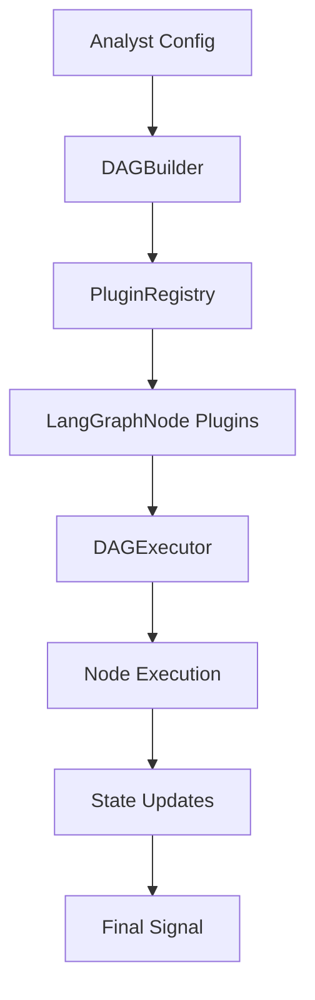

# AFI LangGraphNode Analysis and Refactoring Report

**Date:** 2025-12-28
**Analysis Scope:** afi-core, afi-reactor, afi-skills repositories
**Subject:** Comprehensive analysis of `LangGraphNode` usage and architectural recommendations

> **Note:** This report has been updated with new naming recommendations based on project MVP status and architectural agility priorities.

---

## Executive Summary

This report provides a comprehensive analysis of the `LangGraphNode` interface across the AFI modular repositories. The search revealed that `LangGraphNode` is exclusively used in the **afi-reactor** repository (82 occurrences across 18 files), with no usage in afi-core or afi-skills.

The `LangGraphNode` interface serves as the foundational contract for all executable nodes in the AFI LangGraph DAG orchestration system. It enables a plugin-based architecture where nodes can be dynamically registered, validated, and executed within a directed acyclic graph (DAG) framework.

---

## 1. Search Results Summary

| Repository | Occurrences | Files | Status |
|------------|-------------|-------|--------|
| afi-core | 0 | 0 | Not found |
| afi-reactor | 82 | 18 | Primary usage |
| afi-skills | 0 | 0 | Not found |
| **Total** | **82** | **18** | - |

---

## 2. LangGraphNode Interface Definition

**Location:** [`afi-reactor/src/types/langgraph.ts:33-51`](afi-reactor/src/types/langgraph.ts:33)

```typescript
export interface LangGraphNode {
  /** Node ID. Must be unique within the DAG. */
  id: string;

  /** Node type: 'required' nodes are always present, 'enrichment' and 'ingress' nodes are analyst-configurable. */
  type: 'required' | 'enrichment' | 'ingress';

  /** Plugin ID that implements this node. Must reference a registered plugin. */
  plugin: string;

  /** Node execution function that processes state and returns updated state. */
  execute: (state: LangGraphState) => Promise<LangGraphState>;

  /** Whether this node can run in parallel with other nodes. */
  parallel?: boolean;

  /** Node dependencies. The DAG will ensure all dependencies complete before executing this node. */
  dependencies?: string[];
}
```

### Type Guard Function

**Location:** [`afi-reactor/src/types/langgraph.ts:248-261`](afi-reactor/src/types/langgraph.ts:248)

```typescript
export function isLangGraphNode(obj: unknown): obj is LangGraphNode {
  if (typeof obj !== 'object' || obj === null) {
    return false;
  }

  const node = obj as unknown as Record<string, unknown>;

  return (
    typeof node.id === 'string' &&
    (node.type === 'required' || node.type === 'enrichment' || node.type === 'ingress') &&
    typeof node.plugin === 'string' &&
    typeof node.execute === 'function'
  );
}
```

---

## 3. File-by-File Occurrence Analysis

### 3.1 Core Type Definition Files

| File | Line(s) | Usage Context |
|------|---------|---------------|
| [`afi-reactor/src/types/langgraph.ts`](afi-reactor/src/types/langgraph.ts) | 33-51, 248-261 | Interface definition and type guard |

### 3.2 Core Infrastructure Files

| File | Line(s) | Usage Context |
|------|---------|---------------|
| [`afi-reactor/src/langgraph/PluginRegistry.ts`](afi-reactor/src/langgraph/PluginRegistry.ts) | 14-15, 102, 218, 304, 314-316, 333, 369-370, 380, 508-509, 527-529 | Plugin registration, validation, retrieval |
| [`afi-reactor/src/langgraph/DAGBuilder.ts`](afi-reactor/src/langgraph/DAGBuilder.ts) | 16, 100 | DAG construction with node references |
| [`afi-reactor/src/langgraph/DAGExecutor.ts`](afi-reactor/src/langgraph/DAGExecutor.ts) | 17 | Node execution orchestration |

### 3.3 Node Implementations (Required Nodes)

| File | Line(s) | Node Type | Usage Context |
|------|---------|-----------|---------------|
| [`afi-reactor/src/langgraph/nodes/AnalystNode.ts`](afi-reactor/src/langgraph/nodes/AnalystNode.ts) | 16, 32 | Required | Signal aggregation and scoring |
| [`afi-reactor/src/langgraph/nodes/ExecutionNode.ts`](afi-reactor/src/langgraph/nodes/ExecutionNode.ts) | 13, 21 | Required | Final signal generation |
| [`afi-reactor/src/langgraph/nodes/ObserverNode.ts`](afi-reactor/src/langgraph/nodes/ObserverNode.ts) | 13, 21 | Required | Signal publishing |

### 3.4 Node Implementations (Enrichment Nodes)

| File | Line(s) | Node Type | Usage Context |
|------|---------|-----------|---------------|
| [`afi-reactor/src/langgraph/plugins/TechnicalIndicatorsNode.ts`](afi-reactor/src/langgraph/plugins/TechnicalIndicatorsNode.ts) | 13, 21 | Enrichment | Technical analysis |
| [`afi-reactor/src/langgraph/plugins/PatternRecognitionNode.ts`](afi-reactor/src/langgraph/plugins/PatternRecognitionNode.ts) | 14, 22 | Enrichment | Pattern detection |
| [`afi-reactor/src/langgraph/plugins/SentimentNode.ts`](afi-reactor/src/langgraph/plugins/SentimentNode.ts) | 14, 22 | Enrichment | Sentiment analysis |
| [`afi-reactor/src/langgraph/plugins/NewsNode.ts`](afi-reactor/src/langgraph/plugins/NewsNode.ts) | 13, 21 | Enrichment | News analysis |
| [`afi-reactor/src/langgraph/plugins/AiMlNode.ts`](afi-reactor/src/langgraph/plugins/AiMlNode.ts) | 13, 29 | Enrichment | ML predictions |

### 3.5 Node Implementations (Ingress Nodes)

| File | Line(s) | Node Type | Usage Context |
|------|---------|-----------|---------------|
| [`afi-reactor/src/langgraph/plugins/ScoutNode.ts`](afi-reactor/src/langgraph/plugins/ScoutNode.ts) | 19, 34 | Ingress | Signal discovery |
| [`afi-reactor/src/langgraph/plugins/SignalIngressNode.ts`](afi-reactor/src/langgraph/plugins/SignalIngressNode.ts) | 14, 22 | Ingress | External signal ingestion |

### 3.6 Test Files

| File | Line(s) | Usage Context |
|------|---------|---------------|
| [`afi-reactor/src/types/__tests__/langgraph.test.ts`](afi-reactor/src/types/__tests__/langgraph.test.ts) | 11-13, 22-24, 120-121, 131-132, 262-270, 358, 370-371, 383-386 | Type testing |
| [`afi-reactor/src/langgraph/__tests__/integration.test.ts`](afi-reactor/src/langgraph/__tests__/integration.test.ts) | 11 | Integration testing |
| [`afi-reactor/src/langgraph/__tests__/PluginRegistry.test.ts`](afi-reactor/src/langgraph/__tests__/PluginRegistry.test.ts) | 10, 23, 38, 199, 212, 504, 517, 923 | Plugin registry testing |
| [`afi-reactor/src/langgraph/__tests__/DAGBuilder.test.ts`](afi-reactor/src/langgraph/__tests__/DAGBuilder.test.ts) | 10, 27, 42, 57, 1625, 1640, 1806, 1821 | DAG builder testing |
| [`afi-reactor/src/langgraph/__tests__/DAGExecutor.test.ts`](afi-reactor/src/langgraph/__tests__/DAGExecutor.test.ts) | 10, 27, 86, 101, 160, 175, 193, 858, 906, 952 | DAG executor testing |
| [`afi-reactor/src/langgraph/__tests__/test-utils.ts`](afi-reactor/src/langgraph/__tests__/test-utils.ts) | 11, 125, 188 | Test utilities |

### 3.7 Documentation Files

| File | Line(s) | Usage Context |
|------|---------|---------------|
| [`afi-reactor/INTEGRATION_TEST_ANALYSIS_AND_PLAN.md`](afi-reactor/INTEGRATION_TEST_ANALYSIS_AND_PLAN.md) | 31, 392, 441 | Documentation reference |

---

## 4. Architectural Purpose and Functionality

### 4.1 Core Design Pattern

`LangGraphNode` implements the **Strategy Pattern** combined with the **Plugin Architecture** pattern. It serves as:

1. **Contract Interface**: Defines the standard contract that all executable nodes must implement
2. **Plugin Registration**: Enables dynamic registration of nodes in the `PluginRegistry`
3. **DAG Execution**: Provides the execution unit for the DAG orchestration system
4. **Type Safety**: Ensures compile-time and runtime type checking through TypeScript interfaces and type guards

### 4.2 Node Type Hierarchy

```
LangGraphNode (Interface)
├── Required Nodes (Always Present)
│   ├── AnalystNode
│   ├── ExecutionNode
│   └── ObserverNode
├── Enrichment Nodes (Analyst-Configurable)
│   ├── TechnicalIndicatorsNode
│   ├── PatternRecognitionNode
│   ├── SentimentNode
│   ├── NewsNode
│   └── AiMlNode
└── Ingress Nodes (Analyst-Configurable)
    ├── ScoutNode
    └── SignalIngressNode
```

### 4.3 Execution Flow



### 4.4 Key Architectural Components

#### 4.4.1 PluginRegistry

The `PluginRegistry` manages all `LangGraphNode` implementations:

- **Registration**: Validates and registers plugins using `isLangGraphNode()` type guard
- **Retrieval**: Provides methods to get plugins by name, type, or all plugins
- **Metadata**: Tracks plugin metadata including enabled status and registration timestamp
- **Type Indexing**: Maintains a type-based index for efficient filtering

#### 4.4.2 DAGBuilder

The `DAGBuilder` constructs DAGs from analyst configurations:

- **Node Resolution**: Resolves plugin references to `LangGraphNode` implementations
- **Dependency Management**: Handles node dependencies for topological sorting
- **Validation**: Validates DAG structure including cycle detection
- **Execution Levels**: Groups nodes into parallel execution levels

#### 4.4.3 DAGExecutor

The `DAGExecutor` executes DAGs with support for sequential and parallel execution:

- **Node Execution**: Calls the `execute()` method on each `LangGraphNode`
- **State Management**: Passes `LangGraphState` through nodes
- **Error Handling**: Implements retry logic and fail-fast behavior
- **Metrics Tracking**: Collects execution metrics for monitoring

### 4.5 State Management

The `LangGraphState` interface is passed through all nodes:

```typescript
export interface LangGraphState {
  signalId: string;
  rawSignal: unknown;
  enrichmentResults: Map<string, unknown>;
  analystConfig: AnalystConfig;
  currentNode?: string;
  metadata: {
    startTime: string;
    currentNodeStartTime?: string;
    trace: ExecutionTraceEntry[];
  };
}
```

Each node:
1. Receives the current state
2. Processes the state according to its logic
3. Stores results in `enrichmentResults`
4. Adds trace entries to `metadata.trace`
5. Returns the updated state

---

## 5. Naming and Terminology Analysis

### 5.1 Current Naming Issues

| Issue | Description | Impact |
|-------|-------------|--------|
| **"LangGraph" Prefix** | The name suggests a dependency on LangChain's LangGraph library, but this is a custom implementation | Misleading, creates confusion about dependencies |
| **"Node" Suffix** | Generic term that doesn't convey the plugin-based nature | Less descriptive than alternatives |
| **"Plugin" vs "Node" Inconsistency** | Code uses both "plugin" and "node" terminology interchangeably | Confusing for developers |
| **"LangGraphNode" vs "DAGNode"** | Two similar interfaces exist with different purposes | Potential confusion |

### 5.2 Terminology Mapping

| Current Term | Suggested Alternative | Rationale |
|--------------|----------------------|-----------|
| `LangGraphNode` | `DAGPlugin` or `PipelineNode` | More descriptive of actual purpose |
| `LangGraphState` | `PipelineState` or `ExecutionContext` | Removes LangGraph branding |
| `LangGraphConfig` | `DAGConfig` (already used) | Consistent with DAG terminology |
| `PluginRegistry` | `NodeRegistry` or `PluginRegistry` (keep) | Accurate description |

---

## 6. Refactoring Recommendations

### 6.1 Primary Recommendation: Rename to `DAGPlugin`

**Rationale:**
- Removes misleading "LangGraph" branding
- Accurately describes the plugin-based architecture
- Aligns with existing `DAGConfig` and `DAGNode` terminology
- Maintains clarity about the DAG execution context

**Proposed Interface:**

```typescript
/**
 * DAG Plugin interface
 *
 * Defines the contract for all DAG plugins (required, enrichment, and ingress).
 * All plugins must implement this interface to be executable in the DAG.
 */
export interface DAGPlugin {
  /** Plugin ID. Must be unique within the DAG. */
  id: string;

  /** Plugin type: 'required' plugins are always present, 'enrichment' and 'ingress' plugins are analyst-configurable. */
  type: 'required' | 'enrichment' | 'ingress';

  /** Plugin identifier that implements this plugin. */
  plugin: string;

  /** Plugin execution function that processes state and returns updated state. */
  execute: (state: PipelineState) => Promise<PipelineState>;

  /** Whether this plugin can run in parallel with other plugins. */
  parallel?: boolean;

  /** Plugin dependencies. The DAG will ensure all dependencies complete before executing this plugin. */
  dependencies?: string[];
}
```

### 6.2 Secondary Recommendation: Create Abstract Base Class

**Rationale:**
- Provides common implementation for trace entry creation
- Reduces code duplication across pipehead implementations
- Enforces consistent error handling patterns
- **"BasePipehead"** maintains the playful naming convention

**Proposed Base Class:**

```typescript
/**
 * Abstract base class for pipeheads.
 *
 * Provides common functionality for all pipehead implementations including:
 * - Trace entry creation
 * - Error handling
 * - State management utilities
 *
 * Why "BasePipehead"? Because every pipehead needs a good foundation!
 */
export abstract class BasePipehead implements Pipehead {
  abstract id: string;
  abstract type: 'required' | 'enrichment' | 'ingress';
  abstract plugin: string;
  abstract parallel?: boolean;
  abstract dependencies?: string[];

  /**
   * Executes the pipehead with automatic trace entry management.
   *
   * @param state - The current pipeline state
   * @returns Promise<PipelineState> - The updated state
   */
  async execute(state: PipelineState): Promise<PipelineState> {
    const startTime = Date.now();
    const startTimeIso = new Date(startTime).toISOString();

    // Create a trace entry for the start of execution
    const traceEntry: ExecutionTraceEntry = {
      nodeId: this.id,
      nodeType: this.type,
      startTime: startTimeIso,
      status: 'running',
    };

    try {
      // Execute the pipehead logic
      const result = await this.executeInternal(state);

      // Update trace entry with completion status
      const endTime = Date.now();
      const endTimeIso = new Date(endTime).toISOString();
      const duration = endTime - startTime;

      const completedTraceEntry: ExecutionTraceEntry = {
        ...traceEntry,
        endTime: endTimeIso,
        duration,
        status: 'completed',
      };

      result.metadata.trace.push(completedTraceEntry);

      return result;
    } catch (error) {
      // Update trace entry with failure status
      const endTime = Date.now();
      const endTimeIso = new Date(endTime).toISOString();
      const duration = endTime - startTime;

      const failedTraceEntry: ExecutionTraceEntry = {
        ...traceEntry,
        endTime: endTimeIso,
        duration,
        status: 'failed',
        error: error instanceof Error ? error.message : String(error),
      };

      state.metadata.trace.push(failedTraceEntry);

      throw error;
    }
  }

  /**
   * Internal execution method to be implemented by subclasses.
   *
   * @param state - The current pipeline state
   * @returns Promise<PipelineState> - The updated state
   * @protected
   */
  protected abstract executeInternal(state: PipelineState): Promise<PipelineState>;
}
```

### 6.3 Tertiary Recommendation: Introduce Plugin Metadata Interface

**Rationale:**
- Separates plugin metadata from execution logic
- Enables better plugin discovery and documentation
- Supports plugin versioning and deprecation

**Proposed Interface:**

```typescript
/**
 * Plugin metadata interface
 *
 * Provides additional information about a DAG plugin.
 */
export interface DAGPluginMetadata {
  /** Plugin ID */
  id: string;

  /** Plugin type */
  type: 'required' | 'enrichment' | 'ingress';

  /** Plugin version */
  version: string;

  /** Plugin name */
  name: string;

  /** Plugin description */
  description: string;

  /** Plugin author */
  author?: string;

  /** Plugin tags for categorization */
  tags?: string[];

  /** Whether the plugin is deprecated */
  deprecated?: boolean;

  /** Minimum required AFI version */
  minAfiVersion?: string;

  /** Maximum compatible AFI version */
  maxAfiVersion?: string;
}

/**
 * Enhanced DAG plugin interface with metadata support
 */
export interface DAGPluginWithMetadata extends DAGPlugin {
  /** Plugin metadata */
  metadata: DAGPluginMetadata;
}
```

### 6.4 Quaternary Recommendation: Separate Configuration from Execution

**Rationale:**
- Enables static analysis of pipeline structure without instantiating pipeheads
- Supports configuration validation before execution
- Improves testability by separating concerns
- **"PipeheadConfig"** maintains consistent naming with a touch of humor

**Proposed Interfaces:**

```typescript
/**
 * Pipehead configuration interface
 *
 * Defines the static configuration of a pipehead without execution logic.
 *
 * Why "PipeheadConfig"? Because even pipeheads need to know how to configure themselves!
 */
export interface PipeheadConfig {
  /** Pipehead ID */
  id: string;

  /** Pipehead type */
  type: 'required' | 'enrichment' | 'ingress';

  /** Pipehead identifier */
  plugin: string;

  /** Whether this pipehead can run in parallel */
  parallel?: boolean;

  /** Pipehead dependencies */
  dependencies?: string[];

  /** Pipehead-specific configuration */
  config?: Record<string, unknown>;
}

/**
 * Pipehead factory interface
 *
 * Creates pipehead instances from configuration.
 */
export interface PipeheadFactory {
  /**
   * Creates a pipehead instance from configuration.
   *
   * @param config - The pipehead configuration
   * @returns Pipehead - The pipehead instance
   */
  create(config: PipeheadConfig): Pipehead;

  /**
   * Validates pipehead configuration.
   *
   * @param config - The pipehead configuration
   * @returns ValidationResult - The validation result
   */
  validate(config: PipeheadConfig): ValidationResult;
}
```

---

## 7. Migration Strategy

### 7.1 Global Rename Operation (No Backward Compatibility)

Since this is a solo MVP where architectural agility is prioritized over legacy support, we will perform a **global rename operation** without backward compatibility constraints:

```typescript
// In afi-reactor/src/types/langgraph.ts
export interface Pipehead {
  id: string;
  type: 'required' | 'enrichment' | 'ingress';
  plugin: string;
  execute: (state: PipelineState) => Promise<PipelineState>;
  parallel?: boolean;
  dependencies?: string[];
}

export interface PipeheadConfig {
  id: string;
  type: 'required' | 'enrichment' | 'ingress';
  plugin: string;
  parallel?: boolean;
  dependencies?: string[];
  config?: Record<string, unknown>;
}

// Type guard for pipehead validation
export function isPipehead(obj: unknown): obj is Pipehead {
  if (typeof obj !== 'object' || obj === null) {
    return false;
  }

  const pipehead = obj as unknown as Record<string, unknown>;

  return (
    typeof pipehead.id === 'string' &&
    (pipehead.type === 'required' || pipehead.type === 'enrichment' || pipehead.type === 'ingress') &&
    typeof pipehead.plugin === 'string' &&
    typeof pipehead.execute === 'function'
  );
}
```

### 7.2 Global Search and Replace

Perform the following global replacements across all files:

| Old Term | New Term | Files Affected |
|-----------|-----------|----------------|
| `LangGraphNode` | `Pipehead` | All 18 files |
| `LangGraphState` | `PipelineState` | All files |
| `DAGPluginConfig` | `PipeheadConfig` | All files |
| `isLangGraphNode` | `isPipehead` | All files |
| `DAGPlugin` | `Pipehead` | All files |

### 7.3 File-by-File Migration

Execute the following changes:

1. **Type Definition File** (`afi-reactor/src/types/langgraph.ts`)
   - Rename `LangGraphNode` interface to `Pipehead`
   - Rename `LangGraphState` interface to `PipelineState`
   - Rename `isLangGraphNode` function to `isPipehead`
   - Rename `isLangGraphState` function to `isPipelineState`

2. **Core Infrastructure Files**
   - `PluginRegistry.ts`: Update all references to use `Pipehead`
   - `DAGBuilder.ts`: Update all references to use `Pipehead`
   - `DAGExecutor.ts`: Update all references to use `Pipehead`

3. **Node Implementation Files** (10 files)
   - Update all `implements LangGraphNode` to `implements Pipehead`
   - Update all type annotations to use `Pipehead`

4. **Test Files** (6 files)
   - Update all mock classes to implement `Pipehead`
   - Update all type annotations to use `Pipehead`

5. **Documentation Files**
   - Update all references to use `Pipehead` terminology

---

## 8. Impact Analysis

### 8.1 Files Requiring Changes

| Category | Count | Files |
|----------|-------|-------|
| Type Definitions | 1 | `afi-reactor/src/types/langgraph.ts` |
| Core Infrastructure | 3 | `PluginRegistry.ts`, `DAGBuilder.ts`, `DAGExecutor.ts` |
| Node Implementations | 10 | All node files |
| Test Files | 6 | All test files |
| Documentation | 1 | `INTEGRATION_TEST_ANALYSIS_AND_PLAN.md` |
| **Total** | **21** | - |

### 8.2 Risk Assessment

| Risk | Level | Mitigation |
|------|-------|------------|
| Breaking changes to external consumers | **Low** | No external consumers - solo MVP |
| Test failures | Low | Update tests during migration |
| Documentation inconsistency | Low | Update documentation in parallel |
| Runtime errors | Low | TypeScript compilation will catch issues |
| Developer confusion during transition | Medium | Clear communication of naming change |

### 8.3 Benefits

| Benefit | Impact |
|---------|--------|
| Improved code clarity | High |
| Reduced confusion about dependencies | High |
| Better alignment with system design goals | High |
| Enhanced maintainability | Medium |
| Improved developer experience | Medium |
| **Added memorability and personality** | High |
| **Playful, approachable codebase** | High |

---

## 9. Alternative Naming Options

### 9.1 Naming Options Analysis

| Option | Pros | Cons | Recommendation |
|--------|------|------|----------------|
| `Pipehead` | **Memorable, playful, evokes pipeline leadership, distinctive** | May require explanation for newcomers | **Primary** |
| `DAGPlugin` | Clear, accurate, aligns with existing terminology | Generic, lacks personality | Secondary |
| `PipelineNode` | Describes execution flow | Less specific to DAG structure | Not recommended |
| `ExecutionUnit` | Generic, reusable | Too abstract | Not recommended |
| `GraphPlugin` | Short, concise | Less descriptive than Pipehead | Not recommended |
| `AFINode` | Brand-aligned | Too generic | Not recommended |

### 9.2 Semantic Suitability of "Pipehead"

**Why "Pipehead" Works:**

1. **Pipeline Context**: The system processes data through a pipeline/DAG, and "pipe" directly references this architecture
2. **Leadership Connotation**: "Head" suggests being at the front, leading the processing
3. **Memorability**: The term is unique and quirky, making it easy to remember
4. **Humor Factor**: The playful nature makes the codebase more approachable and fun to work with
5. **Technical Accuracy**: Despite the humor, it accurately describes the function (leading a pipe segment)

**Potential Concerns and Mitigations:**

| Concern | Mitigation |
|---------|-------------|
| May confuse newcomers | Add clear documentation explaining the term's origin and meaning |
| Not industry-standard | Embrace it as a unique AFI brand element |
| May seem unprofessional | Balance with clear, professional documentation |

### 9.3 Recommended Naming Convention

**Primary:** `Pipehead` (replaces `LangGraphNode`)
**Secondary:** `PipelineState` (replaces `LangGraphState`)
**Tertiary:** `PipeheadConfig` (replaces `DAGPluginConfig`)
**Type Guard:** `isPipehead` (replaces `isLangGraphNode`)
**Base Class:** `BasePipehead` (replaces `BaseDAGPlugin`)
**Metadata:** `PipeheadMetadata` (replaces `DAGPluginMetadata`)
**Factory:** `PipeheadFactory` (replaces `DAGPluginFactory`)

---

## 10. Conclusion

The `LangGraphNode` interface serves as a critical architectural component in the AFI Reactor system, enabling a flexible, plugin-based DAG orchestration framework. While the current implementation is functionally sound, the naming creates confusion about dependencies and system architecture.

The recommended refactoring to `Pipehead` will:

1. **Improve clarity** by accurately describing the plugin-based architecture
2. **Reduce confusion** by removing misleading "LangGraph" branding
3. **Align terminology** with existing DAG-related interfaces
4. **Enhance maintainability** through clearer naming conventions
5. **Support future growth** with extensible plugin metadata and factory patterns
6. **Add personality** to the codebase with a memorable, playful term
7. **Improve developer experience** by making the codebase more approachable

Since this is a solo MVP where architectural agility is prioritized over legacy support, the migration strategy will be a **global rename operation** without backward compatibility constraints. This approach allows for rapid iteration and establishes a unique AFI brand identity.

The "Pipehead" naming convention, while unconventional, provides:
- **Distinctiveness**: Sets AFI apart from other projects
- **Memorability**: Easy to remember and recall
- **Personality**: Makes the codebase more enjoyable to work with
- **Technical accuracy**: Despite the humor, accurately describes the function

This refactoring represents an opportunity to establish a unique, memorable brand identity while improving code clarity and maintainability.

---

## 11. Appendix: Complete File Reference

### 11.1 Type Definition Files

```
afi-reactor/src/types/langgraph.ts
├── LangGraphNode interface (lines 33-51)
├── LangGraphState interface (lines 59-86)
├── ExecutionTraceEntry interface (lines 94-115)
├── DAGConfig interface (lines 123-132)
├── isLangGraphNode type guard (lines 248-261)
└── isLangGraphState type guard (lines 266-285)
```

### 11.2 Core Infrastructure Files

```
afi-reactor/src/langgraph/
├── PluginRegistry.ts
│   ├── LangGraphNode import (line 14)
│   ├── isLangGraphNode import (line 15)
│   ├── plugins: Map<string, LangGraphNode> (line 102)
│   ├── registerPlugin(plugin: LangGraphNode) (line 218)
│   ├── getPlugin(name: string): LangGraphNode | undefined (line 304)
│   ├── getPluginsByType(type: PluginType): LangGraphNode[] (line 314)
│   ├── getAllPlugins(): LangGraphNode[] (line 333)
│   ├── validatePlugin(plugin: unknown): boolean (line 369)
│   ├── determinePluginType(plugin: LangGraphNode) (line 380)
│   ├── getEnabledPlugins(): LangGraphNode[] (line 508)
│   └── getEnabledPluginsByType(type: PluginType): LangGraphNode[] (line 527)
├── DAGBuilder.ts
│   ├── LangGraphNode import (line 16)
│   └── node?: LangGraphNode (line 100)
└── DAGExecutor.ts
    └── LangGraphNode import (line 17)
```

### 11.3 Node Implementation Files

```
afi-reactor/src/langgraph/nodes/
├── AnalystNode.ts
│   ├── LangGraphNode import (line 16)
│   └── export class AnalystNode implements LangGraphNode (line 32)
├── ExecutionNode.ts
│   ├── LangGraphNode import (line 13)
│   └── export class ExecutionNode implements LangGraphNode (line 21)
└── ObserverNode.ts
    ├── LangGraphNode import (line 13)
    └── export class ObserverNode implements LangGraphNode (line 21)

afi-reactor/src/langgraph/plugins/
├── TechnicalIndicatorsNode.ts
│   ├── LangGraphNode import (line 13)
│   └── export class TechnicalIndicatorsNode implements LangGraphNode (line 21)
├── PatternRecognitionNode.ts
│   ├── LangGraphNode import (line 14)
│   └── export class PatternRecognitionNode implements LangGraphNode (line 22)
├── SentimentNode.ts
│   ├── LangGraphNode import (line 14)
│   └── export class SentimentNode implements LangGraphNode (line 22)
├── NewsNode.ts
│   ├── LangGraphNode import (line 13)
│   └── export class NewsNode implements LangGraphNode (line 21)
├── AiMlNode.ts
│   ├── LangGraphNode import (line 13)
│   └── export class AiMlNode implements LangGraphNode (line 29)
├── ScoutNode.ts
│   ├── LangGraphNode import (line 19)
│   └── export class ScoutNode implements LangGraphNode (line 34)
└── SignalIngressNode.ts
    ├── LangGraphNode import (line 14)
    └── export class SignalIngressNode implements LangGraphNode (line 22)
```

### 11.4 Test Files

```
afi-reactor/src/types/__tests__/langgraph.test.ts
├── LangGraphNode import (lines 12-13)
├── isLangGraphNode import (lines 22-24)
├── const validLangGraphNode: LangGraphNode (line 120)
├── const requiredLangGraphNode: LangGraphNode (line 131)
├── isLangGraphNode(langGraphNodeTest1) (line 269)
├── function processNode(node: LangGraphNode) (line 358)
└── processNode(validLangGraphNode) (line 370)

afi-reactor/src/langgraph/__tests__/test-utils.ts
├── LangGraphNode import (line 11)
├── export class MockPlugin implements LangGraphNode (line 125)
└── export class MockRetryPlugin implements LangGraphNode (line 188)

afi-reactor/src/langgraph/__tests__/PluginRegistry.test.ts
├── LangGraphNode import (line 10)
├── class MockPlugin implements LangGraphNode (line 23)
├── class MockIngressPlugin implements LangGraphNode (line 38)
├── const invalidPlugin = new InvalidPlugin() as unknown as LangGraphNode (line 199)
├── } as unknown as LangGraphNode (lines 212, 504, 517)
└── const plugins: LangGraphNode[] (line 923)

afi-reactor/src/langgraph/__tests__/DAGBuilder.test.ts
├── LangGraphNode import (line 10)
├── class MockPlugin implements LangGraphNode (line 27)
├── class MockIngressPlugin implements LangGraphNode (line 42)
├── class MockPluginWithDeps implements LangGraphNode (line 57)
├── class MockScoutPlugin implements LangGraphNode (lines 1625, 1806)
└── class MockSignalIngressPlugin implements LangGraphNode (lines 1640, 1821)

afi-reactor/src/langgraph/__tests__/DAGExecutor.test.ts
├── LangGraphNode import (line 10)
├── class MockPlugin implements LangGraphNode (line 27)
├── class MockIngressPlugin implements LangGraphNode (line 86)
├── class MockPluginWithDeps implements LangGraphNode (line 101)
├── class MockFailingPlugin implements LangGraphNode (line 160)
├── class MockDelayPlugin implements LangGraphNode (line 175)
├── class MockStateModifyingPlugin implements LangGraphNode (line 193)
├── class MockRetryPlugin implements LangGraphNode (line 858)
├── class MockAlwaysFailingPlugin implements LangGraphNode (line 906)
└── class MockRetryWithDelayPlugin implements LangGraphNode (line 952)
```

---

**End of Report**
