# LangGraph Terminology Elimination - Phase 2 Workflow

## Current State Assessment

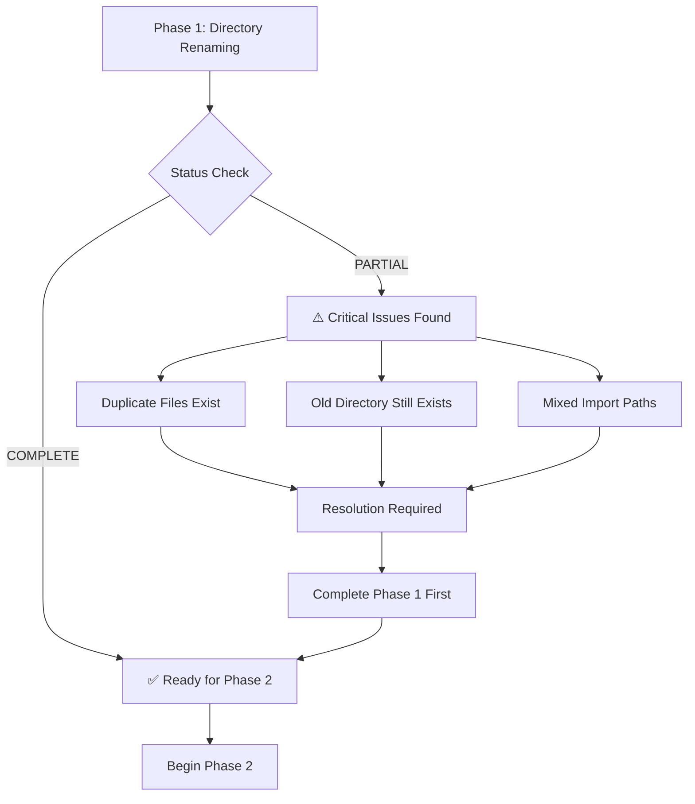

## Phase 1 Completion Workflow

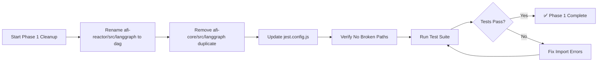

## Phase 2 Execution Workflow

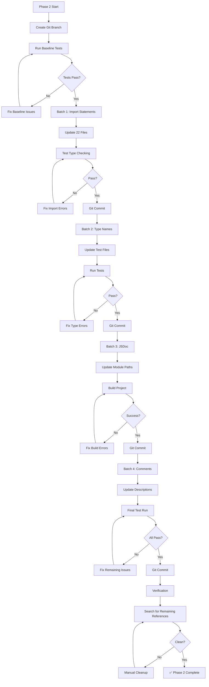

## Issue Resolution Decision Tree

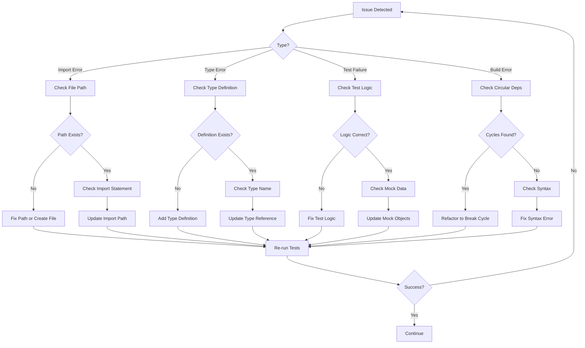

## Safety Checkpoint Flow

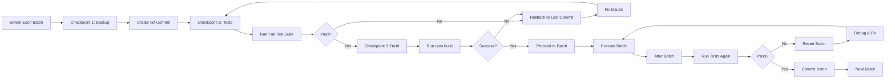

## Risk Mitigation Flow

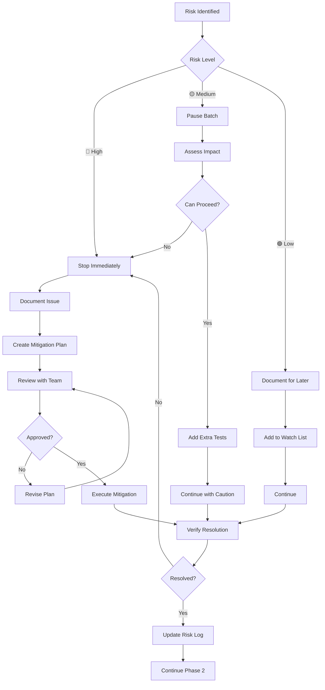

## File Update Batch Strategy

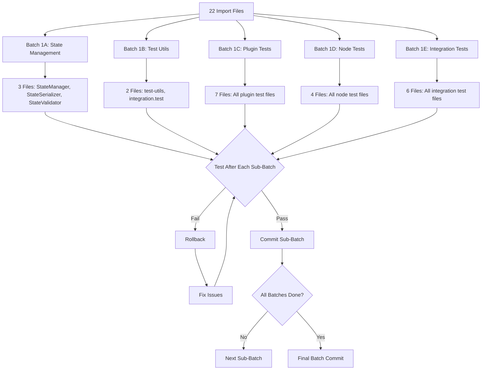

## Verification Workflow

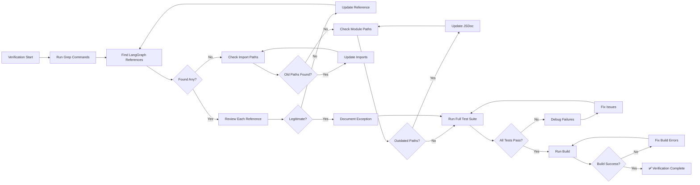

## Rollback Strategy

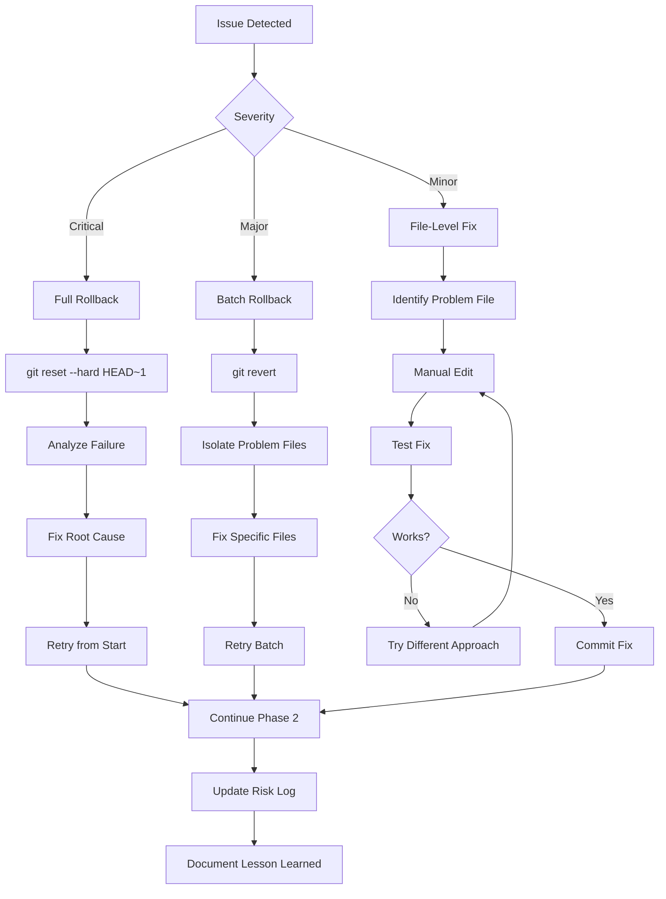

## Success Metrics Dashboard

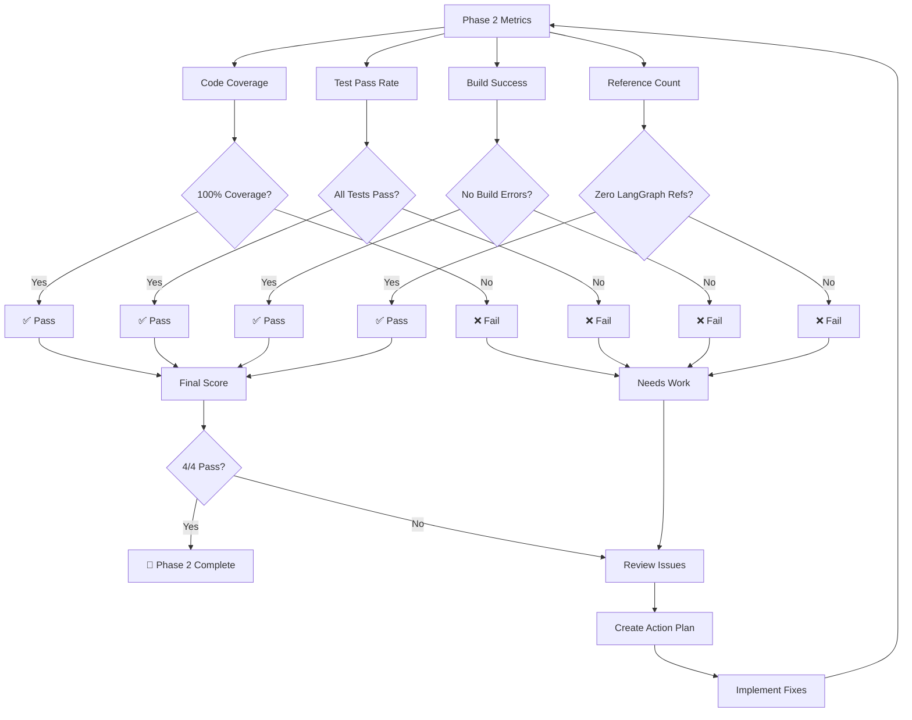

## Communication Flow

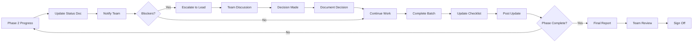

---

## Quick Reference: Critical Paths

### Path 1: Happy Path (No Issues)
```
Phase 1 Complete → Batch 1 → Test → Pass → Commit
→ Batch 2 → Test → Pass → Commit
→ Batch 3 → Test → Pass → Commit
→ Batch 4 → Test → Pass → Commit
→ Verification → Pass → Complete
```

### Path 2: With Minor Issues
```
Phase 1 Complete → Batch 1 → Test → Fail
→ Fix Issues → Test → Pass → Commit
→ Batch 2 → Test → Pass → Commit
→ [Continue normally]
```

### Path 3: With Major Issues
```
Phase 1 Complete → Batch 1 → Test → Critical Fail
→ Rollback → Analyze → Fix Root Cause
→ Retry Batch 1 → Test → Pass → Commit
→ [Continue normally]
```

### Path 4: Phase 1 Incomplete
```
Phase 1 Incomplete → Block Phase 2
→ Complete Phase 1 First
→ Verify Phase 1 → Pass
→ Begin Phase 2
```

---

**Workflow Version:** 1.0  
**Created:** 2025-12-28  
**Status:** Ready for Execution
