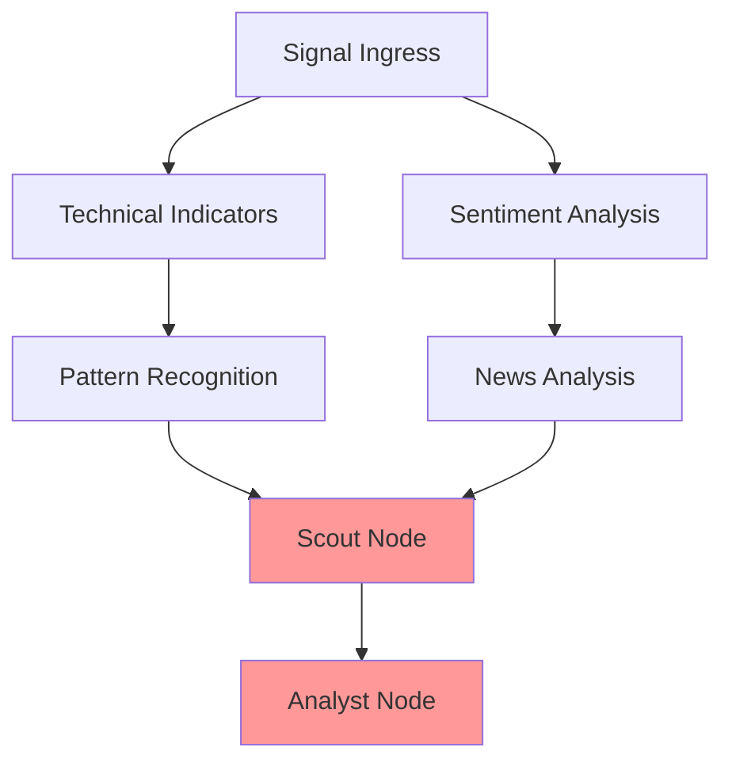
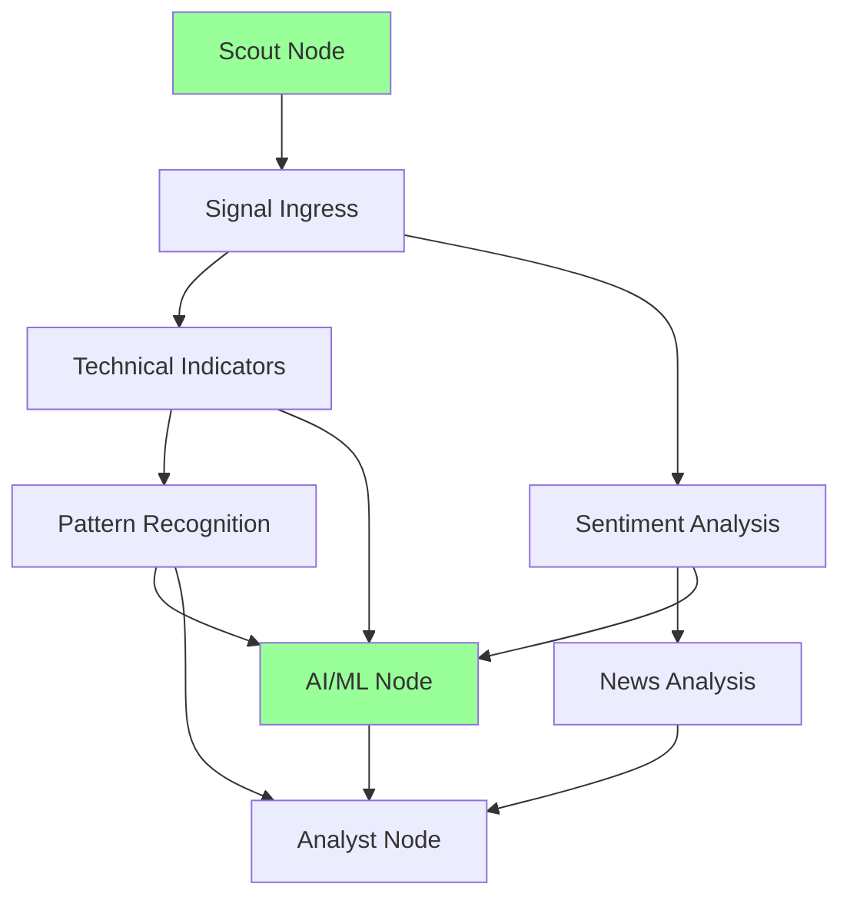

# AFI LangGraph Scout Node and AI/ML Node Refactoring Plan

**Version**: 2.0  
**Date**: 2025-12-26  
**Status**: Planning Phase  
**Target Mode**: Orchestrator

---

## Executive Summary

This plan outlines the refactoring of the AFI LangGraph architecture to address two critical architectural issues:

1. **Scout Node Positioning**: Correctly position the Scout node as a **pre-enrichment signal provider** rather than part of the enrichment stage
2. **AI/ML Node Integration**: Create a dedicated AI/ML enrichment node that interfaces with the Tiny Brains service for AI model ensemble setups and advanced logic execution

The Scout node should function as an independent signal source that feeds opportunities into the enrichment pipeline, where they are then processed by enrichment nodes (including the new AI/ML node) and scored by the Analyst node.

### Key Objectives

1. **Reposition Scout as Independent Signal Ingress**: Scout nodes should execute BEFORE enrichment stage, not after
2. **Remove Scoring from Scout**: Scout nodes should NOT perform scoring - that's the Analyst's responsibility
3. **Enable Third-Party Scout Registration**: Any third party can register as a Scout, receive credentials, and submit signals for potential rewards
4. **Create Dedicated AI/ML Node**: Implement a dedicated AiMlNode plugin that interfaces with the Tiny Brains service
5. **Maintain Parallel Enrichment**: The enrichment stage should maintain its parallel processing capabilities as default but customizable
6. **Eliminate Unnecessary Dependencies**: Scout nodes should have no dependencies on enrichment nodes

---

## Critical Architectural Discrepancy: Missing AI/ML Node

### Current State Analysis

**Location**: [`afi-reactor/plugins/froggy-enrichment-adapter.plugin.ts`](afi-reactor/plugins/froggy-enrichment-adapter.plugin.ts)

The current architecture has a critical discrepancy:

1. **AI/ML Functionality is Embedded**: The AI/ML enrichment is embedded within the `froggy-enrichment-adapter.plugin.ts` as a category, not as a dedicated LangGraph node
2. **No Dedicated AiMlNode**: There is NO dedicated `AiMlNode` in the LangGraph plugin system
3. **PluginRegistry Missing AI/ML**: The PluginRegistry does not include an AI/ML node
4. **Tiny Brains Service Exists**: The [`afi-tiny-brains`](afi-tiny-brains) repository provides a Python microservice for AI/ML predictions
5. **Client Integration Exists**: The [`tinyBrainsClient.ts`](afi-reactor/src/aiMl/tinyBrainsClient.ts) provides the client interface

### Tiny Brains Service Overview

**Location**: [`afi-tiny-brains/README.md`](afi-tiny-brains/README.md)

The Tiny Brains service is AFI's AI/ML microservice for the Froggy enrichment pipeline. It provides ML-based predictions using an ensemble of three "brains":

- **Chronos Brain**: Time-series forecasting for directional bias (uses Chronos-Bolt or heuristics)
- **HMM Brain**: Hidden Markov Model for regime detection (bull/bear/choppy + risk flags)
- **LightGBM Brain**: Meta-learner for conviction scoring over enriched features

**Service Endpoints**:
- `GET /health` - Model status check
- `POST /predict/froggy` - Main prediction endpoint

**Request Flow**:
1. Client builds `TinyBrainsFroggyInput` with technical/pattern/sentiment/news context
2. HTTP POST to `{TINY_BRAINS_URL}/predict/froggy`
3. Service runs three brains in parallel/sequence
4. Returns `FroggyAiMlV1` response (convictionScore, direction, regime, riskFlag, notes)
5. Result attached to enrichment field

**Fail-Soft Design**:
- If models aren't loaded, brains fall back to simple heuristics
- Service always returns a valid response (never errors)
- Missing features → neutral predictions with low conviction

### The Problem

The current architecture incorrectly positions AI/ML functionality:

1. **AI/ML is NOT a LangGraph Node**: It's embedded in a plugin, not a first-class node
2. **No Independent Configuration**: AI/ML cannot be configured independently in the DAG
3. **No Parallel Execution Control**: AI/ML cannot be independently controlled for parallel execution
4. **No Dependency Management**: AI/ML dependencies cannot be explicitly managed
5. **Inconsistent Architecture**: Other enrichment nodes (TechnicalIndicators, PatternRecognition, Sentiment, News) are dedicated LangGraph nodes, but AI/ML is not

### The Solution

Create a dedicated `AiMlNode` plugin that:

1. **Is a First-Class LangGraph Node**: Implements `LangGraphNode` interface
2. **Interfaces with Tiny Brains Service**: Uses the existing `tinyBrainsClient.ts`
3. **Can Be Configured Independently**: Has its own configuration in the DAG
4. **Supports Parallel Execution**: Can be configured for parallel or sequential execution
5. **Has Explicit Dependencies**: Can depend on other enrichment nodes (technical, pattern, sentiment, news)
6. **Maintains Fail-Soft Behavior**: Returns undefined if service unavailable, doesn't break pipeline

---

## Current Architecture Analysis

### Problem Identification

#### Issue 1: Scout Node Positioned After Enrichment Stage

**Location**: [`afi-reactor/src/langgraph/__tests__/integration.test.ts:371-378`](afi-reactor/src/langgraph/__tests__/integration.test.ts:371-378)

```typescript
{
  id: 'scout',
  type: 'ingress',
  plugin: 'scout',
  enabled: true,
  dependencies: ['pattern-recognition', 'news'],  // ❌ WRONG: Scout depends on enrichment nodes
  config: {},
}
```

**Impact**: Scout node executes AFTER pattern-recognition and news enrichment nodes, which is architecturally incorrect.

#### Issue 2: Scout Node Performs Scoring

**Location**: [`afi-reactor/src/langgraph/plugins/ScoutNode.ts:70-71`](afi-reactor/src/langgraph/plugins/ScoutNode.ts:70-71)

```typescript
// Score discovered signals
const scoredSignals = this.scoreSignals(discoveredSignals);
```

**Impact**: Scout node is performing scoring logic, which should be the responsibility of the Analyst node.

#### Issue 3: Scout Node Type Confusion

**Location**: [`afi-reactor/src/langgraph/plugins/ScoutNode.ts:26`](afi-reactor/src/langgraph/plugins/ScoutNode.ts:26)

```typescript
type = 'ingress' as const,  // Correct type, but wrong positioning
```

**Impact**: While the type is correct (`ingress`), the node is positioned as if it were an enrichment node.

#### Issue 4: Missing Dedicated AI/ML Node (CRITICAL)

**Location**: [`afi-reactor/src/langgraph/PluginRegistry.ts:158-163`](afi-reactor/src/langgraph/PluginRegistry.ts:158-163)

```typescript
const enrichmentNodes = [
  { name: 'technical-indicators', plugin: new TechnicalIndicatorsNode() },
  { name: 'pattern-recognition', plugin: new PatternRecognitionNode() },
  { name: 'sentiment', plugin: new SentimentNode() },
  { name: 'news', plugin: new NewsNode() },
  // ❌ MISSING: No AI/ML node
];
```

**Impact**: AI/ML functionality is embedded in a plugin rather than being a first-class LangGraph node, making it impossible to:
- Configure AI/ML independently in the DAG
- Control AI/ML execution order and dependencies
- Enable/disable AI/ML per-analyst configuration
- Track AI/ML execution metrics separately
- Support multiple AI/ML strategies or models

### Current DAG Flow (Incorrect)



**Problems**:
- Scout node depends on enrichment nodes (pattern-recognition, news)
- Scout executes AFTER enrichment stage
- Scout performs scoring before Analyst
- No dedicated AI/ML node in the enrichment stage

### Correct DAG Flow (Target)



**Correct Behavior**:
- Scout node executes BEFORE enrichment stage
- Scout has NO dependencies on enrichment nodes
- Scout only discovers signals, does NOT score them
- AI/ML node is a dedicated enrichment node that interfaces with Tiny Brains
- AI/ML node depends on technical, pattern, sentiment, and/or news nodes
- Analyst node performs all scoring

---

## Refactoring Architecture

### New Node Type Classification

| Node Type | Position | Responsibilities | Dependencies |
|------------|-----------|------------------|---------------|
| **Scout** (ingress) | Pre-enrichment | Discover signals, submit to pipeline | None (independent) |
| **Signal Ingress** (ingress) | Pre-enrichment | Ingest external signals | Optional: Scout |
| **Technical Indicators** (enrichment) | Enrichment stage | Add technical indicators | Signal Ingress |
| **Pattern Recognition** (enrichment) | Enrichment stage | Detect patterns | Technical Indicators |
| **Sentiment Analysis** (enrichment) | Enrichment stage | Analyze sentiment | Signal Ingress |
| **News Analysis** (enrichment) | Enrichment stage | Analyze news events | Sentiment Analysis |
| **AI/ML** (enrichment) | Enrichment stage | Run ML predictions via Tiny Brains | Technical, Pattern, Sentiment, News |
| **Analyst** (required) | Post-enrichment | Score signals, generate narratives | All enrichment nodes |

### Scout Node Responsibilities (Refined)

**What Scout DOES**:
- Discover trading opportunities from external sources or AFI-native models
- Submit signals to the enrichment pipeline
- Store signal metadata (source, timestamp, origin kind)
- Track signal submission for reward attribution

**What Scout DOES NOT**:
- Enrich signals with features or context
- Score or analyze signals
- Validate or mint signals
- Depend on any enrichment nodes

### AI/ML Node Responsibilities (New)

**What AI/ML Node DOES**:
- Interface with Tiny Brains service via `tinyBrainsClient.ts`
- Build `TinyBrainsFroggyInput` from enrichment results
- Call Tiny Brains service for ML predictions
- Store AI/ML predictions (convictionScore, direction, regime, riskFlag, notes)
- Maintain fail-soft behavior (returns undefined if service unavailable)

**What AI/ML Node DOES NOT**:
- Score signals (that's Analyst's job)
- Generate narratives (that's Analyst's job)
- Validate or mint signals (that's Validator's job)
- Perform any enrichment beyond ML predictions

### Analyst Node Responsibilities (Clarified)

**What Analyst DOES**:
- Load analyst configuration
- Initialize enrichment pipeline
- Aggregate enrichment results (including AI/ML predictions)
- Score signals using ensemble ML models and AI/ML predictions
- Generate narratives and interpretations
- Propose trading actions

**What Analyst DOES NOT**:
- Discover signals (that's Scout's job)
- Enrich signals (that's Enrichers' job)
- Run ML predictions (that's AI/ML Node's job)
- Validate or mint signals (that's Validator's job)

---

## Implementation Plan

### Phase 1: Create Dedicated AI/ML Node (NEW)

#### 1.1 Create AiMlNode.ts

**File**: `afi-reactor/src/langgraph/plugins/AiMlNode.ts` (NEW)

**Purpose**: Dedicated LangGraph node for AI/ML enrichment that interfaces with Tiny Brains service

**Structure**:
```typescript
/**
 * AFI Reactor - AI/ML Node
 *
 * This node is responsible for:
 * - Interfacing with Tiny Brains service for ML predictions
 * - Building TinyBrainsFroggyInput from enrichment results
 * - Storing AI/ML predictions in enrichment results
 * - Maintaining fail-soft behavior
 */

import type { LangGraphNode, LangGraphState } from '../../types/langgraph.js';
import { fetchAiMlForFroggy, type TinyBrainsFroggyInput } from '../../aiMl/tinyBrainsClient.js';

export class AiMlNode implements LangGraphNode {
  id = 'ai-ml';
  type = 'enrichment' as const;
  plugin = 'ai-ml';
  parallel = true;  // Can run in parallel with other enrichment nodes
  dependencies: string[] = ['technical-indicators', 'pattern-recognition', 'sentiment', 'news'];

  async execute(state: LangGraphState): Promise<LangGraphState> {
    const startTime = Date.now();
    const startTimeIso = new Date(startTime).toISOString();

    const traceEntry = {
      nodeId: this.id,
      nodeType: this.type,
      startTime: startTimeIso,
      status: 'running' as const,
    };

    try {
      // Build TinyBrainsFroggyInput from enrichment results
      const input = this.buildTinyBrainsInput(state);

      // Call Tiny Brains service
      const aiMlPrediction = await fetchAiMlForFroggy(input);

      // Store AI/ML prediction in enrichment results
      state.enrichmentResults.set(this.id, {
        aiMl: aiMlPrediction,
        serviceAvailable: aiMlPrediction !== undefined,
        timestamp: new Date().toISOString(),
      });

      // Update trace entry with completion status
      const endTime = Date.now();
      const endTimeIso = new Date(endTime).toISOString();
      const duration = endTime - startTime;

      const completedTraceEntry = {
        ...traceEntry,
        endTime: endTimeIso,
        duration,
        status: 'completed' as const,
      };

      state.metadata.trace.push(completedTraceEntry);

      return state;
    } catch (error) {
      // Update trace entry with failure status
      const endTime = Date.now();
      const endTimeIso = new Date(endTime).toISOString();
      const duration = endTime - startTime;

      const failedTraceEntry = {
        ...traceEntry,
        endTime: endTimeIso,
        duration,
        status: 'failed' as const,
        error: error instanceof Error ? error.message : String(error),
      };

      state.metadata.trace.push(failedTraceEntry);

      // Don't throw - fail-soft behavior
      return state;
    }
  }

  /**
   * Builds TinyBrainsFroggyInput from enrichment results.
   */
  private buildTinyBrainsInput(state: LangGraphState): TinyBrainsFroggyInput {
    const technical = state.enrichmentResults.get('technical-indicators') as any;
    const pattern = state.enrichmentResults.get('pattern-recognition') as any;
    const sentiment = state.enrichmentResults.get('sentiment') as any;
    const news = state.enrichmentResults.get('news') as any;

    return {
      signalId: state.signalId,
      symbol: this.extractSymbol(state.rawSignal),
      timeframe: this.extractTimeframe(state.rawSignal),
      traceId: state.signalId,
      technical: this.extractTechnicalFeatures(technical),
      pattern: this.extractPatternFeatures(pattern),
      sentiment: this.extractSentimentFeatures(sentiment),
      newsFeatures: this.extractNewsFeatures(news),
    };
  }

  // Helper methods for extracting features...
}
```

#### 1.2 Create AiMlNode Tests

**File**: `afi-reactor/src/langgraph/plugins/__tests__/AiMlNode.test.ts` (NEW)

**Test Cases**:
1. Test node properties (id, type, plugin, parallel, dependencies)
2. Test successful execution with Tiny Brains service
3. Test fail-soft behavior when service unavailable
4. Test building TinyBrainsFroggyInput from enrichment results
5. Test trace entries are added correctly

---

### Phase 2: Core Node Refactoring

#### 2.1 Refactor ScoutNode.ts

**File**: [`afi-reactor/src/langgraph/plugins/ScoutNode.ts`](afi-reactor/src/langgraph/plugins/ScoutNode.ts)

**Changes**:
1. Remove `scoreSignals()` method entirely
2. Remove scoring logic from `execute()` method
3. Update node documentation to clarify Scout role
4. Ensure `dependencies` array is empty
5. Add signal submission tracking for reward attribution

**New ScoutNode Structure**:
```typescript
export class ScoutNode implements LangGraphNode {
  id = 'scout';
  type = 'ingress' as const;
  plugin = 'scout';
  parallel = true;
  dependencies: string[] = [];  // Empty - no dependencies

  async execute(state: LangGraphState): Promise<LangGraphState> {
    // 1. Scout for signals (discover opportunities)
    const discoveredSignals = await this.scoutForSignals(assetInfo);
    
    // 2. Store discovered signals (NO SCORING)
    state.enrichmentResults.set(this.id, {
      signals: discoveredSignals,
      totalSignals: discoveredSignals.length,
      discoveredAt: new Date().toISOString(),
      scoutId: this.getScoutId(),  // For reward attribution
    });
    
    return state;
  }

  // Removed: scoreSignals() method
}
```

#### 2.2 Update AnalystNode.ts

**File**: [`afi-reactor/src/langgraph/nodes/AnalystNode.ts`](afi-reactor/src/langgraph/nodes/AnalystNode.ts)

**Changes**:
1. Ensure Analyst node aggregates all enrichment results (including AI/ML)
2. Add scoring logic for signals from Scout nodes
3. Incorporate AI/ML predictions into scoring
4. Generate narratives based on enriched signals
5. Store scored signals in state

**New AnalystNode Structure**:
```typescript
export class AnalystNode implements LangGraphNode {
  id = 'analyst';
  type = 'required' as const;
  plugin = 'analyst';
  parallel = false;
  dependencies: string[] = [];  // Will be populated by DAGBuilder

  async execute(state: LangGraphState): Promise<LangGraphState> {
    // 1. Load analyst configuration
    const analystConfig = await loadAnalystConfig(state.analystConfig.analystId);
    
    // 2. Aggregate enrichment results (including AI/ML)
    const aggregatedResults = this.aggregateEnrichmentResults(state);
    
    // 3. Get AI/ML predictions if available
    const aiMlPrediction = state.enrichmentResults.get('ai-ml') as any;
    
    // 4. Score signals (incorporating AI/ML predictions)
    const scoredSignals = this.scoreSignals(aggregatedResults, aiMlPrediction);
    
    // 5. Generate narratives
    const narratives = this.generateNarratives(scoredSignals, aiMlPrediction);
    
    // 6. Store results
    state.enrichmentResults.set('scored-signal', scoredSignals);
    state.enrichmentResults.set('narratives', narratives);
    
    return state;
  }
}
```

---

### Phase 3: Plugin Registry Updates

#### 3.1 Update PluginRegistry to Include AI/ML Node

**File**: [`afi-reactor/src/langgraph/PluginRegistry.ts`](afi-reactor/src/langgraph/PluginRegistry.ts)

**Changes**:
1. Import `AiMlNode`
2. Add `AiMlNode` to enrichment nodes array
3. Update initialization logic

**New PluginRegistry Structure**:
```typescript
import { AiMlNode } from './plugins/AiMlNode.js';

export class PluginRegistry {
  private plugins: Map<string, LangGraphNode> = new Map();

  private enrichmentNodes = [
    { name: 'technical-indicators', plugin: new TechnicalIndicatorsNode() },
    { name: 'pattern-recognition', plugin: new PatternRecognitionNode() },
    { name: 'sentiment', plugin: new SentimentNode() },
    { name: 'news', plugin: new NewsNode() },
    { name: 'ai-ml', plugin: new AiMlNode() },  // ✅ NEW: AI/ML node
  ];

  // ... rest of implementation
}
```

---

### Phase 4: DAG Builder Modifications

#### 4.1 Update DAGBuilder to Handle Scout as Pre-Enrichment Node

**File**: [`afi-reactor/src/langgraph/DAGBuilder.ts`](afi-reactor/src/langgraph/DAGBuilder.ts)

**Changes**:
1. Add validation to ensure Scout nodes have no dependencies
2. Add validation to ensure enrichment nodes don't depend on Scout nodes
3. Update topological sort to place Scout nodes at execution level 0
4. Add warnings if Scout nodes are incorrectly configured

**New Validation Logic**:
```typescript
private validateScoutNodePositioning(config: AnalystConfig): ValidationResult {
  const result: ValidationResult = {
    valid: true,
    errors: [],
    warnings: [],
  };

  for (const node of config.enrichmentNodes) {
    if (node.type === 'ingress' && node.plugin === 'scout') {
      // Scout nodes must have no dependencies
      if (node.dependencies && node.dependencies.length > 0) {
        result.valid = false;
        result.errors.push(
          `Scout node '${node.id}' has dependencies [${node.dependencies.join(', ')}]. ` +
          `Scout nodes must be independent signal sources with no dependencies.`
        );
      }
    } else if (node.type === 'enrichment') {
      // Enrichment nodes must not depend on Scout nodes
      if (node.dependencies && node.dependencies.some(dep => dep.startsWith('scout'))) {
        result.valid = false;
        result.errors.push(
          `Enrichment node '${node.id}' depends on Scout node. ` +
          `Enrichment nodes must not depend on Scout nodes.`
        );
      }
    }
  }

  return result;
}
```

#### 4.2 Update Execution Level Calculation

**File**: [`afi-reactor/src/langgraph/DAGBuilder.ts:482-517`](afi-reactor/src/langgraph/DAGBuilder.ts:482-517)

**Changes**:
1. Ensure Scout nodes are always at execution level 0
2. Ensure Signal Ingress nodes are at execution level 0 or 1 (if they depend on Scout)
3. Enrichment nodes start at level 1 or higher
4. AI/ML node can be at any enrichment level based on its dependencies

---

### Phase 5: DAG Executor Modifications

#### 5.1 Update DAGExecutor to Handle Scout Execution

**File**: [`afi-reactor/src/langgraph/DAGExecutor.ts`](afi-reactor/src/langgraph/DAGExecutor.ts)

**Changes**:
1. Add special handling for Scout nodes (execute first, independently)
2. Ensure Scout nodes don't wait for any dependencies
3. Track Scout submissions for reward attribution
4. Add metrics for Scout node execution

**New Scout Execution Logic**:
```typescript
private async executeScoutNodes(context: ExecutionContext): Promise<void> {
  // Get all Scout nodes
  const scoutNodes = Array.from(context.dag.nodes.entries())
    .filter(([_, node]) => node.type === 'ingress' && node.plugin === 'scout');

  // Execute Scout nodes in parallel (they have no dependencies)
  const scoutPromises = scoutNodes.map(([nodeId, node]) => 
    this.executeNode(context, nodeId)
  );

  await Promise.all(scoutPromises);

  this.log(context, `Executed ${scoutNodes.length} Scout nodes`, 'info');
}
```

---

### Phase 6: Test Refactoring

#### 6.1 Update Integration Tests

**File**: [`afi-reactor/src/langgraph/__tests__/integration.test.ts`](afi-reactor/src/langgraph/__tests__/integration.test.ts)

**Changes**:
1. Update test configuration to position Scout correctly (lines 371-378)
2. Add tests for Scout node with no dependencies
3. Add tests for Scout node as independent signal source
4. Add tests for Analyst node scoring Scout signals
5. Add tests for third-party Scout registration
6. Add tests for AI/ML node execution
7. Add tests for AI/ML node fail-soft behavior

**New Test Configuration**:
```typescript
const config = createTestConfig([
  {
    id: 'scout',
    type: 'ingress',
    plugin: 'scout',
    enabled: true,
    dependencies: [],  // ✅ CORRECT: No dependencies
    config: {},
  },
  {
    id: 'signal-ingress',
    type: 'ingress',
    plugin: 'signal-ingress',
    enabled: true,
    dependencies: [],  // Can optionally depend on Scout
    config: {},
  },
  {
    id: 'technical-indicators',
    type: 'enrichment',
    plugin: 'technical-indicators',
    enabled: true,
    dependencies: ['signal-ingress'],
    config: {},
  },
  {
    id: 'pattern-recognition',
    type: 'enrichment',
    plugin: 'pattern-recognition',
    enabled: true,
    dependencies: ['technical-indicators'],
    config: {},
  },
  {
    id: 'sentiment',
    type: 'enrichment',
    plugin: 'sentiment',
    enabled: true,
    dependencies: ['signal-ingress'],
    config: {},
  },
  {
    id: 'news',
    type: 'enrichment',
    plugin: 'news',
    enabled: true,
    dependencies: ['sentiment'],
    config: {},
  },
  {
    id: 'ai-ml',
    type: 'enrichment',
    plugin: 'ai-ml',
    enabled: true,
    dependencies: ['technical-indicators', 'pattern-recognition', 'sentiment', 'news'],
    config: {},
  },
  {
    id: 'analyst',
    type: 'required',
    plugin: 'analyst',
    enabled: true,
    dependencies: ['ai-ml'],
    config: {},
  },
]);
```

#### 6.2 Add New Test Cases

1. **Test Scout Node Independence**: Verify Scout executes with no dependencies
2. **Test Scout Signal Submission**: Verify Scout submits signals correctly
3. **Test Analyst Scoring**: Verify Analyst scores Scout signals
4. **Test Parallel Enrichment**: Verify enrichment nodes run in parallel
5. **Test Third-Party Scout**: Verify external Scout can submit signals
6. **Test AI/ML Node Execution**: Verify AI/ML node calls Tiny Brains service
7. **Test AI/ML Fail-Soft**: Verify AI/ML node handles service unavailability gracefully
8. **Test AI/ML Integration**: Verify Analyst incorporates AI/ML predictions into scoring

---

### Phase 7: Configuration Updates

#### 7.1 Update Configuration Examples

**Files**:
- [`afi-config/examples/analyst-config.example.json`](afi-config/examples/analyst-config.example.json)
- [`afi-config/examples/enrichment-node.example.json`](afi-config/examples/enrichment-node.example.json)
- [`afi-config/examples/pipeline-langgraph.example.json`](afi-config/examples/pipeline-langgraph.example.json)

**Changes**:
1. Update examples to show Scout as pre-enrichment node
2. Remove Scout dependencies from enrichment nodes
3. Add Scout configuration examples
4. Add third-party Scout registration examples
5. Add AI/ML node configuration examples

**New Scout Configuration Example**:
```json
{
  "analystId": "crypto-analyst",
  "version": "v1.0.0",
  "enrichmentNodes": [
    {
      "id": "external-scout",
      "type": "ingress",
      "plugin": "scout",
      "enabled": true,
      "dependencies": [],
      "config": {
        "scoutId": "scout:tv-webhook-btc-perps:v1",
        "originKind": "external",
        "credential": "tv-webhook-credential-123"
      }
    },
    {
      "id": "signal-ingress",
      "type": "ingress",
      "plugin": "signal-ingress",
      "enabled": true,
      "dependencies": [],
      "config": {}
    },
    {
      "id": "technical-indicators",
      "type": "enrichment",
      "plugin": "technical-indicators",
      "enabled": true,
      "dependencies": ["signal-ingress"],
      "config": {}
    },
    {
      "id": "ai-ml",
      "type": "enrichment",
      "plugin": "ai-ml",
      "enabled": true,
      "dependencies": ["technical-indicators", "pattern-recognition", "sentiment", "news"],
      "config": {
        "tinyBrainsUrl": "http://localhost:8090",
        "timeout": 1500
      }
    }
  ]
}
```

#### 7.2 Update Schema Definitions

**Files**:
- [`afi-config/schemas/analyst-config.schema.json`](afi-config/schemas/analyst-config.schema.json)
- [`afi-config/schemas/definitions/enrichment-node.schema.json`](afi-config/schemas/definitions/enrichment-node.schema.json)

**Changes**:
1. Add Scout-specific configuration fields
2. Add validation for Scout node dependencies
3. Add third-party Scout registration fields
4. Add AI/ML node configuration fields
5. Add Tiny Brains service configuration fields

---

### Phase 8: Documentation Updates

#### 8.1 Update AFI Agent Taxonomy

**File**: [`afi-config/docs/AFI_AGENT_TAXONOMY.v0.1.md`](afi-config/docs/AFI_AGENT_TAXONOMY.v0.1.md)

**Changes**:
1. Clarify Scout role as independent signal source
2. Emphasize Scout executes BEFORE enrichment stage
3. Add third-party Scout registration information
4. Update Scout examples
5. Add AI/ML enricher description
6. Add Tiny Brains service integration information

#### 8.2 Update README Files

**Files**:
- [`afi-reactor/README.md`](afi-reactor/README.md)
- [`AFI_REACTOR_LANGGRAPH_IMPLEMENTATION_PLAN.md`](AFI_REACTOR_LANGGRAPH_IMPLEMENTATION_PLAN.md)

**Changes**:
1. Update DAG diagrams to show Scout as pre-enrichment node
2. Update DAG diagrams to show AI/ML node in enrichment stage
3. Update node descriptions
4. Add Scout registration guide
5. Add AI/ML node configuration guide
6. Update architecture diagrams

---

### Phase 9: Migration Guide

#### 9.1 Create Migration Guide

**File**: `afi-reactor/docs/SCOUT_AND_AI_ML_NODE_MIGRATION_GUIDE.md`

**Content**:
1. Overview of changes
2. Breaking changes for existing configurations
3. Step-by-step migration instructions
4. Example before/after configurations
5. Testing checklist
6. Tiny Brains service setup instructions

**Migration Steps**:
1. Remove Scout node dependencies from enrichment nodes
2. Remove scoring logic from Scout node implementations
3. Move scoring logic to Analyst node
4. Add AI/ML node to enrichment pipeline
5. Configure Tiny Brains service integration
6. Update configuration files
7. Run integration tests
8. Verify parallel enrichment still works

---

## Validation & Testing

### Test Coverage Requirements

| Test Category | Test Cases | Status |
|---------------|-------------|--------|
| Scout Node Independence | Scout executes with no dependencies | Pending |
| Scout Signal Submission | Scout submits signals correctly | Pending |
| Analyst Scoring | Analyst scores Scout signals | Pending |
| Parallel Enrichment | Enrichment nodes run in parallel | Pending |
| Third-Party Scout | External Scout can submit signals | Pending |
| DAG Validation | Invalid Scout configurations are rejected | Pending |
| Execution Order | Scout executes before enrichment | Pending |
| Reward Attribution | Scout submissions are tracked | Pending |
| AI/ML Node Execution | AI/ML node calls Tiny Brains service | Pending |
| AI/ML Fail-Soft | AI/ML node handles service unavailability | Pending |
| AI/ML Integration | Analyst incorporates AI/ML predictions | Pending |

### Integration Test Scenarios

1. **Scenario 1: Scout as Independent Signal Source**
   - Scout node executes with no dependencies
   - Scout submits signals to pipeline
   - Signals flow to enrichment stage

2. **Scenario 2: Parallel Enrichment After Scout**
   - Scout executes first
   - Multiple enrichment nodes execute in parallel
   - Analyst aggregates and scores results

3. **Scenario 3: Third-Party Scout Registration**
   - External Scout registers with network
   - Scout receives credentials
   - Scout submits signals for rewards

4. **Scenario 4: Invalid Scout Configuration**
   - Scout with dependencies is rejected
   - Enrichment node depending on Scout is rejected
   - Appropriate error messages are shown

5. **Scenario 5: AI/ML Node with Tiny Brains**
   - AI/ML node depends on enrichment nodes
   - AI/ML node calls Tiny Brains service
   - AI/ML predictions are stored correctly

6. **Scenario 6: AI/ML Fail-Soft Behavior**
   - Tiny Brains service is unavailable
   - AI/ML node returns undefined gracefully
   - Pipeline continues without errors

7. **Scenario 7: Analyst Incorporates AI/ML**
   - Analyst receives AI/ML predictions
   - Analyst incorporates predictions into scoring
   - Final scores reflect AI/ML input

---

## Risk Assessment

### High-Risk Areas

| Risk | Impact | Mitigation |
|-------|---------|------------|
| Breaking existing configurations | High | Provide migration guide, maintain backward compatibility where possible |
| Parallel enrichment regression | Medium | Comprehensive testing of parallel execution |
| Third-party Scout integration issues | Medium | Clear documentation, registration API validation |
| Reward attribution errors | Medium | Thorough testing of Scout submission tracking |
| Tiny Brains service integration issues | Medium | Fail-soft design, comprehensive testing |
| AI/ML node performance impact | Medium | Performance testing, timeout configuration |

### Mitigation Strategies

1. **Backward Compatibility**: Support old Scout configurations with deprecation warnings
2. **Comprehensive Testing**: Extensive test coverage before deployment
3. **Documentation**: Clear migration guide and examples
4. **Validation**: Strict validation to prevent misconfiguration
5. **Fail-Soft Design**: AI/ML node doesn't break pipeline if service unavailable
6. **Performance Monitoring**: Monitor AI/ML node execution time and impact

---

## Success Criteria

### Functional Requirements

- [ ] Scout nodes execute with no dependencies
- [ ] Scout nodes do not perform scoring
- [ ] Scout nodes submit signals to enrichment pipeline
- [ ] Analyst nodes score Scout signals
- [ ] Enrichment nodes execute in parallel (default)
- [ ] Third-party Scouts can register and submit signals
- [ ] Scout submissions are tracked for reward attribution
- [ ] AI/ML node is a dedicated LangGraph node
- [ ] AI/ML node interfaces with Tiny Brains service
- [ ] AI/ML node maintains fail-soft behavior
- [ ] Analyst incorporates AI/ML predictions into scoring

### Non-Functional Requirements

- [ ] No performance regression in DAG execution
- [ ] Parallel enrichment performance is maintained
- [ ] Configuration validation prevents misconfiguration
- [ ] Clear error messages for invalid configurations
- [ ] Comprehensive test coverage (>90%)
- [ ] Tiny Brains service integration is reliable
- [ ] AI/ML node execution time is acceptable (<2s)

### Documentation Requirements

- [ ] Migration guide is complete and tested
- [ ] API documentation is updated
- [ ] Architecture diagrams are accurate
- [ ] Examples are provided for common use cases
- [ ] Tiny Brains service documentation is referenced

---

## Implementation Timeline

### Phase 1: Create Dedicated AI/ML Node (2-3 days)
- Day 1: Create AiMlNode.ts with Tiny Brains integration
- Day 2: Create AiMlNode tests
- Day 3: Update PluginRegistry to include AI/ML node

### Phase 2: Core Node Refactoring (2-3 days)
- Day 1: Refactor ScoutNode.ts
- Day 2: Update AnalystNode.ts
- Day 3: Unit tests for refactored nodes

### Phase 3: Plugin Registry Updates (1 day)
- Day 1: Update PluginRegistry to include AI/ML node

### Phase 4: DAG Builder Modifications (1-2 days)
- Day 1: Add Scout validation logic
- Day 2: Update execution level calculation

### Phase 5: DAG Executor Modifications (1 day)
- Day 1: Add Scout execution handling

### Phase 6: Test Refactoring (2-3 days)
- Day 1: Update integration tests
- Day 2: Add new test cases
- Day 3: Run full test suite

### Phase 7: Configuration Updates (1 day)
- Day 1: Update examples and schemas

### Phase 8: Documentation Updates (1-2 days)
- Day 1: Update taxonomy and README
- Day 2: Create migration guide

### Phase 9: Validation & Deployment (1-2 days)
- Day 1: Run comprehensive tests
- Day 2: Deploy and monitor

**Total Estimated Time**: 12-17 days

---

## Dependencies

### Internal Dependencies
- [`afi-reactor/src/langgraph/DAGBuilder.ts`](afi-reactor/src/langgraph/DAGBuilder.ts)
- [`afi-reactor/src/langgraph/DAGExecutor.ts`](afi-reactor/src/langgraph/DAGExecutor.ts)
- [`afi-reactor/src/langgraph/plugins/ScoutNode.ts`](afi-reactor/src/langgraph/plugins/ScoutNode.ts)
- [`afi-reactor/src/langgraph/nodes/AnalystNode.ts`](afi-reactor/src/langgraph/nodes/AnalystNode.ts)
- [`afi-reactor/src/langgraph/PluginRegistry.ts`](afi-reactor/src/langgraph/PluginRegistry.ts)
- [`afi-reactor/src/aiMl/tinyBrainsClient.ts`](afi-reactor/src/aiMl/tinyBrainsClient.ts)

### External Dependencies
- [`afi-config/docs/AFI_AGENT_TAXONOMY.v0.1.md`](afi-config/docs/AFI_AGENT_TAXONOMY.v0.1.md)
- [`afi-config/schemas/analyst-config.schema.json`](afi-config/schemas/analyst-config.schema.json)
- [`afi-config/examples/analyst-config.example.json`](afi-config/examples/analyst-config.example.json)
- [`afi-tiny-brains/README.md`](afi-tiny-brains/README.md)

---

## Next Steps

1. **Review and Approve Plan**: Stakeholders review this plan
2. **Switch to Orchestrator Mode**: Request mode switch to begin implementation
3. **Execute Implementation**: Follow phases in order
4. **Continuous Validation**: Test after each phase
5. **Deploy and Monitor**: Deploy changes and monitor for issues

---

## Appendix

### A. Current Scout Node Issues Summary

| Issue | Location | Severity | Fix |
|-------|-----------|------------|------|
| Scout depends on enrichment nodes | integration.test.ts:376 | Critical | Remove dependencies |
| Scout performs scoring | ScoutNode.ts:70-71 | High | Remove scoring logic |
| Scout positioned after enrichment | integration.test.ts:371-378 | Critical | Reposition to level 0 |

### B. Current AI/ML Node Issues Summary

| Issue | Location | Severity | Fix |
|-------|-----------|------------|------|
| No dedicated AI/ML node | PluginRegistry.ts:158-163 | Critical | Create AiMlNode |
| AI/ML embedded in plugin | froggy-enrichment-adapter.plugin.ts | High | Extract to dedicated node |
| No independent configuration | N/A | Medium | Add to DAG configuration |
| No dependency management | N/A | Medium | Add explicit dependencies |

### C. Key Architectural Principles

1. **Separation of Concerns**: Each node has a single, well-defined responsibility
2. **Independent Signal Sources**: Scout nodes are independent and have no dependencies
3. **Explicit Scoring**: Only Analyst nodes perform scoring
4. **Parallel by Default**: Enrichment nodes execute in parallel unless configured otherwise
5. **Third-Party Friendly**: External parties can register as Scouts
6. **Dedicated AI/ML Node**: AI/ML functionality is a first-class LangGraph node
7. **Fail-Soft Design**: AI/ML node doesn't break pipeline if service unavailable
8. **Service Integration**: AI/ML node interfaces with Tiny Brains service

### D. Tiny Brains Service Integration

**Service Location**: [`afi-tiny-brains`](afi-tiny-brains)

**Client Location**: [`afi-reactor/src/aiMl/tinyBrainsClient.ts`](afi-reactor/src/aiMl/tinyBrainsClient.ts)

**Service Endpoints**:
- `GET /health` - Model status check
- `POST /predict/froggy` - Main prediction endpoint

**Request/Response Contract**:
- Request: `TinyBrainsFroggyInput` (technical, pattern, sentiment, news features)
- Response: `FroggyAiMlV1` (convictionScore, direction, regime, riskFlag, notes)

**Fail-Soft Behavior**:
- Service unavailable → returns undefined
- Missing features → neutral predictions with low conviction
- Always returns valid response (never errors)

### E. References

- AFI Agent Taxonomy: [`afi-config/docs/AFI_AGENT_TAXONOMY.v0.1.md`](afi-config/docs/AFI_AGENT_TAXONOMY.v0.1.md)
- LangGraph Implementation Plan: [`AFI_REACTOR_LANGGRAPH_IMPLEMENTATION_PLAN.md`](AFI_REACTOR_LANGGRAPH_IMPLEMENTATION_PLAN.md)
- DAG Configuration: [`afi-reactor/config/dag.codex.json`](afi-reactor/config/dag.codex.json)
- Tiny Brains Service: [`afi-tiny-brains/README.md`](afi-tiny-brains/README.md)
- Tiny Brains Client: [`afi-reactor/src/aiMl/tinyBrainsClient.ts`](afi-reactor/src/aiMl/tinyBrainsClient.ts)

---

**Document Status**: Ready for Review  
**Next Action**: Request stakeholder approval and switch to Orchestrator mode
