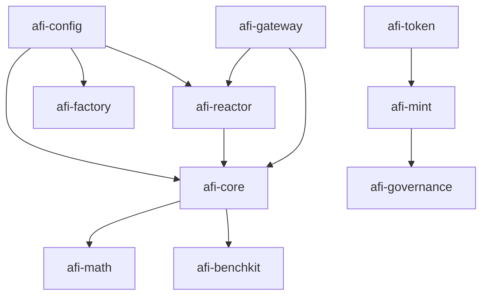
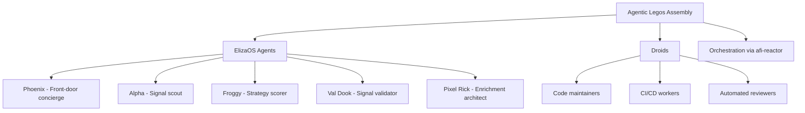

# AFI Agentic Legos Architecture Analysis

> ⚠️ Historical snapshot. The legacy Froggy demo chain (Alpha Scout → Pixel Rick → Val Dook → Execution Sim) was removed; the reactor is scored-only, executing analyst-configurable `afi.pipeline.v1` manifests from the governed afi-config registries (see `ARCHITECTURE_STATUS.md`; decision: afi-governance `decisions/factory-configurable-pipelines-v1.md`).

## Executive Summary

The AFI Protocol implements an "agentic legos" architecture where modular components (skills, agents, droids) can be assembled into intelligent systems. This analysis clarifies the relationships between afi-math, afi-benchkit, afi-core, and afi-reactor, along with the broader agent universe, agent playbook, and current implementation status.

## Core Relationships

### Repository Dependencies



### Agentic Legos Concept

**Agentic Legos** refers to the modular assembly of:
- **Skills**: Reusable capabilities with typed I/O
- **Agents**: ElizaOS personas that execute skills
- **Droids**: Automated workers that maintain the system
- **Orchestration** (afi-reactor): DAG-based pipeline coordination

## Detailed Component Analysis

### afi-core (Runtime Implementation)
- **Purpose**: Core runtime for validators, scoring, signal processing
- **Dependencies**:
  - afi-config: Schemas and governance rules
  - afi-math: Mathematical functions for scoring/decay
- **Consumed by**: afi-reactor (orchestration), afi-gateway (types/clients)
- **Current Status**: Implements validator logic, signal scoring, enrichment adapters

### afi-math (Pure Mathematics)
- **Purpose**: Mathematical primitives for AFI Protocol
- **Provides**: Decay curves, UWR calculations, time-value functions
- **Consumed by**: afi-core (validator scoring)
- **Current Status**: TypeScript implementation with comprehensive tests

### afi-benchkit (Benchmarking Toolkit)
- **Purpose**: Performance benchmarking for validators
- **Benchmarks**: PoI (Proof-of-Intelligence), PoInsight (Proof-of-Insight) scoring
- **Dependencies**: Consumes afi-core validator outputs
- **Current Status**: Python toolkit with deterministic harness, golden outputs

### afi-reactor (DAG Orchestrator)
- **Purpose**: 15-node signal processing pipeline orchestration
- **Architecture**: DAG-based with generators → analyzers → scorers → validators → executors
- **Dependencies**: afi-core (validators), afi-config (schemas)
- **Current Status**: Active development with branch divergence; validators incorrectly placed in DAG (should be external)

## Agent Universe Architecture

### Agent Types



### Agent Playbook (Runtime Governance)

The **Agent Playbook** governs ElizaOS agents that interact with AFI:

**Core Rules:**
1. **AFI is source of truth** - Agents call AFI APIs, don't reimplement logic
2. **Gateway boundary** - All AFI calls through afi-gateway
3. **Explicit sourcing** - Mark AFI data vs agent interpretation
4. **Safety over cleverness** - Admit uncertainty, no guessing
5. **No secrets/keys** - Agents aren't secure vaults

**Agent Roles:**
- **Phoenix**: Explains AFI, provides access to signals/scores
- **Mentor Agents**: Guide contributors through AFI workflows
- **Validator Agents**: Assist human validators with signal review

### Droid Governance

**Droids** are automated workers governed by the **Droid Charter**:
- Build and maintain AFI repos
- Operate in Git, CI/CD environments
- Follow strict rules about what they can/cannot modify
- Never interact directly with end users

**Coordination Contract:**
- Droids shape the machine (code, APIs, schemas)
- Agents speak for the machine (explain to users, call APIs)
- Agents don't edit code; droids don't talk to users

## Current Implementation Status

### Repository Maturity Levels

| Repository | Status | Key Features | Gaps |
|------------|--------|--------------|------|
| afi-core | HIGH | Validators, scoring, enrichment | Full integration testing |
| afi-math | HIGH | Decay models, UWR calc | Performance optimization |
| afi-benchkit | MEDIUM | PoI/PoInsight benchmarks | Integration with afi-core |
| afi-reactor | MEDIUM | DAG orchestration | Validator externalization, branch merge |
| afi-config | HIGH | Schemas, governance | Complete coverage |
| afi-factory | LOW | Templates, manifests | Implementation |
| afi-gateway | MEDIUM | Agent runtime | Full AFI integration |

### Critical Issues

1. **Validator Architecture Violation**: afi-reactor places validators as DAG nodes instead of external services
2. **Branch Divergence**: afi-reactor has unmerged feature branches with TSSD, Provenance, Replay
3. **Agent Assembly**: Factory templates exist but agent spawning logic incomplete

## Intended Design vs Current State

### Intended Agentic Legos Design

```
Skills → Factory Templates (afi-factory) → Agent Assembly → Orchestration (afi-reactor)
                                      ↓
                               ElizaOS Runtime (afi-gateway)
                                      ↓
                               Human Interaction (Agent Playbook)
```

### Current State Gaps

- **Skill Execution**: Skills defined but not fully executable in runtime
- **Agent Factory**: Templates exist but spawning logic incomplete
- **Orchestration Maturity**: DAG works but advanced features (TSSD, Replay) not merged
- **Integration Testing**: Cross-repo integration not fully validated

## Recommendations

### Immediate Actions
1. **Fix Validator Architecture**: Remove validators from afi-reactor DAG, implement as external services
2. **Merge afi-reactor Branches**: Consolidate TSSD, Provenance, Replay features into main
3. **Factory Implementation**: Complete agent spawning logic in afi-factory

### Long-term Vision
1. **Complete Agentic Legos**: Full skill → agent → orchestration pipeline
2. **Enhanced Benchmarking**: afi-benchkit integrated into CI/CD for all validators
3. **Runtime Skill Execution**: Skills executable in both DAG nodes and agent contexts
4. **Unified Governance**: Seamless coordination between droids and agents

## Conclusion

The AFI agentic legos architecture provides a solid foundation for modular intelligence assembly, with clear separation between skills (capabilities), agents (personas), droids (workers), and orchestration (coordination). Current implementation shows strong core components (afi-core, afi-math, afi-config) with gaps in integration and advanced features. The architecture supports the intended design but requires focused work on validator externalization, branch consolidation, and runtime skill execution to achieve full agentic legos capability.