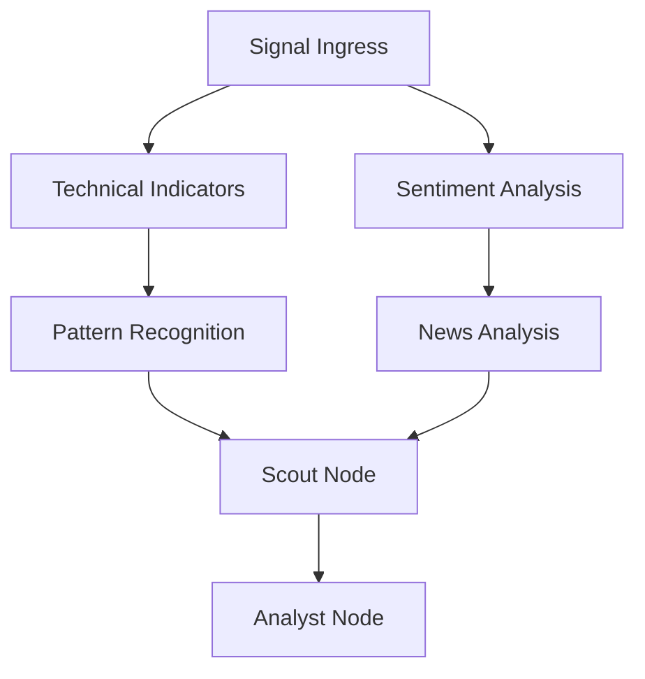
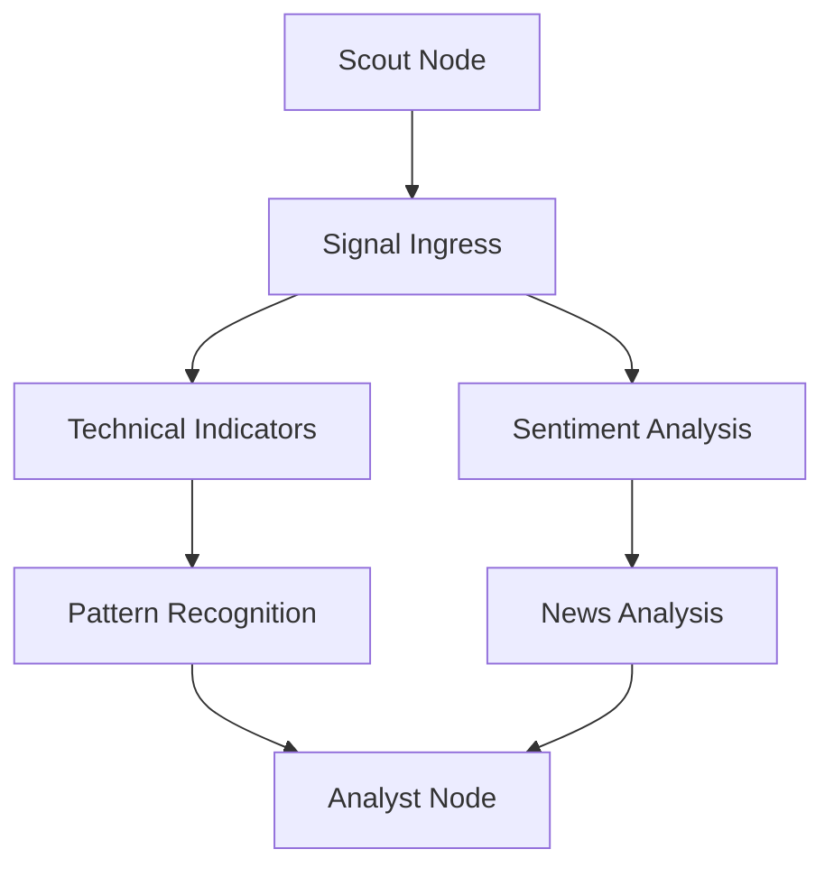

> **Historical note:** This document describes a superseded LangGraph-era architecture plan. AFI Reactor now uses a custom deterministic TypeScript DAG under `afi-reactor/src/dag/`. This file is retained only for historical context and should not be treated as current implementation guidance.
>

# AFI LangGraph Scout Node Refactoring Plan

**Version**: 1.0  
**Date**: 2025-12-26  
**Status**: Planning Phase  
**Target Mode**: Orchestrator

---

## Executive Summary

This plan outlines the refactoring of the AFI LangGraph architecture to correctly position the Scout node as a **pre-enrichment signal provider** rather than part of the enrichment stage. The Scout node should function as an independent signal source that feeds opportunities into the enrichment pipeline, where they are then processed and scored by the Analyst node.

### Key Objectives

1. **Reposition Scout as Independent Signal Ingress**: Scout nodes should execute BEFORE enrichment stage, not after
2. **Remove Scoring from Scout**: Scout nodes should NOT perform scoring - that's the Analyst's responsibility
3. **Enable Third-Party Scout Registration**: Any third party can register as a Scout, receive credentials, and submit signals for potential rewards
4. **Maintain Parallel Enrichment**: The enrichment stage should maintain its parallel processing capabilities as default but customizable
5. **Eliminate Unnecessary Dependencies**: Scout nodes should have no dependencies on enrichment nodes

---

## Current Architecture Analysis

### Problem Identification

#### Issue 1: Scout Node Positioned After Enrichment Stage

**Location**: [`afi-reactor/src/langgraph/__tests__/integration.test.ts:371-378`](afi-reactor/src/langgraph/__tests__/integration.test.ts:371-378)

```typescript
{
  id: 'scout',
  type: 'ingress',
  plugin: 'scout',
  enabled: true,
  dependencies: ['pattern-recognition', 'news'],  // ❌ WRONG: Scout depends on enrichment nodes
  config: {},
}
```

**Impact**: Scout node executes AFTER pattern-recognition and news enrichment nodes, which is architecturally incorrect.

#### Issue 2: Scout Node Performs Scoring

**Location**: [`afi-reactor/src/langgraph/plugins/ScoutNode.ts:70-71`](afi-reactor/src/langgraph/plugins/ScoutNode.ts:70-71)

```typescript
// Score discovered signals
const scoredSignals = this.scoreSignals(discoveredSignals);
```

**Impact**: Scout node is performing scoring logic, which should be the responsibility of the Analyst node.

#### Issue 3: Scout Node Type Confusion

**Location**: [`afi-reactor/src/langgraph/plugins/ScoutNode.ts:26`](afi-reactor/src/langgraph/plugins/ScoutNode.ts:26)

```typescript
type = 'ingress' as const,  // Correct type, but wrong positioning
```

**Impact**: While the type is correct (`ingress`), the node is positioned as if it were an enrichment node.

### Current DAG Flow (Incorrect)



**Problems**:
- Scout node depends on enrichment nodes (pattern-recognition, news)
- Scout executes AFTER enrichment stage
- Scout performs scoring before Analyst

### Correct DAG Flow (Target)



**Correct Behavior**:
- Scout node executes BEFORE enrichment stage
- Scout has NO dependencies on enrichment nodes
- Scout only discovers signals, does NOT score them
- Analyst node performs all scoring

---

## Refactoring Architecture

### New Node Type Classification

| Node Type | Position | Responsibilities | Dependencies |
|------------|-----------|------------------|---------------|
| **Scout** (ingress) | Pre-enrichment | Discover signals, submit to pipeline | None (independent) |
| **Signal Ingress** (ingress) | Pre-enrichment | Ingest external signals | Optional: Scout |
| **Enrichment** (enrichment) | Enrichment stage | Add features, context, metadata | Signal Ingress, other enrichment nodes |
| **Analyst** (required) | Post-enrichment | Score signals, generate narratives | All enrichment nodes |

### Scout Node Responsibilities (Refined)

**What Scout DOES**:
- Discover trading opportunities from external sources or AFI-native models
- Submit signals to the enrichment pipeline
- Store signal metadata (source, timestamp, origin kind)
- Track signal submission for reward attribution

**What Scout DOES NOT**:
- Enrich signals with features or context
- Score or analyze signals
- Validate or mint signals
- Depend on any enrichment nodes

### Analyst Node Responsibilities (Clarified)

**What Analyst DOES**:
- Load analyst configuration
- Initialize enrichment pipeline
- Aggregate enrichment results
- Score signals using ensemble ML models
- Generate narratives and interpretations
- Propose trading actions

**What Analyst DOES NOT**:
- Discover signals (that's Scout's job)
- Enrich signals (that's Enrichers' job)
- Validate or mint signals (that's Validator's job)

---

## Implementation Plan

### Phase 1: Core Node Refactoring

#### 1.1 Refactor ScoutNode.ts

**File**: [`afi-reactor/src/langgraph/plugins/ScoutNode.ts`](afi-reactor/src/langgraph/plugins/ScoutNode.ts)

**Changes**:
1. Remove `scoreSignals()` method entirely
2. Remove scoring logic from `execute()` method
3. Update node documentation to clarify Scout role
4. Ensure `dependencies` array is empty
5. Add signal submission tracking for reward attribution

**New ScoutNode Structure**:
```typescript
export class ScoutNode implements LangGraphNode {
  id = 'scout';
  type = 'ingress' as const;
  plugin = 'scout';
  parallel = true;
  dependencies: string[] = [];  // Empty - no dependencies

  async execute(state: LangGraphState): Promise<LangGraphState> {
    // 1. Scout for signals (discover opportunities)
    const discoveredSignals = await this.scoutForSignals(assetInfo);
    
    // 2. Store discovered signals (NO SCORING)
    state.enrichmentResults.set(this.id, {
      signals: discoveredSignals,
      totalSignals: discoveredSignals.length,
      discoveredAt: new Date().toISOString(),
      scoutId: this.getScoutId(),  // For reward attribution
    });
    
    return state;
  }

  // Removed: scoreSignals() method
}
```

#### 1.2 Update AnalystNode.ts

**File**: [`afi-reactor/src/langgraph/nodes/AnalystNode.ts`](afi-reactor/src/langgraph/nodes/AnalystNode.ts)

**Changes**:
1. Ensure Analyst node aggregates all enrichment results
2. Add scoring logic for signals from Scout nodes
3. Generate narratives based on enriched signals
4. Store scored signals in state

**New AnalystNode Structure**:
```typescript
export class AnalystNode implements LangGraphNode {
  id = 'analyst';
  type = 'required' as const;
  plugin = 'analyst';
  parallel = false;
  dependencies: string[] = [];  // Will be populated by DAGBuilder

  async execute(state: LangGraphState): Promise<LangGraphState> {
    // 1. Load analyst configuration
    const analystConfig = await loadAnalystConfig(state.analystConfig.analystId);
    
    // 2. Aggregate enrichment results
    const aggregatedResults = this.aggregateEnrichmentResults(state);
    
    // 3. Score signals (NEW: Scout signals are scored here)
    const scoredSignals = this.scoreSignals(aggregatedResults);
    
    // 4. Generate narratives
    const narratives = this.generateNarratives(scoredSignals);
    
    // 5. Store results
    state.enrichmentResults.set('scored-signal', scoredSignals);
    state.enrichmentResults.set('narratives', narratives);
    
    return state;
  }
}
```

### Phase 2: DAG Builder Modifications

#### 2.1 Update DAGBuilder to Handle Scout as Pre-Enrichment Node

**File**: [`afi-reactor/src/langgraph/DAGBuilder.ts`](afi-reactor/src/langgraph/DAGBuilder.ts)

**Changes**:
1. Add validation to ensure Scout nodes have no dependencies
2. Add validation to ensure enrichment nodes don't depend on Scout nodes
3. Update topological sort to place Scout nodes at execution level 0
4. Add warnings if Scout nodes are incorrectly configured

**New Validation Logic**:
```typescript
private validateScoutNodePositioning(config: AnalystConfig): ValidationResult {
  const result: ValidationResult = {
    valid: true,
    errors: [],
    warnings: [],
  };

  for (const node of config.enrichmentNodes) {
    if (node.type === 'ingress' && node.plugin === 'scout') {
      // Scout nodes must have no dependencies
      if (node.dependencies && node.dependencies.length > 0) {
        result.valid = false;
        result.errors.push(
          `Scout node '${node.id}' has dependencies [${node.dependencies.join(', ')}]. ` +
          `Scout nodes must be independent signal sources with no dependencies.`
        );
      }
    } else if (node.type === 'enrichment') {
      // Enrichment nodes must not depend on Scout nodes
      if (node.dependencies && node.dependencies.some(dep => dep.startsWith('scout'))) {
        result.valid = false;
        result.errors.push(
          `Enrichment node '${node.id}' depends on Scout node. ` +
          `Enrichment nodes must not depend on Scout nodes.`
        );
      }
    }
  }

  return result;
}
```

#### 2.2 Update Execution Level Calculation

**File**: [`afi-reactor/src/langgraph/DAGBuilder.ts:482-517`](afi-reactor/src/langgraph/DAGBuilder.ts:482-517)

**Changes**:
1. Ensure Scout nodes are always at execution level 0
2. Ensure Signal Ingress nodes are at execution level 0 or 1 (if they depend on Scout)
3. Enrichment nodes start at level 1 or higher

### Phase 3: DAG Executor Modifications

#### 3.1 Update DAGExecutor to Handle Scout Execution

**File**: [`afi-reactor/src/langgraph/DAGExecutor.ts`](afi-reactor/src/langgraph/DAGExecutor.ts)

**Changes**:
1. Add special handling for Scout nodes (execute first, independently)
2. Ensure Scout nodes don't wait for any dependencies
3. Track Scout submissions for reward attribution
4. Add metrics for Scout node execution

**New Scout Execution Logic**:
```typescript
private async executeScoutNodes(context: ExecutionContext): Promise<void> {
  // Get all Scout nodes
  const scoutNodes = Array.from(context.dag.nodes.entries())
    .filter(([_, node]) => node.type === 'ingress' && node.plugin === 'scout');

  // Execute Scout nodes in parallel (they have no dependencies)
  const scoutPromises = scoutNodes.map(([nodeId, node]) => 
    this.executeNode(context, nodeId)
  );

  await Promise.all(scoutPromises);

  this.log(context, `Executed ${scoutNodes.length} Scout nodes`, 'info');
}
```

### Phase 4: Test Refactoring

#### 4.1 Update Integration Tests

**File**: [`afi-reactor/src/langgraph/__tests__/integration.test.ts`](afi-reactor/src/langgraph/__tests__/integration.test.ts)

**Changes**:
1. Update test configuration to position Scout correctly (lines 371-378)
2. Add tests for Scout node with no dependencies
3. Add tests for Scout node as independent signal source
4. Add tests for Analyst node scoring Scout signals
5. Add tests for third-party Scout registration

**New Test Configuration**:
```typescript
const config = createTestConfig([
  {
    id: 'scout',
    type: 'ingress',
    plugin: 'scout',
    enabled: true,
    dependencies: [],  // ✅ CORRECT: No dependencies
    config: {},
  },
  {
    id: 'signal-ingress',
    type: 'ingress',
    plugin: 'signal-ingress',
    enabled: true,
    dependencies: [],  // Can optionally depend on Scout
    config: {},
  },
  {
    id: 'technical-indicators',
    type: 'enrichment',
    plugin: 'technical-indicators',
    enabled: true,
    dependencies: ['signal-ingress'],
    config: {},
  },
  // ... other enrichment nodes
  {
    id: 'analyst',
    type: 'required',
    plugin: 'analyst',
    enabled: true,
    dependencies: ['technical-indicators', 'sentiment', 'news'],
    config: {},
  },
]);
```

#### 4.2 Add New Test Cases

1. **Test Scout Node Independence**: Verify Scout executes with no dependencies
2. **Test Scout Signal Submission**: Verify Scout submits signals correctly
3. **Test Analyst Scoring**: Verify Analyst scores Scout signals
4. **Test Parallel Enrichment**: Verify enrichment nodes run in parallel
5. **Test Third-Party Scout**: Verify external Scout can submit signals

### Phase 5: Configuration Updates

#### 5.1 Update Configuration Examples

**Files**:
- [`afi-config/examples/analyst-config.example.json`](afi-config/examples/analyst-config.example.json)
- [`afi-config/examples/enrichment-node.example.json`](afi-config/examples/enrichment-node.example.json)
- [`afi-config/examples/pipeline-langgraph.example.json`](afi-config/examples/pipeline-langgraph.example.json)

**Changes**:
1. Update examples to show Scout as pre-enrichment node
2. Remove Scout dependencies from enrichment nodes
3. Add Scout configuration examples
4. Add third-party Scout registration examples

**New Scout Configuration Example**:
```json
{
  "analystId": "crypto-analyst",
  "version": "v1.0.0",
  "enrichmentNodes": [
    {
      "id": "external-scout",
      "type": "ingress",
      "plugin": "scout",
      "enabled": true,
      "dependencies": [],
      "config": {
        "scoutId": "scout:tv-webhook-btc-perps:v1",
        "originKind": "external",
        "credential": "tv-webhook-credential-123"
      }
    },
    {
      "id": "signal-ingress",
      "type": "ingress",
      "plugin": "signal-ingress",
      "enabled": true,
      "dependencies": [],
      "config": {}
    },
    {
      "id": "technical-indicators",
      "type": "enrichment",
      "plugin": "technical-indicators",
      "enabled": true,
      "dependencies": ["signal-ingress"],
      "config": {}
    }
  ]
}
```

#### 5.2 Update Schema Definitions

**Files**:
- [`afi-config/schemas/analyst-config.schema.json`](afi-config/schemas/analyst-config.schema.json)
- [`afi-config/schemas/definitions/enrichment-node.schema.json`](afi-config/schemas/definitions/enrichment-node.schema.json)

**Changes**:
1. Add Scout-specific configuration fields
2. Add validation for Scout node dependencies
3. Add third-party Scout registration fields

### Phase 6: Documentation Updates

#### 6.1 Update AFI Agent Taxonomy

**File**: [`afi-config/docs/AFI_AGENT_TAXONOMY.v0.1.md`](afi-config/docs/AFI_AGENT_TAXONOMY.v0.1.md)

**Changes**:
1. Clarify Scout role as independent signal source
2. Emphasize Scout executes BEFORE enrichment stage
3. Add third-party Scout registration information
4. Update Scout examples

#### 6.2 Update README Files

**Files**:
- [`afi-reactor/README.md`](afi-reactor/README.md)
- [`AFI_REACTOR_LANGGRAPH_IMPLEMENTATION_PLAN.md`](AFI_REACTOR_LANGGRAPH_IMPLEMENTATION_PLAN.md)

**Changes**:
1. Update DAG diagrams to show Scout as pre-enrichment node
2. Update node descriptions
3. Add Scout registration guide
4. Update architecture diagrams

### Phase 7: Migration Guide

#### 7.1 Create Migration Guide

**File**: `afi-reactor/docs/SCOUT_NODE_MIGRATION_GUIDE.md`

**Content**:
1. Overview of changes
2. Breaking changes for existing configurations
3. Step-by-step migration instructions
4. Example before/after configurations
5. Testing checklist

**Migration Steps**:
1. Remove Scout node dependencies from enrichment nodes
2. Remove scoring logic from Scout node implementations
3. Move scoring logic to Analyst node
4. Update configuration files
5. Run integration tests
6. Verify parallel enrichment still works

---

## Validation & Testing

### Test Coverage Requirements

| Test Category | Test Cases | Status |
|---------------|-------------|--------|
| Scout Node Independence | Scout executes with no dependencies | Pending |
| Scout Signal Submission | Scout submits signals correctly | Pending |
| Analyst Scoring | Analyst scores Scout signals | Pending |
| Parallel Enrichment | Enrichment nodes run in parallel | Pending |
| Third-Party Scout | External Scout can submit signals | Pending |
| DAG Validation | Invalid Scout configurations are rejected | Pending |
| Execution Order | Scout executes before enrichment | Pending |
| Reward Attribution | Scout submissions are tracked | Pending |

### Integration Test Scenarios

1. **Scenario 1: Scout as Independent Signal Source**
   - Scout node executes with no dependencies
   - Scout submits signals to pipeline
   - Signals flow to enrichment stage

2. **Scenario 2: Parallel Enrichment After Scout**
   - Scout executes first
   - Multiple enrichment nodes execute in parallel
   - Analyst aggregates and scores results

3. **Scenario 3: Third-Party Scout Registration**
   - External Scout registers with network
   - Scout receives credentials
   - Scout submits signals for rewards

4. **Scenario 4: Invalid Scout Configuration**
   - Scout with dependencies is rejected
   - Enrichment node depending on Scout is rejected
   - Appropriate error messages are shown

---

## Risk Assessment

### High-Risk Areas

| Risk | Impact | Mitigation |
|-------|---------|------------|
| Breaking existing configurations | High | Provide migration guide, maintain backward compatibility where possible |
| Parallel enrichment regression | Medium | Comprehensive testing of parallel execution |
| Third-party Scout integration issues | Medium | Clear documentation, registration API validation |
| Reward attribution errors | Medium | Thorough testing of Scout submission tracking |

### Mitigation Strategies

1. **Backward Compatibility**: Support old Scout configurations with deprecation warnings
2. **Comprehensive Testing**: Extensive test coverage before deployment
3. **Documentation**: Clear migration guide and examples
4. **Validation**: Strict validation to prevent misconfiguration

---

## Success Criteria

### Functional Requirements

- [ ] Scout nodes execute with no dependencies
- [ ] Scout nodes do not perform scoring
- [ ] Scout nodes submit signals to enrichment pipeline
- [ ] Analyst nodes score Scout signals
- [ ] Enrichment nodes execute in parallel (default)
- [ ] Third-party Scouts can register and submit signals
- [ ] Scout submissions are tracked for reward attribution

### Non-Functional Requirements

- [ ] No performance regression in DAG execution
- [ ] Parallel enrichment performance is maintained
- [ ] Configuration validation prevents misconfiguration
- [ ] Clear error messages for invalid configurations
- [ ] Comprehensive test coverage (>90%)

### Documentation Requirements

- [ ] Migration guide is complete and tested
- [ ] API documentation is updated
- [ ] Architecture diagrams are accurate
- [ ] Examples are provided for common use cases

---

## Implementation Timeline

### Phase 1: Core Node Refactoring (2-3 days)
- Day 1: Refactor ScoutNode.ts
- Day 2: Update AnalystNode.ts
- Day 3: Unit tests for refactored nodes

### Phase 2: DAG Builder Modifications (1-2 days)
- Day 1: Add Scout validation logic
- Day 2: Update execution level calculation

### Phase 3: DAG Executor Modifications (1 day)
- Day 1: Add Scout execution handling

### Phase 4: Test Refactoring (2-3 days)
- Day 1: Update integration tests
- Day 2: Add new test cases
- Day 3: Run full test suite

### Phase 5: Configuration Updates (1 day)
- Day 1: Update examples and schemas

### Phase 6: Documentation Updates (1-2 days)
- Day 1: Update taxonomy and README
- Day 2: Create migration guide

### Phase 7: Validation & Deployment (1-2 days)
- Day 1: Run comprehensive tests
- Day 2: Deploy and monitor

**Total Estimated Time**: 9-14 days

---

## Dependencies

### Internal Dependencies
- [`afi-reactor/src/langgraph/DAGBuilder.ts`](afi-reactor/src/langgraph/DAGBuilder.ts)
- [`afi-reactor/src/langgraph/DAGExecutor.ts`](afi-reactor/src/langgraph/DAGExecutor.ts)
- [`afi-reactor/src/langgraph/plugins/ScoutNode.ts`](afi-reactor/src/langgraph/plugins/ScoutNode.ts)
- [`afi-reactor/src/langgraph/nodes/AnalystNode.ts`](afi-reactor/src/langgraph/nodes/AnalystNode.ts)

### External Dependencies
- [`afi-config/docs/AFI_AGENT_TAXONOMY.v0.1.md`](afi-config/docs/AFI_AGENT_TAXONOMY.v0.1.md)
- [`afi-config/schemas/analyst-config.schema.json`](afi-config/schemas/analyst-config.schema.json)
- [`afi-config/examples/analyst-config.example.json`](afi-config/examples/analyst-config.example.json)

---

## Next Steps

1. **Review and Approve Plan**: Stakeholders review this plan
2. **Switch to Orchestrator Mode**: Request mode switch to begin implementation
3. **Execute Implementation**: Follow phases in order
4. **Continuous Validation**: Test after each phase
5. **Deploy and Monitor**: Deploy changes and monitor for issues

---

## Appendix

### A. Current Scout Node Issues Summary

| Issue | Location | Severity | Fix |
|-------|-----------|------------|------|
| Scout depends on enrichment nodes | integration.test.ts:376 | Critical | Remove dependencies |
| Scout performs scoring | ScoutNode.ts:70-71 | High | Remove scoring logic |
| Scout positioned after enrichment | integration.test.ts:371-378 | Critical | Reposition to level 0 |

### B. Key Architectural Principles

1. **Separation of Concerns**: Each node has a single, well-defined responsibility
2. **Independent Signal Sources**: Scout nodes are independent and have no dependencies
3. **Explicit Scoring**: Only Analyst nodes perform scoring
4. **Parallel by Default**: Enrichment nodes execute in parallel unless configured otherwise
5. **Third-Party Friendly**: External parties can register as Scouts

### C. References

- AFI Agent Taxonomy: [`afi-config/docs/AFI_AGENT_TAXONOMY.v0.1.md`](afi-config/docs/AFI_AGENT_TAXONOMY.v0.1.md)
- LangGraph Implementation Plan: [`AFI_REACTOR_LANGGRAPH_IMPLEMENTATION_PLAN.md`](AFI_REACTOR_LANGGRAPH_IMPLEMENTATION_PLAN.md)
- DAG Configuration: [`afi-reactor/config/dag.codex.json`](afi-reactor/config/dag.codex.json)

---

**Document Status**: Ready for Review  
**Next Action**: Request stakeholder approval and switch to Orchestrator mode
