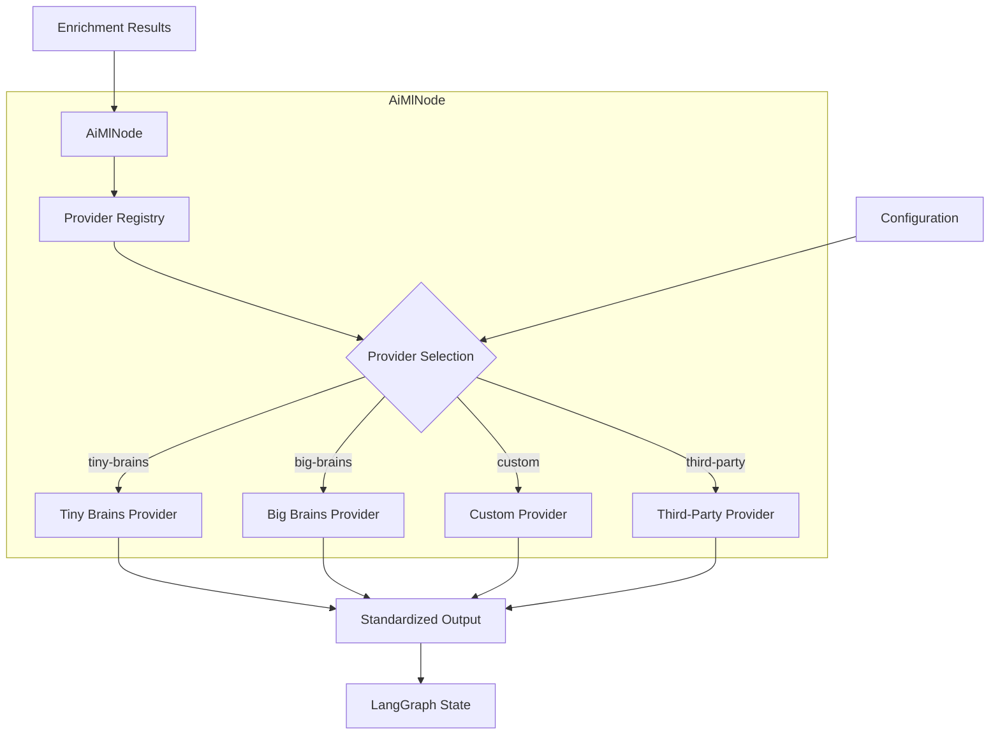
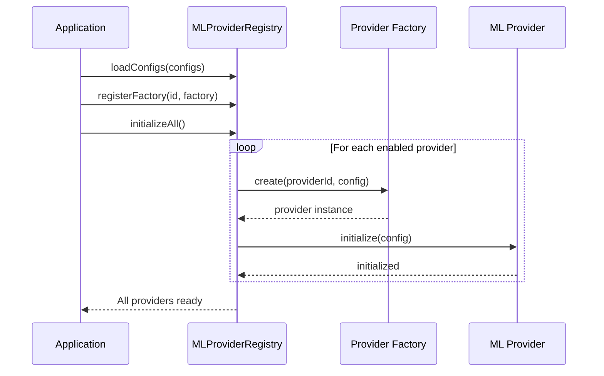
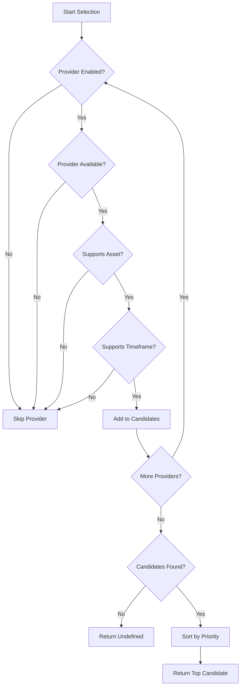
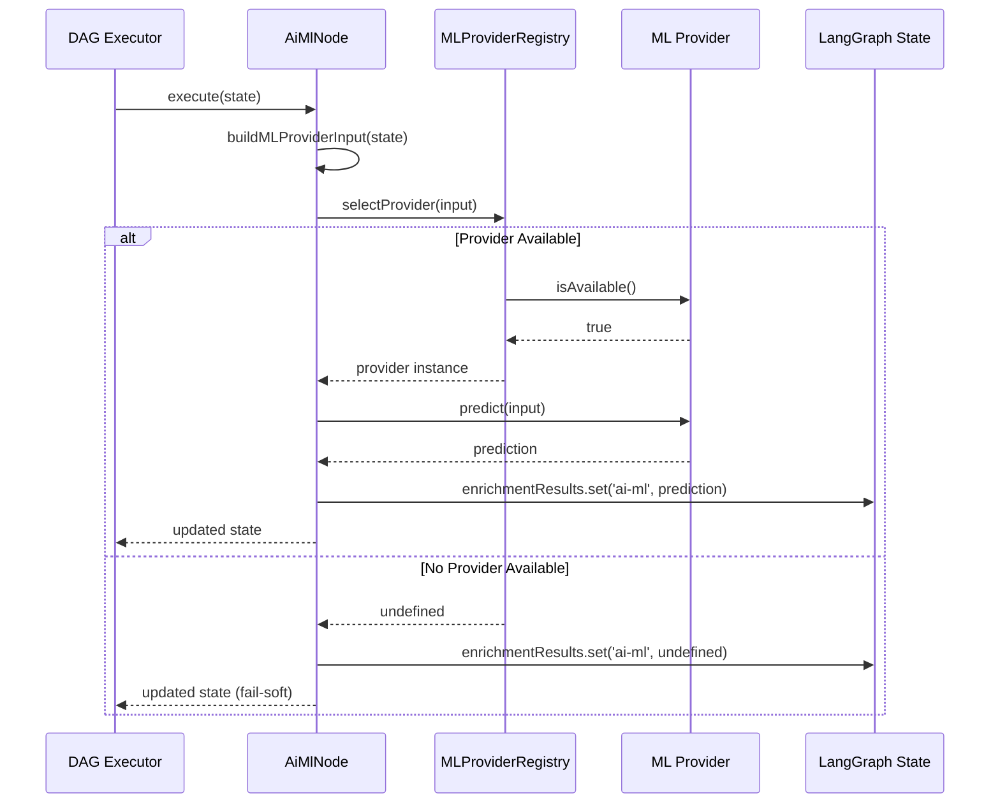
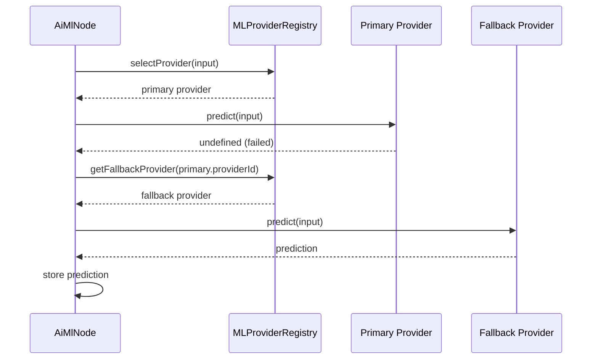
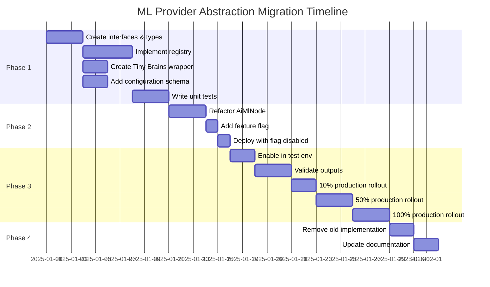

> **Historical note:** This document describes a superseded LangGraph-era architecture plan. AFI Reactor now uses a custom deterministic TypeScript DAG under `afi-reactor/src/dag/`. This file is retained only for historical context and should not be treated as current implementation guidance.
>

# AFI ML Provider Abstraction Layer - Architecture Design

## Executive Summary

This document defines the architecture for an AI/ML provider abstraction layer that enables the AiMlNode to support multiple ML providers (Tiny Brains, custom local models, third-party services) through a unified interface. The design maintains backward compatibility with the existing Tiny Brains integration while providing flexibility for future provider additions.

## Table of Contents

1. [Current State Analysis](#current-state-analysis)
2. [Architecture Overview](#architecture-overview)
3. [Provider Interface Design](#provider-interface-design)
4. [Provider Registry Architecture](#provider-registry-architecture)
5. [Configuration Schema](#configuration-schema)
6. [Component Interactions](#component-interactions)
7. [Migration Path](#migration-path)
8. [Provider Implementations](#provider-implementations)
9. [Error Handling and Fail-Soft Behavior](#error-handling-and-fail-soft-behavior)
10. [Testing Strategy](#testing-strategy)

---

## Current State Analysis

### Existing Architecture

The current [`AiMlNode`](afi-reactor/src/langgraph/plugins/AiMlNode.ts:23) implementation is tightly coupled to the Tiny Brains service:

```typescript
// Current implementation
import { fetchAiMlForFroggy, type TinyBrainsFroggyInput } from '../../aiMl/tinyBrainsClient.js';

export class AiMlNode implements LangGraphNode {
  async execute(state: LangGraphState): Promise<LangGraphState> {
    const input = this.buildTinyBrainsInput(state);
    const aiMlPrediction = await fetchAiMlForFroggy(input);
    // ...
  }
}
```

### Key Characteristics

1. **Direct Dependency**: Directly imports and calls [`fetchAiMlForFroggy`](afi-reactor/src/aiMl/tinyBrainsClient.ts:77)
2. **Fail-Soft Behavior**: Returns `undefined` on errors without throwing
3. **Input Format**: Uses [`TinyBrainsFroggyInput`](afi-reactor/src/aiMl/tinyBrainsClient.ts:24) with technical, pattern, sentiment, and news features
4. **Output Format**: Returns [`FroggyAiMlV1`](afi-core/analysts/froggy.enrichment_adapter.ts:91) (convictionScore, direction, regime, riskFlag, notes)
5. **State Storage**: Stores results in `state.enrichmentResults.set('ai-ml', ...)`

### Limitations

- Cannot switch between ML providers without code changes
- No standardized interface for adding new providers
- Configuration is hardcoded (environment variables only)
- No provider selection mechanism at runtime

---

## Architecture Overview

### Design Goals

1. **Provider Abstraction**: Define a clear contract for ML prediction services
2. **Extensibility**: Enable easy addition of new ML providers
3. **Configuration-Driven**: Allow provider selection via configuration
4. **Backward Compatibility**: Maintain existing Tiny Brains integration
5. **Fail-Soft Behavior**: Ensure all providers handle errors gracefully
6. **Standardized I/O**: Consistent input/output format across providers

### High-Level Architecture



### Key Components

1. **ML Provider Interface**: Contract that all ML providers must implement
2. **Provider Registry**: Central registry for registering and retrieving providers
3. **Provider Implementations**: Concrete implementations for each ML service
4. **Configuration Schema**: Schema for provider selection and configuration
5. **AiMlNode Refactor**: Updated node that uses the provider abstraction

---

## Provider Interface Design

### Core Interface

```typescript
/**
 * ML Provider Interface
 *
 * Defines the contract for all ML prediction providers.
 * All providers must implement this interface to be compatible with AiMlNode.
 */
export interface MLProvider {
  /**
   * Unique identifier for this provider
   */
  readonly providerId: string;

  /**
   * Human-readable name for this provider
   */
  readonly providerName: string;

  /**
   * Provider version
   */
  readonly version: string;

  /**
   * Provider capabilities
   */
  readonly capabilities: MLProviderCapabilities;

  /**
   * Initialize the provider with configuration
   *
   * @param config - Provider-specific configuration
   * @returns Promise that resolves when initialization is complete
   * @throws Error if initialization fails
   */
  initialize(config: unknown): Promise<void>;

  /**
   * Check if the provider is available and ready to serve requests
   *
   * @returns Promise that resolves to true if provider is available
   */
  isAvailable(): Promise<boolean>;

  /**
   * Generate ML predictions for the given input
   *
   * @param input - Standardized ML input containing enrichment features
   * @returns Promise that resolves to ML prediction or undefined if unavailable
   *
   * Fail-soft behavior:
   * - Returns undefined if provider is unavailable
   * - Returns undefined if prediction fails
   * - Never throws exceptions
   */
  predict(input: MLProviderInput): Promise<MLProviderOutput | undefined>;

  /**
   * Get provider health status
   *
   * @returns Promise that resolves to health status
   */
  getHealth(): Promise<MLProviderHealth>;

  /**
   * Cleanup provider resources
   *
   * @returns Promise that resolves when cleanup is complete
   */
  dispose(): Promise<void>;
}
```

### Supporting Types

```typescript
/**
 * ML Provider Capabilities
 *
 * Defines what features and capabilities a provider supports
 */
export interface MLProviderCapabilities {
  /**
   * Supported asset classes
   */
  supportedAssets: string[];

  /**
   * Supported timeframes
   */
  supportedTimeframes: string[];

  /**
   * Whether provider supports batch predictions
   */
  supportsBatch: boolean;

  /**
   * Whether provider supports streaming predictions
   */
  supportsStreaming: boolean;

  /**
   * Maximum input size (in bytes)
   */
  maxInputSize?: number;

  /**
   * Maximum batch size
   */
  maxBatchSize?: number;

  /**
   * Provider-specific metadata
   */
  metadata?: Record<string, unknown>;
}

/**
 * ML Provider Input
 *
 * Standardized input format for all ML providers.
 * This format is provider-agnostic and contains all enrichment features.
 */
export interface MLProviderInput {
  /**
   * Signal identifier
   */
  signalId: string;

  /**
   * Trading symbol (e.g., "BTC", "ETH")
   */
  symbol: string;

  /**
   * Timeframe (e.g., "1h", "4h", "1d")
   */
  timeframe: string;

  /**
   * Optional trace ID for observability
   */
  traceId?: string;

  /**
   * Technical indicators features
   */
  technical: {
    emaDistancePct?: number | null;
    isInValueSweetSpot?: boolean | null;
    brokeEmaWithBody?: boolean | null;
    indicators?: Record<string, number | null> | null;
  };

  /**
   * Pattern recognition features
   */
  pattern: {
    patternName?: string | null;
    patternConfidence?: number | null;
    regime?: unknown;
  };

  /**
   * Sentiment analysis features
   */
  sentiment: {
    score?: number | null;
    tags?: string[] | null;
  };

  /**
   * News analysis features
   */
  newsFeatures: {
    hasNewsShock: boolean;
    headlineCount: number;
    mostRecentMinutesAgo: number | null;
    oldestMinutesAgo: number | null;
    hasExchangeEvent: boolean;
    hasRegulatoryEvent: boolean;
    hasMacroEvent: boolean;
  };

  /**
   * Provider-specific parameters
   */
  providerParams?: Record<string, unknown>;
}

/**
 * ML Provider Output
 *
 * Standardized output format for all ML providers.
 * This format is compatible with FroggyAiMlV1 from afi-core.
 */
export interface MLProviderOutput {
  /**
   * Confidence in the suggested direction (0-1 range)
   */
  convictionScore: number;

  /**
   * Suggested trade direction from ML model
   */
  direction: 'long' | 'short' | 'neutral';

  /**
   * Optional market regime detected by model
   */
  regime?: string;

  /**
   * True if model detects elevated risk conditions
   */
  riskFlag?: boolean;

  /**
   * Optional human-readable notes or explanation from model
   */
  notes?: string | null;

  /**
   * Provider that generated this prediction
   */
  providerId: string;

  /**
   * Timestamp when prediction was generated
   */
  timestamp: string;

  /**
   * Optional provider-specific metadata
   */
  providerMetadata?: Record<string, unknown>;
}

/**
 * ML Provider Health Status
 *
 * Health status information for a provider
 */
export interface MLProviderHealth {
  /**
   * Whether provider is healthy
   */
  healthy: boolean;

  /**
   * Health check timestamp
   */
  timestamp: string;

  /**
   * Optional health message
   */
  message?: string;

  /**
   * Optional error details if unhealthy
   */
  error?: {
    code: string;
    message: string;
    details?: unknown;
  };

  /**
   * Optional metrics
   */
  metrics?: {
    averageResponseTime?: number;
    successRate?: number;
    requestCount?: number;
    errorCount?: number;
  };
}

/**
 * ML Provider Configuration
 *
 * Configuration for a specific ML provider
 */
export interface MLProviderConfig {
  /**
   * Provider identifier
   */
  providerId: string;

  /**
   * Whether this provider is enabled
   */
  enabled: boolean;

  /**
   * Provider-specific configuration
   */
  config?: Record<string, unknown>;

  /**
   * Priority for provider selection (higher = preferred)
   */
  priority?: number;

  /**
   * Fallback provider if this provider fails
   */
  fallbackProviderId?: string;
}
```

### Provider Factory Interface

```typescript
/**
 * ML Provider Factory
 *
 * Factory interface for creating provider instances
 */
export interface MLProviderFactory {
  /**
   * Create a new provider instance
   *
   * @param providerId - Provider identifier
   * @param config - Provider configuration
   * @returns Provider instance
   */
  create(providerId: string, config: unknown): MLProvider;

  /**
   * Get supported provider IDs
   *
   * @returns Array of supported provider IDs
   */
  getSupportedProviders(): string[];
}
```

---

## Provider Registry Architecture

### Registry Design

```typescript
/**
 * ML Provider Registry
 *
 * Central registry for managing ML providers.
 * Handles registration, retrieval, and lifecycle management of providers.
 */
export class MLProviderRegistry {
  private providers: Map<string, MLProvider>;
  private factories: Map<string, MLProviderFactory>;
  private configs: Map<string, MLProviderConfig>;
  private initialized: boolean;

  /**
   * Register a provider factory
   *
   * @param providerId - Provider identifier
   * @param factory - Provider factory
   */
  registerFactory(providerId: string, factory: MLProviderFactory): void;

  /**
   * Register a provider instance
   *
   * @param provider - Provider instance
   */
  registerProvider(provider: MLProvider): void;

  /**
   * Get a provider by ID
   *
   * @param providerId - Provider identifier
   * @returns Provider instance or undefined if not found
   */
  getProvider(providerId: string): MLProvider | undefined;

  /**
   * Get all registered providers
   *
   * @returns Array of all registered providers
   */
  getAllProviders(): MLProvider[];

  /**
   * Get enabled providers
   *
   * @returns Array of enabled providers
   */
  getEnabledProviders(): MLProvider[];

  /**
   * Get available providers (enabled and healthy)
   *
   * @returns Promise that resolves to array of available providers
   */
  getAvailableProviders(): Promise<MLProvider[]>;

  /**
   * Select the best provider for a given request
   *
   * Selection criteria:
   * 1. Provider must be enabled
   * 2. Provider must be available (healthy)
   * 3. Provider must support the requested asset/timeframe
   * 4. Provider with highest priority is selected
   *
   * @param input - ML provider input
   * @returns Promise that resolves to selected provider or undefined
   */
  selectProvider(input: MLProviderInput): Promise<MLProvider | undefined>;

  /**
   * Initialize all registered providers
   *
   * @returns Promise that resolves when all providers are initialized
   */
  initializeAll(): Promise<void>;

  /**
   * Dispose all registered providers
   *
   * @returns Promise that resolves when all providers are disposed
   */
  disposeAll(): Promise<void>;

  /**
   * Load provider configurations
   *
   * @param configs - Array of provider configurations
   */
  loadConfigs(configs: MLProviderConfig[]): void;

  /**
   * Get health status for all providers
   *
   * @returns Promise that resolves to map of provider health status
   */
  getAllHealth(): Promise<Map<string, MLProviderHealth>>;
}
```

### Registry Initialization Flow



### Provider Selection Algorithm



---

## Configuration Schema

### Provider Configuration Schema

```typescript
/**
 * ML Provider Configuration Schema
 *
 * JSON Schema for validating ML provider configurations
 */
export const MLProviderConfigSchema = {
  type: 'object',
  properties: {
    defaultProvider: {
      type: 'string',
      description: 'Default provider ID to use if not specified',
      enum: ['tiny-brains', 'big-brains', 'custom', 'third-party']
    },
    providers: {
      type: 'array',
      description: 'Array of provider configurations',
      items: {
        type: 'object',
        properties: {
          providerId: {
            type: 'string',
            description: 'Unique provider identifier'
          },
          enabled: {
            type: 'boolean',
            description: 'Whether this provider is enabled',
            default: true
          },
          priority: {
            type: 'number',
            description: 'Priority for provider selection (higher = preferred)',
            default: 0
          },
          fallbackProviderId: {
            type: 'string',
            description: 'Fallback provider if this provider fails'
          },
          config: {
            type: 'object',
            description: 'Provider-specific configuration',
            properties: {
              // Tiny Brains specific
              tinyBrainsUrl: {
                type: 'string',
                description: 'Tiny Brains service URL'
              },
              tinyBrainsTimeout: {
                type: 'number',
                description: 'Request timeout in milliseconds',
                default: 1500
              },
              
              // Big Brains specific
              bigBrainsModelPath: {
                type: 'string',
                description: 'Path to Big Brains model file'
              },
              bigBrainsDevice: {
                type: 'string',
                description: 'Device to run model on (cpu, cuda, mps)',
                enum: ['cpu', 'cuda', 'mps'],
                default: 'cpu'
              },
              
              // Custom provider specific
              customEndpoint: {
                type: 'string',
                description: 'Custom provider endpoint URL'
              },
              customApiKey: {
                type: 'string',
                description: 'API key for custom provider'
              },
              
              // Third-party provider specific
              thirdPartyService: {
                type: 'string',
                description: 'Third-party service name'
              },
              thirdPartyConfig: {
                type: 'object',
                description: 'Third-party service configuration'
              }
            }
          }
        },
        required: ['providerId', 'enabled']
      }
    },
    fallbackStrategy: {
      type: 'string',
      description: 'Fallback strategy when primary provider fails',
      enum: ['none', 'next-available', 'specific'],
      default: 'next-available'
    },
    healthCheckInterval: {
      type: 'number',
      description: 'Health check interval in milliseconds',
      default: 60000
    },
    enableHealthChecks: {
      type: 'boolean',
      description: 'Whether to enable periodic health checks',
      default: true
    }
  },
  required: ['defaultProvider', 'providers']
};
```

### Example Configuration

```json
{
  "defaultProvider": "tiny-brains",
  "fallbackStrategy": "next-available",
  "healthCheckInterval": 60000,
  "enableHealthChecks": true,
  "providers": [
    {
      "providerId": "tiny-brains",
      "enabled": true,
      "priority": 100,
      "fallbackProviderId": "big-brains",
      "config": {
        "tinyBrainsUrl": "https://tiny-brains.example.com",
        "tinyBrainsTimeout": 1500
      }
    },
    {
      "providerId": "big-brains",
      "enabled": true,
      "priority": 50,
      "config": {
        "bigBrainsModelPath": "/models/big-brains-v1.onnx",
        "bigBrainsDevice": "cpu"
      }
    },
    {
      "providerId": "custom",
      "enabled": false,
      "priority": 0,
      "config": {
        "customEndpoint": "https://custom-ml.example.com/predict",
        "customApiKey": "${CUSTOM_API_KEY}"
      }
    }
  ]
}
```

### Configuration Loading

```typescript
/**
 * ML Provider Configuration Loader
 *
 * Loads and validates ML provider configurations from various sources
 */
export class MLProviderConfigLoader {
  /**
   * Load configuration from environment variables
   *
   * Environment variables:
   * - AFI_ML_DEFAULT_PROVIDER: Default provider ID
   * - AFI_ML_TINY_BRAINS_URL: Tiny Brains URL
   * - AFI_ML_BIG_BRAINS_MODEL_PATH: Big Brains model path
   *
   * @returns Provider configuration
   */
  loadFromEnv(): MLProviderConfig;

  /**
   * Load configuration from JSON file
   *
   * @param filePath - Path to configuration file
   * @returns Provider configuration
   */
  loadFromFile(filePath: string): MLProviderConfig;

  /**
   * Load configuration from object
   *
   * @param config - Configuration object
   * @returns Provider configuration
   */
  loadFromObject(config: unknown): MLProviderConfig;

  /**
   * Validate configuration against schema
   *
   * @param config - Configuration to validate
   * @returns Validation result
   */
  validate(config: unknown): ValidationResult;
}
```

---

## Component Interactions

### AiMlNode Refactor

```typescript
/**
 * Refactored AiMlNode with Provider Abstraction
 *
 * The AiMlNode now uses the ML provider registry instead of
 * directly calling Tiny Brains service.
 */
export class AiMlNode implements LangGraphNode {
  id = 'ai-ml';
  type = 'enrichment' as const;
  plugin = 'ai-ml';
  parallel = true;
  dependencies: string[] = ['technical-indicators', 'pattern-recognition', 'sentiment', 'news'];

  private providerRegistry: MLProviderRegistry;
  private config: MLProviderConfig;

  constructor(
    providerRegistry: MLProviderRegistry,
    config: MLProviderConfig
  ) {
    this.providerRegistry = providerRegistry;
    this.config = config;
  }

  async execute(state: LangGraphState): Promise<LangGraphState> {
    const startTime = Date.now();
    const startTimeIso = new Date(startTime).toISOString();

    const traceEntry = {
      nodeId: this.id,
      nodeType: this.type,
      startTime: startTimeIso,
      status: 'running' as const,
    };

    try {
      // Build standardized ML input
      const input = this.buildMLProviderInput(state);

      // Select provider
      const provider = await this.providerRegistry.selectProvider(input);

      if (!provider) {
        console.warn(`[AiMlNode] No available ML provider for signal ${state.signalId}`);
        this.storeFailureResult(state, traceEntry, startTime, 'No available provider');
        return state;
      }

      // Get prediction from provider
      const prediction = await provider.predict(input);

      if (!prediction) {
        console.warn(`[AiMlNode] Provider ${provider.providerId} returned no prediction`);
        this.storeFailureResult(state, traceEntry, startTime, 'Provider returned no prediction');
        return state;
      }

      // Store prediction in enrichment results
      state.enrichmentResults.set(this.id, {
        aiMl: prediction,
        serviceAvailable: true,
        providerId: provider.providerId,
        timestamp: new Date().toISOString(),
      });

      // Update trace entry with completion status
      const endTime = Date.now();
      const endTimeIso = new Date(endTime).toISOString();
      const duration = endTime - startTime;

      const completedTraceEntry = {
        ...traceEntry,
        endTime: endTimeIso,
        duration,
        status: 'completed' as const,
      };

      state.metadata.trace.push(completedTraceEntry);

      return state;
    } catch (error) {
      // Update trace entry with failure status
      this.storeFailureResult(state, traceEntry, startTime, error);
      return state;
    }
  }

  private buildMLProviderInput(state: LangGraphState): MLProviderInput {
    const technical = state.enrichmentResults.get('technical-indicators') as any;
    const pattern = state.enrichmentResults.get('pattern-recognition') as any;
    const sentiment = state.enrichmentResults.get('sentiment') as any;
    const news = state.enrichmentResults.get('news') as any;

    return {
      signalId: state.signalId,
      symbol: this.extractSymbol(state.rawSignal),
      timeframe: this.extractTimeframe(state.rawSignal),
      traceId: state.signalId,
      technical: this.extractTechnicalFeatures(technical),
      pattern: this.extractPatternFeatures(pattern),
      sentiment: this.extractSentimentFeatures(sentiment),
      newsFeatures: this.extractNewsFeatures(news),
    };
  }

  private storeFailureResult(
    state: LangGraphState,
    traceEntry: any,
    startTime: number,
    error: unknown
  ): void {
    const endTime = Date.now();
    const endTimeIso = new Date(endTime).toISOString();
    const duration = endTime - startTime;

    const failedTraceEntry = {
      ...traceEntry,
      endTime: endTimeIso,
      duration,
      status: 'failed' as const,
      error: error instanceof Error ? error.message : String(error),
    };

    state.metadata.trace.push(failedTraceEntry);

    // Store failure result
    state.enrichmentResults.set(this.id, {
      aiMl: undefined,
      serviceAvailable: false,
      providerId: null,
      timestamp: new Date().toISOString(),
    });
  }

  // Existing helper methods remain unchanged
  private extractSymbol(rawSignal: unknown): string { /* ... */ }
  private extractTimeframe(rawSignal: unknown): string { /* ... */ }
  private extractTechnicalFeatures(technical: any): any { /* ... */ }
  private extractPatternFeatures(pattern: any): any { /* ... */ }
  private extractSentimentFeatures(sentiment: any): any { /* ... */ }
  private extractNewsFeatures(news: any): any { /* ... */ }
}
```

### Interaction Flow



### Fallback Flow



---

## Migration Path

### Phase 1: Foundation (Non-Breaking)

**Objective**: Create provider abstraction without changing existing behavior

1. Create new provider interfaces and types
2. Implement MLProviderRegistry
3. Create TinyBrainsProvider wrapper around existing client
4. Add configuration schema
5. Write unit tests for new components

**Deliverables**:
- [`MLProvider`](afi-reactor/src/aiMl/providers/MLProvider.ts) interface
- [`MLProviderRegistry`](afi-reactor/src/aiMl/providers/MLProviderRegistry.ts) implementation
- [`TinyBrainsProvider`](afi-reactor/src/aiMl/providers/TinyBrainsProvider.ts) implementation
- Configuration schema and loader
- Unit tests

**Risk**: Low - No changes to existing code

### Phase 2: Dual Implementation (Backward Compatible)

**Objective**: Run both old and new implementations in parallel

1. Refactor AiMlNode to support both implementations
2. Add feature flag to switch between implementations
3. Deploy with feature flag disabled (old implementation)
4. Monitor metrics and logs

**Deliverables**:
- Updated [`AiMlNode`](afi-reactor/src/langgraph/plugins/AiMlNode.ts) with dual paths
- Feature flag configuration
- Monitoring and logging

**Risk**: Low - Old implementation still active

### Phase 3: Gradual Rollout

**Objective**: Gradually migrate to new implementation

1. Enable feature flag for test environment
2. Validate outputs match old implementation
3. Enable for 10% of production traffic
4. Monitor for issues
5. Gradually increase to 100%

**Deliverables**:
- A/B testing framework
- Comparison metrics
- Rollback procedures

**Risk**: Medium - New code in production

### Phase 4: Cleanup

**Objective**: Remove old implementation

1. Remove old Tiny Brains client direct calls
2. Remove feature flag
3. Update documentation
4. Deprecate old configuration format

**Deliverables**:
- Cleaned up codebase
- Updated documentation
- Migration guide

**Risk**: Low - New implementation proven

### Migration Timeline



### Rollback Plan

**Trigger Conditions**:
- Error rate increases by > 5%
- Prediction quality degrades
- Latency increases by > 50%
- Provider availability drops below 95%

**Rollback Steps**:
1. Disable feature flag immediately
2. Revert to old implementation
3. Investigate root cause
4. Fix issues
5. Restart migration from Phase 3

---

## Provider Implementations

### Tiny Brains Provider

```typescript
/**
 * Tiny Brains Provider
 *
 * Wrapper around existing Tiny Brains client.
 * Maintains backward compatibility with existing implementation.
 */
export class TinyBrainsProvider implements MLProvider {
  readonly providerId = 'tiny-brains';
  readonly providerName = 'Tiny Brains';
  readonly version = '1.0.0';

  readonly capabilities: MLProviderCapabilities = {
    supportedAssets: ['BTC', 'ETH', 'SOL', 'AVAX', 'MATIC'],
    supportedTimeframes: ['1m', '5m', '15m', '1h', '4h', '1d'],
    supportsBatch: false,
    supportsStreaming: false,
    maxInputSize: 10240, // 10KB
  };

  private config: TinyBrainsConfig;
  private initialized = false;

  async initialize(config: unknown): Promise<void> {
    this.config = config as TinyBrainsConfig;
    this.initialized = true;
  }

  async isAvailable(): Promise<boolean> {
    if (!this.initialized) {
      return false;
    }

    // Check if TINY_BRAINS_URL is configured
    const url = process.env.TINY_BRAINS_URL || this.config.tinyBrainsUrl;
    return !!url;
  }

  async predict(input: MLProviderInput): Promise<MLProviderOutput | undefined> {
    if (!this.initialized) {
      console.warn('[TinyBrainsProvider] Provider not initialized');
      return undefined;
    }

    // Convert MLProviderInput to TinyBrainsFroggyInput
    const tinyBrainsInput: TinyBrainsFroggyInput = {
      signalId: input.signalId,
      symbol: input.symbol,
      timeframe: input.timeframe,
      traceId: input.traceId,
      technical: input.technical,
      pattern: input.pattern,
      sentiment: input.sentiment,
      newsFeatures: input.newsFeatures,
    };

    // Call existing Tiny Brains client
    const prediction = await fetchAiMlForFroggy(tinyBrainsInput);

    if (!prediction) {
      return undefined;
    }

    // Convert FroggyAiMlV1 to MLProviderOutput
    return {
      convictionScore: prediction.convictionScore,
      direction: prediction.direction,
      regime: prediction.regime,
      riskFlag: prediction.riskFlag,
      notes: prediction.notes,
      providerId: this.providerId,
      timestamp: new Date().toISOString(),
    };
  }

  async getHealth(): Promise<MLProviderHealth> {
    const available = await this.isAvailable();
    
    return {
      healthy: available,
      timestamp: new Date().toISOString(),
      message: available ? 'Tiny Brains service is available' : 'Tiny Brains service is unavailable',
    };
  }

  async dispose(): Promise<void> {
    this.initialized = false;
  }
}
```

### Big Brains Provider (Custom Local Model)

```typescript
/**
 * Big Brains Provider
 *
 * Custom local model provider for "big brains" models.
 * Runs models locally using ONNX Runtime or similar.
 */
export class BigBrainsProvider implements MLProvider {
  readonly providerId = 'big-brains';
  readonly providerName = 'Big Brains';
  readonly version = '1.0.0';

  readonly capabilities: MLProviderCapabilities = {
    supportedAssets: ['BTC', 'ETH', 'SOL', 'AVAX', 'MATIC', 'DOT', 'ADA'],
    supportedTimeframes: ['1m', '5m', '15m', '1h', '4h', '1d'],
    supportsBatch: true,
    supportsStreaming: false,
    maxInputSize: 20480, // 20KB
    maxBatchSize: 10,
  };

  private config: BigBrainsConfig;
  private model: any; // ONNX model instance
  private initialized = false;

  async initialize(config: unknown): Promise<void> {
    this.config = config as BigBrainsConfig;
    
    // Load ONNX model
    // this.model = await ort.InferenceSession.create(this.config.bigBrainsModelPath);
    
    this.initialized = true;
  }

  async isAvailable(): Promise<boolean> {
    return this.initialized && this.model !== undefined;
  }

  async predict(input: MLProviderInput): Promise<MLProviderOutput | undefined> {
    if (!this.initialized || !this.model) {
      console.warn('[BigBrainsProvider] Provider not initialized');
      return undefined;
    }

    try {
      // Convert input to model format
      const modelInput = this.convertToModelInput(input);
      
      // Run inference
      // const outputs = await this.model.run(modelInput);
      
      // Parse outputs
      // const prediction = this.parseModelOutputs(outputs);
      
      // Mock prediction for now
      const prediction = {
        convictionScore: 0.75,
        direction: 'long' as const,
        regime: 'bull',
        riskFlag: false,
        notes: 'Big Brains model prediction',
      };

      return {
        ...prediction,
        providerId: this.providerId,
        timestamp: new Date().toISOString(),
      };
    } catch (error) {
      console.error('[BigBrainsProvider] Prediction failed:', error);
      return undefined;
    }
  }

  async getHealth(): Promise<MLProviderHealth> {
    const available = await this.isAvailable();
    
    return {
      healthy: available,
      timestamp: new Date().toISOString(),
      message: available ? 'Big Brains model is loaded' : 'Big Brains model is not loaded',
    };
  }

  async dispose(): Promise<void> {
    if (this.model) {
      // await this.model.release();
      this.model = undefined;
    }
    this.initialized = false;
  }

  private convertToModelInput(input: MLProviderInput): any {
    // Convert MLProviderInput to model-specific format
    // Implementation depends on model architecture
    return {};
  }

  private parseModelOutputs(outputs: any): any {
    // Parse model outputs to prediction format
    // Implementation depends on model architecture
    return {};
  }
}
```

### Custom Provider (Third-Party Service)

```typescript
/**
 * Custom Provider
 *
 * Generic provider for third-party ML services.
 * Can be configured to work with any HTTP-based ML service.
 */
export class CustomProvider implements MLProvider {
  readonly providerId = 'custom';
  readonly providerName = 'Custom Provider';
  readonly version = '1.0.0';

  readonly capabilities: MLProviderCapabilities = {
    supportedAssets: [], // Configured at runtime
    supportedTimeframes: [], // Configured at runtime
    supportsBatch: false,
    supportsStreaming: false,
  };

  private config: CustomProviderConfig;
  private initialized = false;

  async initialize(config: unknown): Promise<void> {
    this.config = config as CustomProviderConfig;
    
    // Validate configuration
    if (!this.config.customEndpoint) {
      throw new Error('Custom provider requires customEndpoint');
    }

    this.initialized = true;
  }

  async isAvailable(): Promise<boolean> {
    if (!this.initialized) {
      return false;
    }

    try {
      // Perform health check
      const response = await fetch(`${this.config.customEndpoint}/health`, {
        method: 'GET',
        headers: {
          'Authorization': `Bearer ${this.config.customApiKey}`,
        },
        signal: AbortSignal.timeout(5000),
      });

      return response.ok;
    } catch (error) {
      return false;
    }
  }

  async predict(input: MLProviderInput): Promise<MLProviderOutput | undefined> {
    if (!this.initialized) {
      console.warn('[CustomProvider] Provider not initialized');
      return undefined;
    }

    try {
      const response = await fetch(`${this.config.customEndpoint}/predict`, {
        method: 'POST',
        headers: {
          'Content-Type': 'application/json',
          'Authorization': `Bearer ${this.config.customApiKey}`,
        },
        body: JSON.stringify(input),
        signal: AbortSignal.timeout(this.config.timeout || 5000),
      });

      if (!response.ok) {
        console.warn(`[CustomProvider] Service error: ${response.status}`);
        return undefined;
      }

      const data = await response.json();

      // Validate response format
      if (
        typeof data.convictionScore !== 'number' ||
        !['long', 'short', 'neutral'].includes(data.direction)
      ) {
        console.warn('[CustomProvider] Invalid response format');
        return undefined;
      }

      return {
        convictionScore: data.convictionScore,
        direction: data.direction,
        regime: data.regime,
        riskFlag: data.riskFlag,
        notes: data.notes,
        providerId: this.providerId,
        timestamp: new Date().toISOString(),
        providerMetadata: data.metadata,
      };
    } catch (error) {
      console.error('[CustomProvider] Prediction failed:', error);
      return undefined;
    }
  }

  async getHealth(): Promise<MLProviderHealth> {
    const available = await this.isAvailable();
    
    return {
      healthy: available,
      timestamp: new Date().toISOString(),
      message: available ? 'Custom service is available' : 'Custom service is unavailable',
    };
  }

  async dispose(): Promise<void> {
    this.initialized = false;
  }
}
```

---

## Error Handling and Fail-Soft Behavior

### Provider-Level Error Handling

All providers must implement fail-soft behavior:

1. **Never throw exceptions** from the `predict()` method
2. **Return `undefined`** on any error or unavailability
3. **Log warnings** for debugging purposes
4. **Validate inputs** before processing
5. **Handle timeouts** gracefully

### Registry-Level Error Handling

```typescript
/**
 * Provider Selection with Fallback
 */
async selectProvider(input: MLProviderInput): Promise<MLProvider | undefined> {
  const enabledProviders = this.getEnabledProviders();
  const availableProviders: MLProvider[] = [];

  // Filter by availability and capabilities
  for (const provider of enabledProviders) {
    try {
      const isAvailable = await provider.isAvailable();
      if (!isAvailable) {
        continue;
      }

      // Check capabilities
      if (
        provider.capabilities.supportedAssets.length > 0 &&
        !provider.capabilities.supportedAssets.includes(input.symbol)
      ) {
        continue;
      }

      if (
        provider.capabilities.supportedTimeframes.length > 0 &&
        !provider.capabilities.supportedTimeframes.includes(input.timeframe)
      ) {
        continue;
      }

      availableProviders.push(provider);
    } catch (error) {
      console.error(`[MLProviderRegistry] Error checking provider ${provider.providerId}:`, error);
      // Continue to next provider
    }
  }

  if (availableProviders.length === 0) {
    return undefined;
  }

  // Sort by priority (descending)
  availableProviders.sort((a, b) => {
    const configA = this.configs.get(a.providerId);
    const configB = this.configs.get(b.providerId);
    const priorityA = configA?.priority ?? 0;
    const priorityB = configB?.priority ?? 0;
    return priorityB - priorityA;
  });

  return availableProviders[0];
}
```

### Node-Level Error Handling

```typescript
/**
 * AiMlNode Error Handling
 */
async execute(state: LangGraphState): Promise<LangGraphState> {
  const startTime = Date.now();
  const traceEntry = {
    nodeId: this.id,
    nodeType: this.type,
    startTime: new Date(startTime).toISOString(),
    status: 'running' as const,
  };

  try {
    const input = this.buildMLProviderInput(state);
    const provider = await this.providerRegistry.selectProvider(input);

    if (!provider) {
      // No provider available - fail-soft
      console.warn(`[AiMlNode] No available ML provider`);
      this.storeFailureResult(state, traceEntry, startTime, 'No available provider');
      return state;
    }

    const prediction = await provider.predict(input);

    if (!prediction) {
      // Provider failed - fail-soft
      console.warn(`[AiMlNode] Provider ${provider.providerId} returned no prediction`);
      this.storeFailureResult(state, traceEntry, startTime, 'Provider returned no prediction');
      return state;
    }

    // Success
    state.enrichmentResults.set(this.id, {
      aiMl: prediction,
      serviceAvailable: true,
      providerId: provider.providerId,
      timestamp: new Date().toISOString(),
    });

    this.storeSuccessResult(state, traceEntry, startTime);
    return state;
  } catch (error) {
    // Unexpected error - fail-soft
    console.error(`[AiMlNode] Unexpected error:`, error);
    this.storeFailureResult(state, traceEntry, startTime, error);
    return state;
  }
}
```

### Error Categories

| Error Type | Handling Strategy | Log Level |
|------------|-------------------|------------|
| Provider not initialized | Return undefined | Warn |
| Provider unavailable | Return undefined | Warn |
| Input validation error | Return undefined | Warn |
| Network timeout | Return undefined | Debug |
| Service error (4xx/5xx) | Return undefined | Warn |
| Invalid response format | Return undefined | Warn |
| Unexpected exception | Return undefined | Error |

---

## Testing Strategy

### Unit Tests

**Provider Interface Tests**:
- Test all providers implement MLProvider interface
- Test provider initialization
- Test provider availability checks
- Test prediction with valid inputs
- Test prediction with invalid inputs
- Test error handling

**Registry Tests**:
- Test provider registration
- Test provider retrieval
- Test provider selection algorithm
- Test fallback logic
- Test health checks
- Test configuration loading

**Node Tests**:
- Test AiMlNode with provider registry
- Test input building
- Test success path
- Test failure paths (no provider, provider failure)
- Test trace entry creation
- Test state updates

### Integration Tests

**End-to-End Tests**:
- Test full pipeline with Tiny Brains provider
- Test full pipeline with Big Brains provider
- Test full pipeline with Custom provider
- Test provider fallback
- Test configuration loading from file
- Test configuration loading from environment

### Contract Tests

**Provider Contract Tests**:
- Test all providers return valid MLProviderOutput
- Test all providers handle errors gracefully
- Test all providers respect timeout
- Test all providers validate inputs

### Performance Tests

**Latency Tests**:
- Measure prediction latency for each provider
- Measure provider selection latency
- Measure overall node execution latency

**Throughput Tests**:
- Test concurrent predictions
- Test batch predictions (if supported)

### Test Coverage Goals

| Component | Coverage Target |
|-----------|----------------|
| Provider interfaces | 100% |
| Provider implementations | 90%+ |
| Registry | 95%+ |
| AiMlNode refactor | 90%+ |
| Configuration loader | 95%+ |

---

## Summary

This architecture design provides a comprehensive solution for abstracting ML providers in the AiMlNode. The key benefits are:

1. **Flexibility**: Easy to add new ML providers without modifying core code
2. **Configuration-Driven**: Provider selection via configuration files
3. **Backward Compatible**: Maintains existing Tiny Brains integration
4. **Fail-Soft**: All providers handle errors gracefully
5. **Standardized**: Consistent input/output format across providers
6. **Extensible**: Supports future provider types and features

The migration path ensures a smooth transition with minimal risk, and the testing strategy ensures reliability and correctness.

---

## Appendix

### File Structure

```
afi-reactor/
├── src/
│   ├── aiMl/
│   │   ├── providers/
│   │   │   ├── MLProvider.ts              # Provider interface
│   │   │   ├── MLProviderRegistry.ts      # Provider registry
│   │   │   ├── MLProviderConfig.ts        # Configuration types
│   │   │   ├── MLProviderConfigLoader.ts  # Configuration loader
│   │   │   ├── TinyBrainsProvider.ts      # Tiny Brains implementation
│   │   │   ├── BigBrainsProvider.ts       # Big Brains implementation
│   │   │   └── CustomProvider.ts          # Custom provider implementation
│   │   └── tinyBrainsClient.ts            # Existing client (unchanged)
│   └── langgraph/
│       └── plugins/
│           └── AiMlNode.ts                # Refactored node
├── config/
│   └── ml-providers.json                  # Provider configuration
└── plans/
    └── AFI_ML_PROVIDER_ABSTRACTION_ARCHITECTURE.md
```

### Configuration Examples

**Environment Variables**:
```bash
# Default provider
AFI_ML_DEFAULT_PROVIDER=tiny-brains

# Tiny Brains configuration
TINY_BRAINS_URL=https://tiny-brains.example.com
TINY_BRAINS_TIMEOUT=1500

# Big Brains configuration
BIG_BRAINS_MODEL_PATH=/models/big-brains-v1.onnx
BIG_BRAINS_DEVICE=cpu

# Custom provider configuration
CUSTOM_ENDPOINT=https://custom-ml.example.com/predict
CUSTOM_API_KEY=your-api-key
```

**JSON Configuration**:
```json
{
  "defaultProvider": "tiny-brains",
  "fallbackStrategy": "next-available",
  "providers": [
    {
      "providerId": "tiny-brains",
      "enabled": true,
      "priority": 100,
      "config": {
        "tinyBrainsUrl": "https://tiny-brains.example.com",
        "tinyBrainsTimeout": 1500
      }
    }
  ]
}
```

### References

- [`AiMlNode`](afi-reactor/src/langgraph/plugins/AiMlNode.ts:23) - Current implementation
- [`tinyBrainsClient`](afi-reactor/src/aiMl/tinyBrainsClient.ts:1) - Tiny Brains client
- [`FroggyAiMlV1`](afi-core/analysts/froggy.enrichment_adapter.ts:91) - Output type
- [`LangGraphState`](afi-reactor/src/types/langgraph.ts:59) - State interface
- [`PluginRegistry`](afi-reactor/src/langgraph/PluginRegistry.ts:100) - Plugin registry pattern
