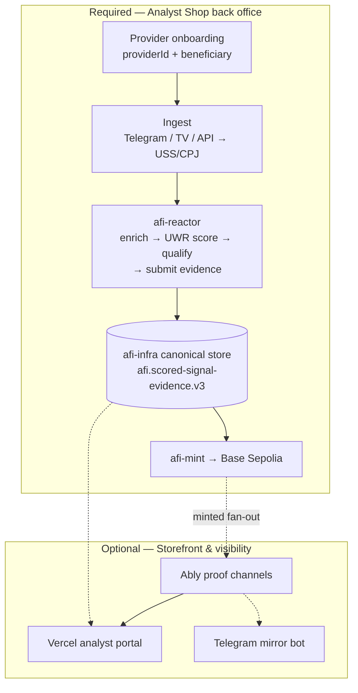

# AFI Analyst Shop MVP — Product Sketch

> **DEPRECATED / SUPERSEDED:** This document predates AFI Settlement v1 doctrine. It may describe v0 per-signal minting, ERC-1155 receipts, direct beneficiary payouts, stale ENS/Snapshot references, or missing vault architecture. See `afi-docs/specs/AFI_SETTLEMENT_V1_DOCTRINE.md` for canonical architecture.

**Status:** Draft — positioning & scope  
**Date:** 2026-06-03  
**Audience:** Product, protocol architects, analyst onboarding  
**Context:** afi-reactor + Mongo reference implementation; Ably optional for live proof

**Related:** [`AFI_PORTABLE_PROTOCOL_SURFACE.v0.1.md`](./AFI_PORTABLE_PROTOCOL_SURFACE.v0.1.md)

---

## One sentence

An **Analyst Shop** is a protocol-registered identity that ingests signals, runs them through AFI scoring, and (when qualified) earns mint attribution — with an **optional live proof channel** so subscribers see validation in real time.

AFI accelerates the **back office** (ingest → score → commit). Ably accelerates the **storefront** (live proof feed). Neither replaces the other.

---

## What “set up shop” means (minimum viable)

| Capability | Analyst gets | Protocol requirement |
|------------|--------------|----------------------|
| **Identity** | `providerId`, channel metadata, beneficiary wallet | Registered in config / onboarding |
| **Ingest** | Webhook or bot posts signals into AFI | USS v1.1 or CPJ v0.1 conformant payload |
| **Processing** | Enrichment + UWR score + qualify/reject | `afi-reactor` (reference) or any conforming orchestrator |
| **Commitment** | Mint to beneficiary when qualified | `afi-mint` → Base Sepolia |
| **Audit trail** | Immutable history for challenge/replay | Mongo TSSD scored signal record |
| ***(Optional)* Proof feed** | Subscribers see SCORED/MINTED live | Ably (or polling, Telegram mirror, etc.) |

**Shop is “open” when rows 1–5 work.** Row 6 is marketing and trust, not protocol membership.

---

## Stack layers (required vs optional)



| Layer | Technology | Required? | Accelerates |
|-------|------------|-----------|-------------|
| Ingest API | `afi-gateway` webhook | **Yes** | Getting signals into protocol |
| Orchestration | **afi-reactor** (not Ably) | **Yes** | Reliable score → mint handoff |
| Scoring | `afi-reactor` + UWR | **Yes** | Deterministic qualify/mint path |
| Evidence | Mongo TSSD vault | **Yes** | Replay, challenge, audit |
| Commitment | `afi-token` / `afi-mint` on Base Sepolia | **Yes** | Rewards attribution |
| Live proof | **Ably** | No | Subscriber trust, dashboard UX |
| Distribution | Telegram/Discord (analyst’s own) | No* | Reach (*analyst usually already has this) |

---

## Analyst onboarding flow (MVP)

### Phase A — Open the shop (required, ~days)

| Step | Analyst action | AFI provides | Ably involved? |
|------|----------------|--------------|----------------|
| A1 | Register as provider | `providerId`, API key, beneficiary address form | No |
| A2 | Choose ingest source | Template: TradingView webhook URL, Telegram bot token, or REST | No |
| A3 | Send test signal | USS/CPJ validation errors surfaced clearly | No |
| A4 | Confirm scored | Canonical scored-signal evidence record (`afi.scored-signal-evidence.v3`) persisted by afi-infra, lifecycleState=SCORED | No |
| A5 | Confirm mint (testnet) | `MintCoordinated` on Base Sepolia + stage=MINTED in TSSD record | No |

**Done = shop is operational.** Analyst can mint-attributed signals on testnet.

**Reference run (testnet demo):** point the reference spine at a Mongo TSSD instance and start it:

```
export AFI_MONGO_URI="mongodb://..."   # required — TSSD scored-signal vault
npm run start:demo                     # webhook → afi-reactor score → Mongo TSSD persist → afi-mint → Base Sepolia
```

The reference spine has a single required dependency (`AFI_MONGO_URI`); no separate warehouse plane is provisioned for the reference implementation.

### Phase B — Proof channel (optional, ~hours if templated)

| Step | Analyst action | AFI provides | Ably involved? |
|------|----------------|--------------|----------------|
| B1 | Enable “public proof feed” | Scoped Ably channel: `afi:proof:{providerId}` | **Yes** |
| B2 | Share proof page link | Read-only Vercel page subscribing to channel | **Yes** |
| B3 | *(Optional)* Mirror to Telegram | Bot posts “✅ Minted signal X” on mint event | Ably or reactor mint fan-out |

**Done = subscribers see live protocol proof.** Trust UX, not protocol core.

---

## What AFI accelerates vs what the analyst still brings

### AFI accelerates (back office)

- Canonical ingest dialect (USS/CPJ) and validation  
- Scoring pipeline via `afi-reactor` (reference orchestrator)  
- Event-driven mint with idempotency (`afi-mint` reads scored signal from Mongo)  
- Mongo TSSD evidence records for disputes  
- Testnet contract addresses and role wiring (reference operator)

### Analyst still brings

- Their audience channel (Telegram, Discord, newsletter)  
- Signal content and strategy (proprietary edge)  
- Beneficiary wallet and key custody  
- Compliance / disclaimers for their jurisdiction  
- *(If no Ably)* Their own way to show proof (screenshots, TSSD export, block explorer)

### Ably accelerates (storefront only)

- **Live Codex** — no WebSocket infra to build  
- **Per-analyst proof channel** — instant branded feed  
- **Operator dashboard** — pipeline errors, mint confirmations in real time  
- **Time-to-credible-UI** — hours instead of weeks

### Ably does not accelerate

- CPJ parsing from Telegram  
- UWR scoring setup  
- Wallet / beneficiary configuration  
- Epoch budget or mint eligibility rules

---

## MVP product tiers (positioning)

| Tier | Name | Includes | Target analyst |
|------|------|----------|----------------|
| **T0** | Protocol participant | Ingest + score + mint + TSSD record | Technical, brings own UI |
| **T1** | Shop MVP | T0 + onboarding wizard + ingest templates | Semi-technical channel owner |
| **T2** | Shop + Proof | T1 + Ably proof channel + public proof page | Wants subscriber-visible trust |
| **T3** | Shop + Proof + Analytics | T2 + market context derived from TSSD records | Full-time signal operator |

**Testnet goal:** ship **T1**; demo **T2** on one pilot analyst.

---

## Ingest templates (the real accelerator)

These reduce time-to-shop more than Ably:

| Source | Template deliverable | Maps to |
|--------|---------------------|---------|
| TradingView | Webhook URL + secret + field mapping doc | USS v1.1 (see `afi-reactor` TV path) |
| Telegram | Bot + CPJ parser preset | CPJ v0.1 → USS |
| REST / SDK | `POST /api/v1/signals` + OpenAPI snippet | Gateway ingest |
| Manual | CLI `afi submit` for testnet | Demo / benchkit |

**Priority for T1:** TradingView + Telegram templates (highest analyst channel overlap).

---

## Ably channel design (if T2 enabled)

| Channel pattern | Payload (public surface only) | Subscriber |
|-----------------|------------------------------|------------|
| `afi:proof:{providerId}` | `{ signalId, stage, publicSurface, txHash? }` | Analyst’s audience |
| `afi:ops:{providerId}` | `{ stage, errors, epochBudget }` | Analyst operator only |
| `afi:global:codex` | Aggregated mint events (opt-in) | Protocol explorers |

**Rules:**

- Publish only **after** Mongo TSSD persist and/or on-chain confirm (Ably is read model, not source of truth).  
- Never put `proprietaryDetail` on Ably — `publicSurface` only per [`afi-infra` TSSD spec](../../afi-infra/docs/TSSD_VAULT_SPEC.md).  
- Token auth: Ably capabilities scoped per `providerId`; subscribers get read-only.

**Fan-out wiring:**

```
afi-mint minted event → tiny fan-out service → Ably REST publish
```

---

## Messaging decision (summary)

| Bus | Role | Use Ably here? |
|-----|------|----------------|
| afi-reactor | Internal pipeline (`raw` → `scored` → `minted`) | **No** |
| Mongo TSSD | Canonical evidence store | **No** |
| Base | Commitment | **No** |
| Ably | External live proof + dashboard | **Yes (optional)** |

---

## Success metrics (Analyst Shop MVP)

| Metric | T1 target | T2 target |
|--------|-----------|-----------|
| Time from signup → first SCORED row | < 1 day | < 1 day |
| Time from signup → first testnet mint | < 3 days | < 3 days |
| Ingest templates shipped | ≥ 2 (TV + Telegram) | ≥ 2 |
| Analyst-built WebSocket code | 0 | 0 (Ably handles) |
| Proof page without Ably | Possible (poll TSSD) | Ably live < 2s latency |

---

## Open product decisions (≤ 5)

1. **Hosted portal vs bring-your-own ingest?** — Hosted wizard strongly accelerates T1.  
2. **Ably day-one or post-T1?** — Recommend: T2 pilot after first successful testnet E2E.  
3. **Single operator vs multi-tenant analyst signup?** — Affects gateway tenancy model.  
4. **Public proof default on or opt-in?** — Privacy vs trust tradeoff.  
5. **Telegram as distribution + proof mirror?** — Many analysts won’t visit a separate proof URL.

---

## Bottom line for positioning

| Claim | Valid? |
|-------|--------|
| “AFI helps analysts set up a protocol-backed signal shop” | **Yes** — if T1 ingest + score + mint ships |
| “Ably is how you set up shop on AFI” | **No** |
| “Ably lets your subscribers *see* your shop is real” | **Yes** — T2 proof channel |
| “AFI is portable; Ably is optional reference UX” | **Yes** — align with north star |

**Invest first in:** ingest templates, provider onboarding, afi-reactor + Mongo TSSD + mint path.  
**Add Ably when:** you want a demo-ready **live proof storefront** for pilot analysts and the Codex UI.

---


