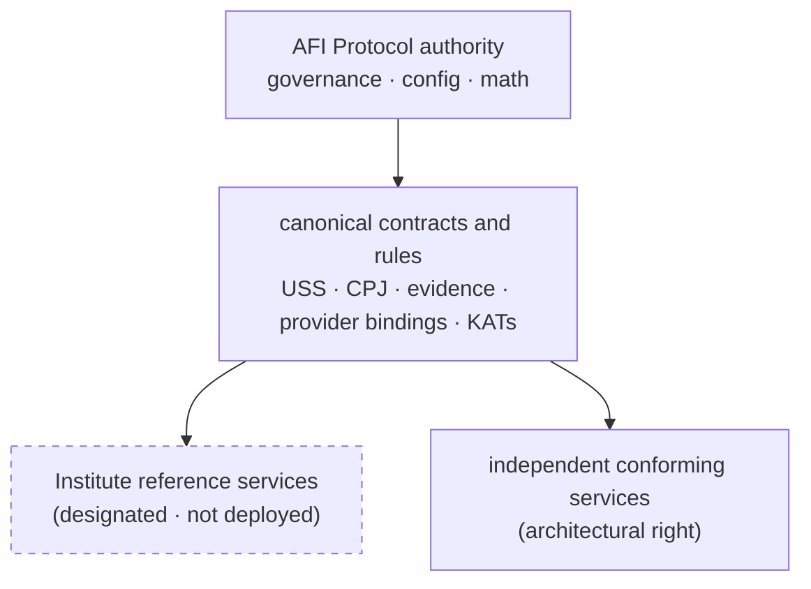
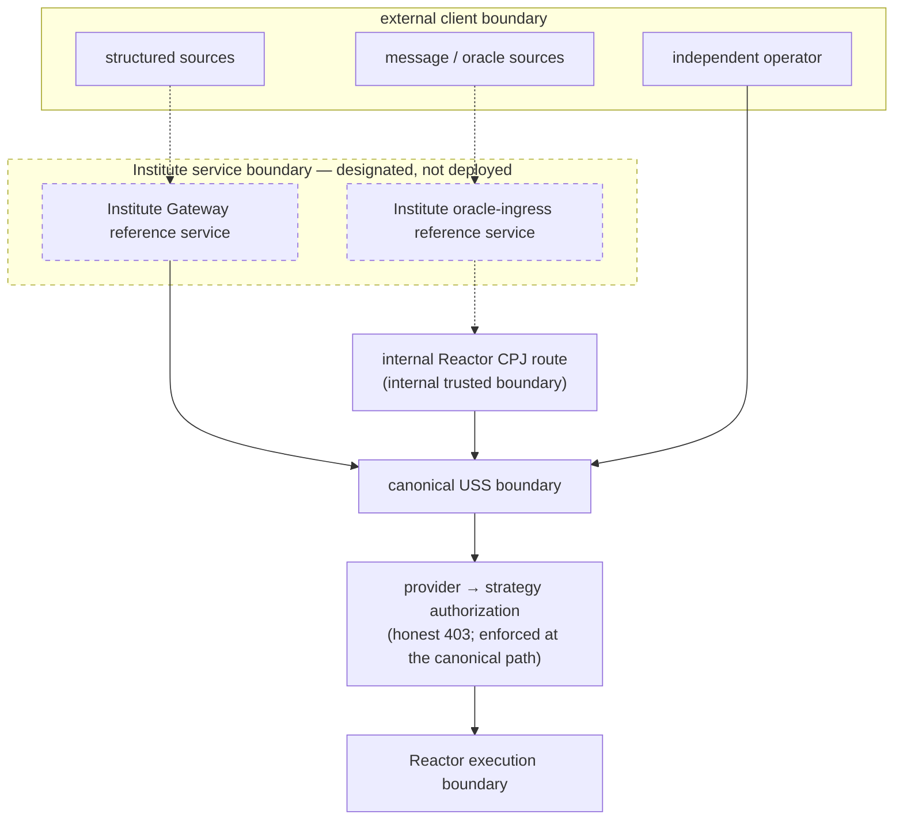

# AFI Research Institute Reference Services v0.1

**Status:** Draft — reference-surface charter
**Version:** 0.1
**Date:** 2026-07-17
**Governed by:** [`AFI-GOV-AUTHORITY-INSTITUTE-REFERENCE-SERVICES-v0.1` (INST-GOV)](https://github.com/AFI-Protocol/afi-governance/blob/main/decisions/research-institute-reference-services-v0.1.md)

This specification describes the **reference-service role** of AFI Research Institute
as it is governed today. It is documentation: it explains a designated operator
role and a target trust boundary; it does not hold protocol authority, and it does
not claim that any hosted service is live. Where this document and a governed
artifact disagree, the governed artifact wins.

---

## 1. Institutional relationship

```text
AFI Protocol
→ defines the interoperable rules and contracts (governance, config, math)

AFI Research Institute
→ the designated operator of AFI's official open reference services

Independent operators
→ may run conforming alternatives to those services
```

AFI Protocol defines the interoperable rules, contracts, authority boundaries,
evidence requirements, and processing standards. AFI Research Institute is
**designated to operate** AFI's official hosted open-reference services. Those
services are **official reference instances, not exclusive or mandatory network
infrastructure** — independent researchers, developers, companies, protocols, and
institutions remain free to operate their own conforming ingress and collectors.

Two terms carry precise, distinct meanings throughout AFI (INST-GOV D-INST-1):

- **Canonical** — a contract, schema, registry, rule, identity, or mathematical
  definition that holds authority through AFI's accepted source-of-truth hierarchy
  (governance → config → math → implementation → tests → maps → docs).
- **Official reference service** — a service operated, or designated for operation,
  by AFI Research Institute to provide accessible, tested, documented, open research
  infrastructure. **An Institute-operated service is not canonical merely because the
  Institute operates it; a conforming independent implementation is not invalid
  merely because the Institute did not operate it.**



Both the Institute's reference services and independent conforming services consume
the **same** protocol contracts. The Institute is drawn beside independent
operators, never above governance, config, or math.

---

## 2. Structured ingress — the Institute Gateway reference service

```text
structured source (TradingView · authenticated webhook · API client · agent system)
→ Institute Gateway reference service   (authenticate · resolve tenant · rate-limit · route)
→ canonical USS boundary
→ Reactor
```

The **AFI Gateway** is the open-source structured-ingress implementation homed in
[`afi-gateway`](https://github.com/AFI-Protocol/afi-gateway) (MIT-licensed). Its
canonical ingress route `POST /api/v1/signals` authenticates the caller's API key,
resolves the tenant, rate-limits per key, performs a **presence-only** field check,
stamps provenance (`providerId = gateway:<tenantId>`), forwards the payload to the
Reactor, and returns the Reactor's answer verbatim. It is **routes-not-writes**: it
never constructs or writes canonical evidence, a boundary enforced by an executable
guardrail and a real-MongoDB boundary proof in CI.

The **Institute Gateway reference service** is the official **hosted instance** of
that implementation, designated for operation by AFI Research Institute so that
structured producers can submit authorized intelligence without deploying the full
AFI ingress stack. Structured sources must conform to the Gateway's supported request
contract (four required-present fields, with additional fields forwarded verbatim to
the Reactor) or use an adapter — arbitrary webhook JSON is **not** a universal accepted
format. The Gateway's endpoint and API authority is reserved to a future governance
track (ATLAS-GOV) and is not fixed here.

---

## 3. Message and oracle ingress — the Institute oracle-ingress reference service

```text
Telegram / Discord / X / email / other source
→ source-specific collector          (communicates with the platform, emits a candidate signal)
→ Institute oracle-ingress service   (collector identity · source auth · provider binding · replay/dedupe · CPJ validation · audit)
→ CPJ                                 (afi.cpj.v0.1 structured handoff)
→ internal Reactor CPJ route          (POST /api/ingest/cpj — internal trusted boundary)
→ CPJ → USS
→ Reactor processing
```

A **source collector** communicates with a platform and produces a structured
candidate signal. **CPJ** (`afi.cpj.v0.1`) is the structured **handoff contract** for
that candidate — the first normalization stage before USS mapping. CPJ does **not**
itself log into platforms, scrape messages, or discover signals; collectors and
parsers do that. Source examples (Telegram, Discord, X, email, news/community
adapters) are **examples, not guaranteed current integrations**: a Telegram collector
client exists in-repo (env-gated, undeployed); Discord, X, and email collectors are
not implemented.

The **Institute oracle-ingress reference service** is the **designated** authenticated
external trust boundary that sits in front of the internal Reactor CPJ route. It may
carry collector identity, source authorization, credential validation, provider
binding, source provenance, message identity, replay protection, deduplication, rate
limiting, CPJ schema validation, audit trails, and bounded normalization. It is
**designated and not implemented or deployed** — the current CPJ route is served
in-process by the Reactor, and no dedicated oracle-ingress service exists.

---

## 4. Independent operation

The reference services are non-exclusive (INST-GOV D-INST-4). Independent parties may:

- run the open-source **AFI Gateway** implementation;
- implement a **conforming Gateway**;
- run their own **source collectors** and parsers;
- submit **CPJ** through an authorized external trust boundary;
- map directly to **canonical USS**;
- create **other source adapters**;
- operate **independent AFI-compatible infrastructure**.

Conformance is defined by the afi-config contracts and KATs — not by who operates the
service. The Institute reference path is designated to be the lowest-friction option;
it does not own all valid paths.

---

## 5. Current versus designated status

| Surface | Current implementation | Institute role | Deployment status |
|---|---|---|---|
| Gateway code (`afi-gateway`) | Implemented (MIT) | Designated official hosted reference service | Not deployed |
| Reactor CPJ route (`POST /api/ingest/cpj`) | Implemented | Internal processing boundary | Not public |
| Institute oracle-ingress service | Not implemented | Designated public/partner trust boundary | Not deployed |
| Source collectors | Telegram client in-repo (undeployed); others not implemented | Institute may operate references | Do not overclaim |
| USS boundary (`afi.usignal.v1.1`) | Canonical current contract | Consumed by all conforming ingress | Implemented contract |
| Independent operators | Permitted | Not controlled exclusively by the Institute | Architectural right |

The **designated role** and the **live status** are never blurred: no Institute-hosted
Gateway or oracle-ingress deployment exists (no CD pipeline, no hosted URL/DNS, no
container or cloud manifest; development/localhost defaults). Status language is
**governed / designated / authorized / reference-service role / not deployed** — never
"operates," "provides," or "hosts" in the present tense for a hosted instance.

---

## 6. Trust boundaries



- **Gateway** is an external trust boundary for structured submissions.
- The **Institute oracle-ingress service** is the intended external trust boundary for
  CPJ submissions; it is designated, not deployed.
- The **direct Reactor CPJ endpoint is internal.** On the direct route, authentication
  is optional and off by default (a single static shared secret compared against a
  request-body field when set), and provider identity is self-asserted, not
  cryptographically authenticated — which is precisely why it is fenced as an internal
  trusted service boundary and why any future public or partner CPJ access must be
  mediated by an authenticated oracle-ingress boundary or another conforming external
  trust boundary.
- **Reactor is the execution engine, not a general public ingestion gateway.**
- **Provider-to-strategy authorization** is enforced on the canonical processing path
  (the Reactor resolves the provider → strategy binding against the boot-validated
  registry; an unbound provider is rejected with an honest `403`, never a silent
  default), on every legitimate ingress path.
- **Source identity, message identity, deduplication, and replay protection** remain
  attributable and must not be bypassed.

---

## 7. Research role

Institute reference services exist to accelerate open research in agentic financial
intelligence by lowering the barrier to submitting, normalizing, evaluating, and
benchmarking financial intelligence. Supported research purposes include agent
development; reproducible experiments; reference-dataset creation; provenance and
source-reliability studies; normalization-accuracy studies; duplicate and
cross-platform signal studies; timeliness studies; PoI/PoInsight research; comparative
collector research; and reproducibility artifacts. Reference adapters and integration
instructions are within the designated services' scope.

This role does **not** imply that every submitted signal, raw message, or proprietary
alpha artifact is public, and it does **not** claim any production PoInsight or
reputation integration exists — those remain research surfaces
([`afi-benchkit`](https://github.com/AFI-Protocol/afi-benchkit) computes PoInsight from
fixtures only). Institute-operated services may set their own transparent research and
privacy policies (retention, PII, consent, disclosure, access control); those policies
apply to Institute-operated instances and do not become protocol law. Raw source
content is not automatically written on-chain and is not automatically published.

---

## 8. Non-authority statement

> Operating an official reference service does not grant AFI Research Institute
> unilateral authority over AFI Protocol contracts, scoring, evidence, finality,
> reputation, incentives, or settlement.

The Institute is an operator, researcher, publisher, and service provider — not a
protocol authority. Governance, config, and math retain their authority; the Gateway
remains routes-not-writes; the Reactor constructs Evidence V3 and does not become a
general external trust gateway; `afi-infra` remains the sole canonical writer;
`afi-factory` authors pipeline artifacts and is not the ingress operator. The Institute
being the MIT copyright holder of record across the organization's licenses is an
open-source stewardship fact, not operational or protocol control. No reward, claim,
validator, governance, or treasury privilege is created by this role.

---

## 9. Terminology

| Term | Meaning |
|---|---|
| **AFI Gateway** | The open-source Gateway implementation and its architectural ingress role. |
| **Institute Gateway reference service** | The official hosted Gateway instance designated for operation by AFI Research Institute. |
| **CPJ** | The structured contract (`afi.cpj.v0.1`) for candidate signals derived from conversational, social, oracle, or semi-structured sources. |
| **Source collector** | A source-specific component that communicates with a platform and produces a structured candidate signal. |
| **Institute oracle-ingress reference service** | The designated Institute-operated external trust boundary for collectors and CPJ submissions. |
| **Internal CPJ processing route** | The current direct Reactor route (`POST /api/ingest/cpj`) that validates and maps CPJ into USS — internal, not public. |
| **USS** | The canonical AFI signal representation and convergence checkpoint (`afi.usignal.v1.1`). |
| **Independent conforming operator** | A third party operating a compatible ingress, collector, Gateway, or AFI stack in accordance with the canonical contracts. |

Avoid: "Institute-owned protocol," "Institute network," "central Gateway," "official
canonical Gateway," "Institute-exclusive endpoint," "universal CPJ route," "mandatory
Institute service."

---

*This specification records the institutional position set by INST-GOV. It establishes
authority and architecture; it does not build or deploy the services.*
