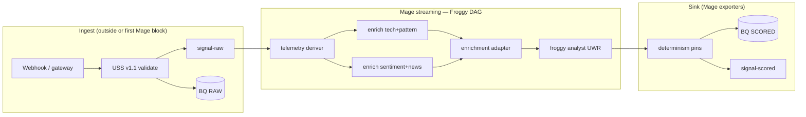

# Froggy → Mage + GCP Migration Map

**Date:** 2026-06-03  
**Scope:** Phase A1 (pipeline shape) — canonical Froggy trend-pullback v1 only  
**Parent:** [`AFI_TESTNET_E2E_CHECKLIST.md`](./AFI_TESTNET_E2E_CHECKLIST.md) §1.2–§1.3

**Source of truth (Froggy DAG):** [`afi-reactor/src/config/froggyPipeline.ts`](../../../afi-reactor/src/config/froggyPipeline.ts)  
**Runtime entry:** [`afi-reactor/src/services/froggyDemoService.ts`](../../../afi-reactor/src/services/froggyDemoService.ts)  
**Scored output contract:** [`afi-reactor/src/types/ReactorScoredSignalV1.ts`](../../../afi-reactor/src/types/ReactorScoredSignalV1.ts)  
**Evidence target:** `afi_evidence.signals_lifecycle` (BigQuery append-only)

---

## Legend

| Change type | Meaning |
|-------------|---------|
| **REUSE** | Keep existing code; call or wrap as-is |
| **ADAPT** | Same logic; new transport/sink/validation wrapper |
| **NEW** | Net-new for GCP spine |
| **DROP** | Do not carry to Mage path (deprecated or out of scope) |
| **DEFER** | Phase A2 / mint half |

---

## End-to-end flow

### Before (Mongo + reactor)

```
TradingView / CPJ HTTP
    → map + validate USS (reactor server)
    → runPipelineDag(FROGGY_TREND_PULLBACK_PIPELINE)
    → insertOne → Mongo reactor_scored_signals_v1
    → HTTP response ReactorScoredSignalV1
```

### After (GCP + Mage OSS)

```
TradingView / CPJ / gateway HTTP
    → map + validate USS/CPJ
    → publish Pub/Sub signal-raw
    → append BQ row stage=RAW                    ← NEW (ingest or Mage loader)
    → Mage streaming pipeline (Froggy stages)
    → append BQ row stage=SCORED               ← replaces tssd-vault-write
    → publish Pub/Sub signal-scored            ← NEW (mint handoff contract)
    → (Phase A2) afi-mint → chain → MINTED row ← DEFER
```



---

## Pre-pipeline: ingest (not in `froggyPipeline.ts`)

| Legacy path | Mage/GCP | Change | Notes |
|-------------|----------|--------|-------|
| `alpha-scout-ingest.plugin` | — | **DROP** | Dev/demo only; [`plugins/alpha-scout-ingest.plugin.ts`](../../../afi-reactor/plugins/alpha-scout-ingest.plugin.ts) |
| `signal-structurer` (Pixel Rick) | USS validation at boundary | **DROP** | Replaced by USS v1.1 schema |
| `POST /api/webhooks/tradingview` | Ingest service + `signal-raw` | **ADAPT** | Keep [`mapTradingViewToUssV11`](../../../afi-reactor/src/uss/tradingViewMapper.ts) + [`validateUsignalV11`](../../../afi-reactor/src/uss/ussValidator.ts) |
| `POST /api/ingest/cpj` | Same + CPJ map | **ADAPT** | [`mapCpjToUssV11`](../../../afi-reactor/src/uss/cpjMapper.ts) |
| `POST /api/v1/signals` (gateway) | Gateway + Pub/Sub hook | **ADAPT** | [`afi-gateway/src/http/app.ts`](../../../afi-gateway/src/http/app.ts) — today writes Mongo; add publisher |
| Reactor in-process dedupe | Ingest dedupe or Pub/Sub idempotency | **ADAPT** | [`ingestDedupeService.ts`](../../../afi-reactor/src/services/ingestDedupeService.ts) |

**`signal-raw` message body (minimum):**

```json
{
  "schema": "afi.usignal.v1_1",
  "uss": { },
  "ingestedAt": "ISO-8601",
  "source": "tradingview-webhook | cpj-telegram | afi-gateway"
}
```

**BQ `stage=RAW` row:** same USS JSON in `payload` + `signal_id` from `uss.provenance.signalId`.

---

## Stage-by-stage: Froggy DAG → Mage blocks

| # | Froggy stage ID | Reactor implementation | Mage block (suggested name) | Lifecycle / BQ | Change | Implementation options |
|---|-----------------|------------------------|----------------------------|----------------|--------|------------------------|
| — | *(pre)* | Webhook USS validate | `ingest_validate_uss` *(optional; prefer pre-Mage)* | `RAW` | **ADAPT** | Cloud Run / gateway before Pub/Sub |
| 0 | — | Pub/Sub N/A | `pubsub_loader_signal_raw` | — | **NEW** | [Mage Pub/Sub loader](https://docs.mage.ai/guides/streaming/sources/google-cloud-pubsub) |
| 1 | `uss-telemetry-deriver` | Internal handler in `pipelineRunner` / `froggyDemoService` | `uss_telemetry_deriver` | — | **REUSE** | Port Python thin wrapper **or** sidecar calls reactor with `rawUss` only |
| 2a | `froggy-enrichment-tech-pattern` | [`plugins/froggy-enrichment-tech-pattern.plugin`](../../../afi-reactor/plugins/froggy-enrichment-tech-pattern.plugin.ts) | `froggy_enrich_tech_pattern` | `ENRICHED` *(optional row)* | **REUSE** | **Sidecar recommended** — OHLCV + indicators unchanged |
| 2b | `froggy-enrichment-sentiment-news` | [`plugins/froggy-enrichment-sentiment-news.plugin`](../../../afi-reactor/plugins/froggy-enrichment-sentiment-news.plugin.ts) | `froggy_enrich_sentiment_news` | `ENRICHED` *(optional row)* | **REUSE** | Parallel branch; Coinalyze/NewsData env vars |
| 3 | `froggy-enrichment-adapter` | [`plugins/froggy-enrichment-adapter.plugin`](../../../afi-reactor/plugins/froggy-enrichment-adapter.plugin.ts) | `froggy_enrichment_adapter` | — | **REUSE** | Join branches; Tiny Brains HTTP optional |
| 4 | `froggy-analyst` | [`plugins/froggy.trend_pullback_v1.plugin`](../../../afi-reactor/plugins/froggy.trend_pullback_v1.plugin.ts) | `froggy_analyst_uwr` | `ANALYZED`/`SCORED` | **REUSE** | UWR via [`afi-core/validators/UniversalWeightingRule.ts`](../../../afi-core/validators/UniversalWeightingRule.ts) |
| 5 | `tssd-vault-write` | [`tssdVaultService.insertSignalDocument`](../../../afi-reactor/src/services/tssdVaultService.ts) | `export_scored_bq` + `export_signal_scored_pubsub` | `SCORED` | **ADAPT** | Replace Mongo `insertOne` with dual export |
| 6 | — | — | `pin_determinism_metadata` | metadata on SCORED | **NEW** | `pipeline_uuid`, `git_sha`, `ruleset_version`, `dag_id=froggy-trend-pullback-v1` |

### Parallel enrichment in Mage

Froggy runs tech-pattern and sentiment-news **in parallel** after telemetry ([`froggyPipeline.ts:84-87`](../../../afi-reactor/src/config/froggyPipeline.ts)).

| Mage approach | Notes |
|---------------|-------|
| **A. Sidecar (fastest)** | One block: `POST /api/webhooks/tradingview` or internal `runFroggyTrendPullbackFromCanonicalUss` — reactor still runs full DAG |
| **B. Multi-block** | Duplicate reactor parallel groups in Mage metadata; two transformers → join block |
| **C. Port plugins** | Long-term; rewrite TS plugins as Python blocks |

**Recommendation for Phase A1:** **A (sidecar)** for scoring blocks 1–4; Mage owns Pub/Sub I/O, BQ append, pins, and `signal-scored` publish.

---

## Post-pipeline: removed / deferred

| Legacy stage | Mage/GCP | Change | Why |
|--------------|----------|--------|-----|
| `validator-decision` | — | **DROP** | External certification layer; not reactor job |
| `execution-sim` | — | **DROP** | Consumer/adapter; demo only |
| `dao-mint-checkpoint` (codex demo) | — | **DROP** | Old ops.codex path |
| `afi-ensemble-scorer` (codex) | — | **DROP** | Froggy uses analyst UWR directly |
| Mint / `afi-mint` | Phase A2 | **DEFER** | Subscribe to `signal-scored` later |
| Ably proof fan-out | Phase B | **DEFER** | After T2 |

---

## Data contract mapping

### Mongo document → BQ + Pub/Sub

| `ReactorScoredSignalDocument` field ([`ReactorScoredSignalV1.ts:67`](../../../afi-reactor/src/types/ReactorScoredSignalV1.ts)) | BQ `payload` / `signal-scored` | Change |
|----------------------------------------------------------------|--------------------------------|--------|
| `signalId` | `signal_id` column + top-level `signalId` | **REUSE** |
| `pipeline.analystScore` | `payload.analystScore` | **REUSE** |
| `pipeline.scoredAt` | `payload.scoredAt` | **REUSE** |
| `pipeline.decayParams` | `payload.decayParams` | **REUSE** |
| `rawUss` | `payload.rawUss` | **REUSE** |
| `market.*` | `payload.meta` / nested in analystScore | **REUSE** |
| `lenses` | `payload.lenses` | **REUSE** |
| `strategy.name`, `strategy.direction` | `payload.meta.strategy`, `direction` | **REUSE** |
| `source` | `payload.source` | **REUSE** |
| `version: "v1.0"` | `payload.schemaVersion` | **ADAPT** rename |
| — | `qualify: boolean` | **NEW** | MVP: `uwrScore >= threshold` |
| — | `metadata.pipeline_uuid`, `git_sha`, `ruleset_version` | **NEW** | Determinism pins |
| — | `beneficiary` / `providerId` | **NEW** | Stub for Phase A2 mint |
| `createdAt` | BQ `ingested_at` | **ADAPT** |

### Canonical type alignment (optional enrichment)

Normative full lifecycle: [`VaultedSignalRecord`](../../../afi-infra/src/tssd/types.ts) with `stages.scored.analystScore`.  
MVP: **flatten** scored fields into BQ JSON `payload` matching `ReactorScoredSignalV1` + pins — map to `VaultedSignalRecord` when mint writes `MINTED`.

---

## `signal-scored` handoff schema (v1 — freeze at Phase A1)

Contract between pipeline half and mint half. Version before Phase A2.

```json
{
  "schema": "afi.signal_scored.v1",
  "signalId": "string",
  "epochId": "string",
  "qualify": true,
  "scoredAt": "ISO-8601",
  "analystScore": { },
  "rawUss": { },
  "decayParams": { },
  "meta": {
    "symbol": "string",
    "timeframe": "string",
    "strategy": "trend_pullback_v1",
    "direction": "long|short|neutral",
    "source": "string"
  },
  "metadata": {
    "pipeline_uuid": "string",
    "git_sha": "string",
    "ruleset_version": "string",
    "dag_id": "froggy-trend-pullback-v1"
  },
  "beneficiary": "0x…",
  "providerId": "string"
}
```

---

## BigQuery row shape (append-only)

Table: `afi_evidence.signals_lifecycle`

| Column | RAW row | SCORED row | MINTED row (A2) |
|--------|---------|------------|-----------------|
| `event_id` | UUID | UUID | UUID |
| `signal_id` | from USS | same | same |
| `stage` | `RAW` | `SCORED` | `MINTED` |
| `payload` | JSON USS | JSON scored contract above | `{ txHash, chainId, … }` |
| `ingested_at` | TIMESTAMP | TIMESTAMP | TIMESTAMP |
| `metadata` | `{ source, ingest_host }` | pins + Mage run id | mint service id |

**MVP:** append **RAW + SCORED** only. Optional `ENRICHED`/`ANALYZED` rows later.

**Do not:** MERGE/update in place (replaces Mongo `upsert` / single-doc pattern).

---

## Implementation strategies

| Strategy | Mage blocks | Effort | Best for |
|----------|-------------|--------|----------|
| **1. Reactor sidecar** | Loader → HTTP to reactor → pin → BQ + Pub/Sub export | Low | Phase A1 T2 gate |
| **2. Plugin port** | One Mage block per Froggy plugin (Python) | High | Long-term portable DAG |
| **3. Hybrid** | Sidecar for enrich+analyst; Mage native validate + export | Medium | Incremental port |

### Sidecar block pseudocode (recommended first)

```python
# transformer: froggy_score_sidecar
import requests

def transform(uss_batch, *args, **kwargs):
    reactor_url = os.environ["AFI_REACTOR_BASE_URL"]
    out = []
    for msg in uss_batch:
        # reactor already: telemetry → enrich → analyst → (skip mongo if env flag)
        r = requests.post(f"{reactor_url}/api/internal/score-uss", json=msg["uss"], timeout=120)
        r.raise_for_status()
        out.append(r.json())  # ReactorScoredSignalV1 shape
    return out
```

*Note:* May need thin reactor endpoint that runs DAG **without** Mongo write when `AFI_SKIP_VAULT_WRITE=true`.

---

## Environment variables (migration)

| Mongo / reactor era | GCP / Mage era |
|---------------------|----------------|
| `AFI_MONGO_URI` | **Remove** from new path |
| `AFI_MONGO_COLLECTION_SCORED` | **Remove** |
| `AFI_TSSD_MONGODB_URI` (gateway) | **Remove** from ingest path |
| `COINALYZE_API_KEY`, `AFI_PRICE_FEED_SOURCE` | **REUSE** on reactor sidecar or Mage blocks |
| `WEBHOOK_SHARED_SECRET` | **REUSE** on ingest |
| — | `GCP_PROJECT`, Pub/Sub topic names |
| — | `BQ_DATASET=afi_evidence`, `BQ_TABLE=signals_lifecycle` |
| — | `AFI_REACTOR_BASE_URL` (sidecar) |
| — | `MAGE_PIPELINE_UUID`, `GIT_SHA` (pins) |

---

## Checklist cross-walk

| Migration map section | E2E checklist |
|----------------------|---------------|
| Pre-pipeline ingest | §1.2 |
| Mage blocks 0–6 | §1.3 |
| `signal-scored` schema | §1.3 + §1.4 input |
| BQ RAW/SCORED | §1.2, §1.3, §1.6 |
| Mint / MINTED | §1.4–§1.7 (Phase A2) |
| Mage OSS deploy | §1.0, §1.1 |

---

## Phase A1 acceptance (pipeline half only)

| # | Check |
|---|-------|
| 1 | Valid USS published to `signal-raw` |
| 2 | BQ row `stage=RAW` exists |
| 3 | Mage pipeline produces same `uwrScore` as reactor for fixed fixture |
| 4 | BQ row `stage=SCORED` exists with pins in `metadata` |
| 5 | `signal-scored` message matches `afi.signal_scored.v1` fixture |
| 6 | No write to Mongo `reactor_scored_signals_v1` on new path |

---

## Files to touch (suggested)

| Action | Path |
|--------|------|
| Keep | `afi-reactor/src/config/froggyPipeline.ts` (DAG blueprint) |
| Keep | `afi-reactor/plugins/froggy*.plugin.ts` |
| Keep | `afi-reactor/src/uss/*`, `afi-reactor/src/cpj/*` |
| Adapt | `afi-gateway/src/http/app.ts` — Pub/Sub publish after validate |
| Adapt | `afi-reactor/src/services/froggyDemoService.ts` — optional skip Mongo |
| New | Mage repo/folder: `pipelines/froggy_trend_pullback_v1/` |
| New | `afi-docs/specs/audit/fixtures/signal_scored_v1.example.json` |
| New | BQ DDL + Terraform (GCP project) |
| Defer | `afi-mint` Pub/Sub push handler |

---

*See also: [`AFI_MAGE_PRO_PLAN_DECISION.md`](./AFI_MAGE_PRO_PLAN_DECISION.md) · [`Mage And GCP Architecture Research.md`](../../../Mage%20And%20GCP%20Architecture%20Research.md)*
