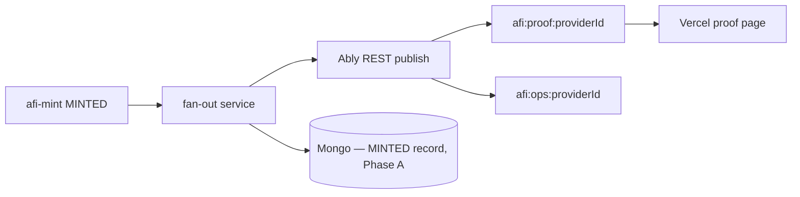

# AFI Base Sepolia — Testnet E2E Checklist (with references)

> **DEPRECATED / SUPERSEDED:** This document predates AFI Settlement v1 doctrine. It may describe v0 per-signal minting, ERC-1155 receipts, direct beneficiary payouts, stale ENS/Snapshot references, or missing vault architecture. See `afi-docs/specs/AFI_SETTLEMENT_V1_DOCTRINE.md` for canonical architecture.

**Workspace root:** `/home/user/AFI-Protocol/`  
**Chain:** Base Sepolia (chain ID `84532`)  
**Purpose:** Track what is needed to run the full signal → score → persist → mint loop on testnet, with **immediate links** to evidence and source files.

**Owner:** _________________________  
**Target date:** _________________________  
**Scope chosen:** [ ] MVP E2E  [ ] Protocol-complete

**Companion docs:** [`AFI_HUMAN_REVIEW_WORKSHEET.md`](./AFI_HUMAN_REVIEW_WORKSHEET.md) (Q1–Q7 decisions) · [`../AFI_ANALYST_SHOP_MVP.md`](../AFI_ANALYST_SHOP_MVP.md) (T1/T2 tiers, Ably storefront) · [`../AFI_ONCHAIN_ANCHOR_GAP_ANALYSIS.md`](../AFI_ONCHAIN_ANCHOR_GAP_ANALYSIS.md) (contract gap detail) · [`AFI_EVIDENCE_STORE_DECISION.md`](./AFI_EVIDENCE_STORE_DECISION.md) (Mongo TSSD is canonical) · [`AFI_MONGO_TSSD_INVENTORY.md`](./AFI_MONGO_TSSD_INVENTORY.md) (code-level Mongo spine)

---

## Reference map (bookmark this)

### Audit evidence

| Report | Path | Use for |
|--------|------|---------|
| On-chain gaps | [`../AFI_ONCHAIN_ANCHOR_GAP_ANALYSIS.md`](../AFI_ONCHAIN_ANCHOR_GAP_ANALYSIS.md) | Contract anchor, events, roles |
| Replay / lifecycle | [`../AFI_REPLAY_READINESS_MATRIX.md`](../AFI_REPLAY_READINESS_MATRIX.md) | RAW→MINTED vault stages |
| Emissions / mint | [`./themes/G-emissions-mint.json`](./themes/G-emissions-mint.json) | Allocation formula, single payee |
| On-chain theme | [`./themes/C-onchain-anchor.json`](./themes/C-onchain-anchor.json) | Breadcrumb vs intended anchor |
| Vault theme | [`./themes/D-evidence-vault.json`](./themes/D-evidence-vault.json) | Mongo TSSD evidence store |
| Master blockers | [`../AFI_PROTOCOL_SURFACE_AUDIT.md`](../AFI_PROTOCOL_SURFACE_AUDIT.md) | §1.3, §6 roadmap |

### Testnet contracts (deployed)

| Contract | Address | Explorer |
|----------|---------|----------|
| `AFIToken` (tAFI) | `0x43DC488caF49495d6abC0eEe021B725be38E81bd` | [BaseScan](https://sepolia.basescan.org/address/0x43DC488caF49495d6abC0eEe021B725be38E81bd) |
| `AFISignalReceipt` | `0xD1aDC1Ca4A98B141D8f3a4fE2cb9638003E70e23` | [BaseScan](https://sepolia.basescan.org/address/0xD1aDC1Ca4A98B141D8f3a4fE2cb9638003E70e23) |
| `AFIMintCoordinator` | `0xDd825a05EFe22668Ffbd627C586f19D08d62eA5e` | [BaseScan](https://sepolia.basescan.org/address/0xDd825a05EFe22668Ffbd627C586f19D08d62eA5e) |

**Sanity script:** [`afi-token/script/afitoken_testnet_sanity_checks.sh`](../../../afi-token/script/afitoken_testnet_sanity_checks.sh)  
**Deploy runbook:** [`afi-token/docs/deployment-testnet.md`](../../../afi-token/docs/deployment-testnet.md)  
**Redeploy script:** [`afi-token/script/DeployAFITestnet.s.sol`](../../../afi-token/script/DeployAFITestnet.s.sol)

### Reference spine (afi-reactor + Mongo TSSD — the working path)

This is the **only** implemented ingest → score → persist path. MongoDB TSSD is AFI's canonical reference evidence store — see [`AFI_EVIDENCE_STORE_DECISION.md`](./AFI_EVIDENCE_STORE_DECISION.md).

| Stage | Component | Key refs |
|-------|-----------|----------|
| **Ingest** | `afi-reactor` webhook (or `afi-gateway` minimal) | [`afi-reactor/src/server.ts:159`](../../../afi-reactor/src/server.ts) `POST /api/webhooks/tradingview` (twin: `/api/ingest/cpj`) |
| **Scoring DAG** | `afi-reactor` Froggy pipeline → `afi-core` UWR | [`froggyDemoService.ts:196`](../../../afi-reactor/src/services/froggyDemoService.ts) `runPipelineDag` → [`UniversalWeightingRule.ts`](../../../afi-core/validators/UniversalWeightingRule.ts) |
| **Evidence** | **MongoDB TSSD** (canonical) | [`tssdVaultService.ts:112`](../../../afi-reactor/src/services/tssdVaultService.ts) `insertOne` → `afi_reactor.reactor_scored_signals_v1`; gateway path: [`MongoTSSDVaultClient.ts`](../../../afi-infra/src/tssd/MongoTSSDVaultClient.ts) → `afi_tssd.tssd_signals` |
| **Mint** | `afi-mint` reads scored signal from Mongo | [`MintExecutor.ts`](../../../afi-mint/src/orchestrator/MintExecutor.ts) → `mintForSignal` (T2 wire-up gap — see §1.4) |
| **Commitment** | `afi-token` Base Sepolia | [`AFIMintCoordinator.sol`](../../../afi-token/src/AFIMintCoordinator.sol) |
| **Proof feed** *(Phase B)* | Ably optional | [`AFI_ANALYST_SHOP_MVP.md`](../AFI_ANALYST_SHOP_MVP.md) T2 — downstream of mint only |

### Shared protocol repos

| Stage | Repo | Key files |
|-------|------|-----------|
| Evidence types | `afi-infra` | [`src/tssd/types.ts`](../../../afi-infra/src/tssd/types.ts), [`docs/TSSD_VAULT_SPEC.md`](../../../afi-infra/docs/TSSD_VAULT_SPEC.md) |
| Scored record | `afi-reactor` | [`src/types/ReactorScoredSignalV1.ts`](../../../afi-reactor/src/types/ReactorScoredSignalV1.ts) |
| UWR math | `afi-core` | [`validators/UniversalWeightingRule.ts`](../../../afi-core/validators/UniversalWeightingRule.ts) |
| Mint coord | `afi-mint` | [`ValidatorDaemon.ts`](../../../afi-mint/src/orchestrator/ValidatorDaemon.ts), [`EmissionsMintDataProvider.ts`](../../../afi-mint/src/adapters/EmissionsMintDataProvider.ts) |
| Emissions math | `afi-math` | [`src/emissions/emissionsSchedule.ts`](../../../afi-math/src/emissions/emissionsSchedule.ts) |
| USS schemas | `afi-config` | [`schemas/usignal/v1_1/`](../../../afi-config/schemas/usignal/v1_1/) |

---

## Readiness tiers (pick your target)

| Tier | Question | Status today | Scope |
|------|----------|--------------|-------|
| **T1** | Can we mint manually on testnet? | **Yes** — contracts deployed; `mintForSignal` works with `EMISSIONS_ROLE` | Manual `cast` / script only |
| **T2** | Can we mint from a real scored signal? | **Partial** — reactor scores → Mongo works; `afi-mint` Mongo reader + on-chain client not yet wired | **MVP E2E (Phase A)** |
| **T2b** | Can a pilot analyst show live proof to subscribers? | **No** | **Phase B** (Ably storefront, after T2) |
| **T3** | Can we test multi-role reward allocations? | **No** — gauge is research-only | Protocol-complete (or deferred) |
| **T4** | Can a third party verify mint from chain + rules? | **No** — no anchors, formula drift | Protocol-complete |

**This checklist is organized around reaching T2 (Phase A MVP E2E), then optional Phase B (Ably proof fan-out).**

### Source of truth (do not conflate)

| Layer | Role | Use for pipeline? |
|-------|------|-------------------|
| **MongoDB TSSD** | Canonical per-signal evidence store (`reactor_scored_signals_v1`) | **Yes — required** |
| **Base Sepolia** | On-chain commitment (mint events, receipts) | **Yes — required** |
| **Ably** | External live proof + dashboard (T2 tier) | **No for pipeline** — Phase B only |

---

## Scope decision (fill before building)

### MVP E2E (recommended first testnet dress rehearsal)

| In scope | Out of scope (defer) |
|----------|----------------------|
| `afi-reactor` webhook ingest → Froggy score | Standalone message bus / external orchestrator |
| `afi-reactor` Froggy scoring DAG (afi-core UWR) | Multi-engine vault (PG/Timescale/Influx) |
| **MongoDB TSSD** `reactor_scored_signals_v1` evidence | Separate analytics/warehouse plane |
| Single beneficiary per signal | Multi-role gauge splits ([`gauge_v0.yaml`](../../../afi-econ/params/gauge_v0.yaml)) |
| `afi-mint` reads scored signal from Mongo → Base Sepolia | Ably in critical mint path |
| Proportional epoch-budget allocation (as implemented) | Goldpaper `clamp(B(t)…)` formula |
| Scored signal → mint via `afi-mint` | Full Snapshot challenge appeals (bypass OK) |
| `MintCoordinated` event as provenance | On-chain `contentHash` (nice-to-have) |
| **Phase B:** Ably proof fan-out after T2 | Analyst onboarding wizard (T1 product — separate track) |

**MVP allocation model (document explicitly):** one `beneficiary` per signal; amount = proportional share of epoch budget × `epochPulseFactor` (default 1.0).

- [ ] **Accepted** — proceed with MVP scope  
- [ ] **Rejected** — need: _________________________

### Protocol-complete (post-MVP)

| Item | Blocker IDs | Key evidence |
|------|-------------|--------------|
| `contentHash` + `rulesetVersion` on-chain | A1 | [`AFI_ONCHAIN_ANCHOR_GAP_ANALYSIS.md` §4.3](../AFI_ONCHAIN_ANCHOR_GAP_ANALYSIS.md) |
| Persisted provenance mapping | A2 | [`AFIMintCoordinator.sol:85`](../../../afi-token/src/AFIMintCoordinator.sol) |
| Multi-role gauge / splits | A4, C1 | [`gauge_v0.yaml`](../../../afi-econ/params/gauge_v0.yaml) |
| On-chain challenge registry | A7 | [`afi-mint/contracts/`](../../../afi-mint/contracts/) stubs |
| Canonical `stages.scored` in vault | D3 | [`tssdVaultService.ts`](../../../afi-reactor/src/services/tssdVaultService.ts) |
| Determinism pinning on records | D7 | [`types.ts:331`](../../../afi-infra/src/tssd/types.ts) |
| External validator replay | T4 | [`AFI_REPLAY_READINESS_MATRIX.md`](../AFI_REPLAY_READINESS_MATRIX.md) |

---

## Section 0 — Pre-flight (contracts & roles)

**Read:** [`deployment-testnet.md`](../../../afi-token/docs/deployment-testnet.md) · run [`afitoken_testnet_sanity_checks.sh`](../../../afi-token/script/afitoken_testnet_sanity_checks.sh)

| Done? | Check | How to verify |
|-------|-------|---------------|
| [ ] | `BASE_SEPOLIA_RPC_URL` set | `.env` in `afi-token` |
| [ ] | Contracts deployed (or redeployed) | Addresses match table above |
| [ ] | `AFIToken.TOTAL_SUPPLY_CAP` = 86B | Sanity script / `cast call` |
| [ ] | Coordinator wired to token + receipts | Sanity script `token()` / `receipts()` |
| [ ] | Coordinator has `EMISSIONS_ROLE` on `AFIToken` | Role check in sanity script |
| [ ] | Coordinator has `MINT_COORDINATOR_ROLE` on receipts | Role check in sanity script |
| [ ] | **Emissions agent** has `EMISSIONS_ROLE` on coordinator | Required to call `mintForSignal` — see [`DeployAFITestnet.s.sol:104-106`](../../../afi-token/script/DeployAFITestnet.s.sol) |
| [ ] | Emissions agent wallet funded (Sepolia ETH) | ~0.01 ETH minimum |
| [ ] | Manual mint smoke test | `cast send` or Foundry script — see §0.1 |

**Role holders (fill in):**

| Role | Address |
|------|---------|
| Treasury / admin Safe | `0x1Dd6705ff84Ecd5eaDc51A913Ad8e2c6C9E79aC4` (from sanity script) |
| Emissions agent (mint caller) | _________________________ |
| Test beneficiary | _________________________ |

### 0.1 Manual mint smoke test (T1 gate)

Proves T1 before wiring the pipeline. Open [`MintCoordinatorIntegration.t.sol`](../../../afi-token/test/MintCoordinatorIntegration.t.sol) for expected behavior.

```bash
# Example: build MintRequest fields off-chain, then:
# cast send $COORDINATOR "mintForSignal((address,uint256,uint256,uint256,bytes32,uint64,bytes))" \
#   "(BENEFICIARY,TOKEN_AMOUNT,RECEIPT_ID,RECEIPT_AMOUNT,SIGNAL_ID,EPOCH,0x)" \
#   --rpc-url $BASE_SEPOLIA_RPC_URL --private-key $EMISSIONS_AGENT_KEY
```

| Done? | Verify on BaseScan |
|-------|-------------------|
| [ ] | `MintCoordinated` event emitted |
| [ ] | `EmissionsMinted` on token |
| [ ] | `ReceiptMinted` on receipts (if receiptAmount > 0) |
| [ ] | Beneficiary `balanceOf` increased |

---

## Section 1 — Phase A: MVP E2E build checklist (afi-reactor + Mongo)

Work in this order. **Phase B (Ably) starts only after §1.7 passes.**

### 1.0 Provision MongoDB (decide before §1.1)

MongoDB TSSD is the canonical reference evidence store. No warehouse/stream plane is required at any tier.

**Default for T2 testnet:** a single MongoDB reachable by `afi-reactor` and `afi-mint`. The repo already ships a one-command local Mongo.

| Done? | Decision | Choice | Notes |
|-------|----------|--------|-------|
| [ ] | Mongo deployment | [ ] **Local docker-compose** (`mongo:7`)  [ ] Atlas free tier  [ ] Self-host | Local compose ships in [`afi-starters/self-hosted-pipeline/docker-compose.yml`](../../../afi-starters/self-hosted-pipeline/docker-compose.yml) |
| [ ] | Connection string | `AFI_MONGO_URI=mongodb://localhost:27017` | Used by `afi-reactor` (and `afi-mint` reader) |
| [ ] | Database / collection | `afi_reactor` / `reactor_scored_signals_v1` (defaults) | [`tssdVaultService.ts:58-59`](../../../afi-reactor/src/services/tssdVaultService.ts) |

**Outside Mongo:** ingest webhook (reactor), `afi-mint` mint client, emissions key, Base Sepolia.

---

### 1.1 Shared testnet config

| Done? | Task | Create / edit | Acceptance |
|-------|------|---------------|------------|
| [ ] | Provision MongoDB (per §1.0) | docker-compose / Atlas | `mongosh $AFI_MONGO_URI` connects |
| [ ] | Centralize contract addresses + chain ID | Env template for `afi-mint`, reactor | `COORDINATOR_ADDRESS`, `CHAIN_ID=84532` |
| [ ] | Set reactor vault env | `AFI_MONGO_URI`, `AFI_MONGO_DB_NAME`, `AFI_MONGO_COLLECTION_SCORED` | Reactor logs `✅ Reactor vault connected` on first write |
| [ ] | Document emissions-agent key | Secret store + `afi-mint` | Key never committed |
| [ ] | Build + run `afi-reactor` | `cd afi-reactor && npm install && npm run build && npm run start:demo` | Listens on `:8080`; webhook reachable |

**Gap ID:** B8 (no shared config)

---

### 1.2 Ingest → reactor score → Mongo SCORED row

| Done? | Task | Files / services | Acceptance |
|-------|------|------------------|------------|
| [ ] | USS/CPJ validate on ingest | [`afi-reactor/src/server.ts:211`](../../../afi-reactor/src/server.ts) `validateUsignalV11` | Invalid payloads rejected (AJV) |
| [ ] | POST a test signal | `curl POST /api/webhooks/tradingview` (or `/api/ingest/cpj`) | HTTP 200 with `analystScore` |
| [ ] | Reactor persists scored signal | [`froggyDemoService.ts:315`](../../../afi-reactor/src/services/froggyDemoService.ts) → [`tssdVaultService.ts:112`](../../../afi-reactor/src/services/tssdVaultService.ts) | Row in `afi_reactor.reactor_scored_signals_v1` |
| [ ] | *(Optional)* TradingView / Telegram template | See [`AFI_ANALYST_SHOP_MVP.md`](../AFI_ANALYST_SHOP_MVP.md) | Pilot analyst can ingest without custom code |

> No API keys required for the demo path: the demo price feed (`AFI_PRICE_FEED_SOURCE=demo`) generates synthetic OHLCV; sentiment/news/aiMl enrichment is fail-soft.

**Gap IDs:** D1 (USS validation present in reactor), B6

---

### 1.3 Scored signal record (shape + determinism)

| Done? | Task | Files / services | Acceptance |
|-------|------|------------------|------------|
| [ ] | Confirm scored record shape | [`ReactorScoredSignalV1.ts`](../../../afi-reactor/src/types/ReactorScoredSignalV1.ts) | `signalId`, `analystScore`, `scoredAt`, `_priceFeedMetadata` present |
| [ ] | Provenance guardrail satisfied | [`froggyDemoService.ts:272-278`](../../../afi-reactor/src/services/froggyDemoService.ts) | `priceSource` + `venueType` set (always set on demo path) |
| [ ] | *(Protocol-complete)* pin `dagTopologyHash` / ruleset version on record | [`types.ts:331`](../../../afi-infra/src/tssd/types.ts) | Determinism fields on every SCORED record |

**Gap IDs:** D3, D7 (record-level determinism pins are protocol-complete work)

---

### 1.4 Mint orchestration (`afi-mint` reads scored signal from Mongo)

| Done? | Task | Files | Acceptance |
|-------|------|-------|------------|
| [ ] | **Implement a Mongo reader** for `ISignalMetadataFetcher` | **New:** `afi-mint/src/adapters/MongoSignalMetadataFetcher.ts` | `afi-mint` fetches the scored signal from `reactor_scored_signals_v1` by `signalId` (currently an in-memory stub seam) |
| [ ] | **Implement `ethers`/`viem` coordinator client** | **New:** `afi-mint/src/adapters/OnChainMintCoordinator.ts` | `mintForSignal` returns real `txHash` |
| [ ] | **Idempotent mint** | Check coordinator / on-chain before re-minting same `signalId` | Re-running does not double-mint |
| [ ] | Build `MintRequest` from the scored record | [`MintExecutor.ts`](../../../afi-mint/src/orchestrator/MintExecutor.ts) | beneficiary, amount, epoch, receiptId populated |
| [ ] | On success: write `MINTED` back to Mongo | Mint post-hook | `txHash` recorded on the signal's Mongo record |
| [ ] | MVP: skip Snapshot challenges | [`SignalStateManager.ts`](../../../afi-mint/src/orchestrator/SignalStateManager.ts) | Fast-path qualify → mint |

**Rejected for mint path:** external message bus, Ably as workflow bus.

**Gap IDs:** B1, B2, B6

---

### 1.5 Emissions amount (single payee)

| Done? | Task | Files | Acceptance |
|-------|------|-------|------------|
| [ ] | Confirm proportional epoch formula | [`EmissionsMintDataProvider.ts:255-287`](../../../afi-mint/src/adapters/EmissionsMintDataProvider.ts) | Test vectors match on-chain wei |
| [ ] | Set `epochPulseFactor = 1.0` | `DEFAULT_CONFIG` | No governance multiplier |
| [ ] | Set `reputationWeight = 1.0` in metadata | Scored record / reader output | No reputation scaling |

**Gap IDs:** C1–C7 (partially deferred)

---

### 1.6 Mint → Mongo evidence write-back

| Done? | Task | Files | Acceptance |
|-------|------|-------|------------|
| [ ] | After mint, update the signal's Mongo record | reactor vault collection or an `afi_reactor.mints` collection | `stage=MINTED`, `txHash`, `chainId=84532` recorded |
| [ ] | Idempotent write (no duplicate mint rows on retry) | upsert by `signalId` | Re-run leaves a single MINTED record |
| [ ] | Align with evidence model | [`MintSnapshot`](../../../afi-infra/src/tssd/types.ts), [`TSSD_VAULT_SPEC.md`](../../../afi-infra/docs/TSSD_VAULT_SPEC.md) | Mongo record matches protocol shape |

**Gap IDs:** B7, D4

---

### 1.7 Phase A acceptance test (T2 gate)

Run once with a single test signal.

| Field | Value |
|-------|-------|
| `signalId` | _________________________ |
| `providerId` | _________________________ |
| Ingest time | _________________________ |
| Mongo SCORED `_id` | _________________________ |
| Mint `txHash` | _________________________ |
| Beneficiary | _________________________ |
| Mongo MINTED record | _________________________ |

| Done? | Step | Verify |
|-------|------|--------|
| [ ] | 1. Ingest → reactor | HTTP 200 with `analystScore` |
| [ ] | 2. Reactor persists | SCORED row in `reactor_scored_signals_v1` (`mongosh`) |
| [ ] | 3. `afi-mint` reads + mints | `MintCoordinated` on [BaseScan](https://sepolia.basescan.org) |
| [ ] | 4. Token balance | `cast call` `balanceOf(beneficiary)` |
| [ ] | 5. Mongo MINTED record | Record updated with `txHash` |
| [ ] | 6. Receipt (if enabled) | `balanceOf(beneficiary, receiptId)` |

**Phase A complete = all six checked.** Proceed to Phase B only after this.

---

## Section 1B — Phase B: Optional proof fan-out (Ably storefront)

**Prerequisite:** §1.7 Phase A passed.  
**Product tier:** [T2 in Analyst Shop MVP](../AFI_ANALYST_SHOP_MVP.md) — *not* required for protocol testnet.

**Purpose:** Live proof channel for pilot analysts and Codex UI. Ably is a **read model**; Mongo + chain remain source of truth.



### 1B.1 Scope (Phase B in / out)

| In scope | Out of scope |
|----------|--------------|
| Fan-out service on mint completion | Ably between scoring and `afi-mint` |
| `afi:proof:{providerId}` public surface only | `proprietaryDetail` on Ably |
| Read-only proof page (Vercel) | Full analyst onboarding wizard (T1) |
| Optional `afi:ops:{providerId}` for operator | Telegram mirror bot (stretch) |

- [ ] **Phase B authorized** — pilot analyst: _________________________  
- [ ] **Deferred** — ship Phase A only first

---

### 1B.2 Build checklist

| Done? | Task | Acceptance |
|-------|------|------------|
| [ ] | Ably app + API key in secret store | Key not in repo |
| [ ] | **Fan-out service** triggers on mint completion (Mongo change stream or mint post-hook) | Service receives mint events |
| [ ] | Map payload → Ably message (`publicSurface` only) | No proprietary fields |
| [ ] | Channel naming: `afi:proof:{providerId}` | Scoped per analyst |
| [ ] | Token auth: read-only capability tokens for subscribers | Clients cannot publish |
| [ ] | Vercel proof page subscribes to channel | Live update < 5s after mint |
| [ ] | *(Optional)* `afi:ops:{providerId}` for operator dashboard | Errors + epoch budget |

---

### 1B.3 Phase B acceptance test

| Done? | Step | Verify |
|-------|------|--------|
| [ ] | Complete Phase A mint for pilot `providerId` | §1.7 still passes |
| [ ] | Ably channel receives `stage=MINTED` event | Message includes `signalId`, `txHash`, `publicSurface` |
| [ ] | Proof page updates without refresh | Browser shows mint within seconds |
| [ ] | Mongo still authoritative | Ably outage does not block mint; Mongo MINTED record exists |

**Phase B complete = all four checked.**

---

### 1B.4 Environment additions (Phase B)

```bash
# --- Ably (Phase B only) ---
ABLY_API_KEY=...                    # secret store
ABLY_CHANNEL_PREFIX=afi:proof
ABLY_OPS_CHANNEL_PREFIX=afi:ops
```

---

## Section 2 — Contract gaps (reference for MVP vs later)

Use when deciding whether MVP needs a contract change before first E2E.

| ID | Gap | MVP blocker? | Files | Fix phase |
|----|-----|--------------|-------|-----------|
| A1 | No `contentHash` / `rulesetVersion` | No (defer) | [`AFIMintCoordinator.sol`](../../../afi-token/src/AFIMintCoordinator.sol) | Protocol-complete |
| A2 | Provenance log-only | No (defer) | Same | Protocol-complete |
| A3 | No on-chain score/epoch enforcement | No — trust emissions agent for testnet | [`AFIToken.sol`](../../../afi-token/src/AFIToken.sol) | Protocol-complete |
| A4 | Single beneficiary only | **Yes if you need gauge splits**; No for MVP | [`AFIMintCoordinator.sol:76`](../../../afi-token/src/AFIMintCoordinator.sol) | T3 |
| A5 | Placeholder receipt URI | No for MVP | [`DeployAFITestnet.s.sol:75`](../../../afi-token/script/DeployAFITestnet.s.sol) | Before mainnet |
| A6 | Receipt schema mismatch | No for MVP | [`mint_receipt_schema.json`](../../../afi-mint/codex/mint_receipt_schema.json) | Protocol-complete |
| A7 | `afi-mint` Solidity stubs | No for MVP (off-chain challenges) | [`contracts/MintManager.sol`](../../../afi-mint/contracts/MintManager.sol) | T3+ |
| A8 | xERC20 bridge | No | [`afi-xerc20/`](../../../afi-xerc20/) | Future |

---

## Section 3 — Vault routing gaps (lifecycle)

**Read:** [`AFI_REPLAY_READINESS_MATRIX.md` §2](../AFI_REPLAY_READINESS_MATRIX.md)

| Stage | Written today? | Phase A (Mongo) | Protocol-complete |
|-------|----------------|-----------------|-------------------|
| RAW | Partial (gateway only) | reactor receives + validates USS | + `payloadHash` |
| ENRICHED | In-pipeline (not persisted) | optional persist of enrichment snapshot | Pinned enrichment snapshot in Mongo |
| ANALYZED | In-pipeline | Defer | Mongo append |
| SCORED | **Yes — `reactor_scored_signals_v1`** | **reactor `insertOne` (working)** | + determinism pins; canonical `stages.scored` |
| MINTED | On-chain logs only | **Mongo write-back via §1.6** | + on-chain anchor |
| REPLAYED | No | Defer | Replay runner |

---

## Section 4 — Reward allocation gaps

**Read:** [`themes/G-emissions-mint.json`](./themes/G-emissions-mint.json) · [`AFI_HUMAN_REVIEW_WORKSHEET.md` §Q3](./AFI_HUMAN_REVIEW_WORKSHEET.md)

| Model | Where defined | On-chain? | MVP? |
|-------|---------------|-----------|------|
| Single beneficiary | [`MintRequest.beneficiary`](../../../afi-token/src/AFIMintCoordinator.sol) | Yes | **Use this** |
| Proportional epoch budget | [`EmissionsMintDataProvider`](../../../afi-mint/src/adapters/EmissionsMintDataProvider.ts) | No (off-chain calc) | **Use this** |
| Gauge splits (55/25/10/10) | [`gauge_v0.yaml`](../../../afi-econ/params/gauge_v0.yaml) | No | Defer |
| Goldpaper `clamp(B(t)…)` | Docstring only | No | Defer |
| Governance challenge flip | [`SignalStateManager.ts:284`](../../../afi-mint/src/orchestrator/SignalStateManager.ts) | No | Bypass for MVP |
| `epochPulseFactor` / `reputationWeight` | [`EmissionsMintDataProvider.ts:272`](../../../afi-mint/src/adapters/EmissionsMintDataProvider.ts) | No | Set to 1.0 for MVP |

---

## Section 5 — Protocol-complete backlog (post-MVP)

Track after T2 passes. Ordered roughly by audit roadmap Phase 2–4.

| Done? | Item | Primary repos | Audit ref |
|-------|------|---------------|-----------|
| [ ] | Add `contentHash` + `rulesetVersion` to `MintRequest` | `afi-token`, `afi-mint` | [`AFI_ONCHAIN_ANCHOR_GAP_ANALYSIS.md` §8.1](../AFI_ONCHAIN_ANCHOR_GAP_ANALYSIS.md) |
| [ ] | Persist minimal `signalId → anchor` mapping | `afi-token` | §8.2 |
| [ ] | Import `afi-math` schedule; pin version in receipt | `afi-mint`, `afi-math` | theme G#0 |
| [ ] | Reconcile mint formula docs vs code | `afi-mint` | theme G#1 |
| [ ] | Write canonical `stages.scored` to the TSSD vault | `afi-reactor`, `afi-infra` | theme D#1 |
| [ ] | Record-level determinism pinning | `afi-infra`, `afi-config` | theme A#3, D#0 |
| [ ] | Gateway USS validation | `afi-gateway` | theme A#1 |
| [ ] | Normative commitment + lifecycle schemas | `afi-config` | Master B3, B5 |
| [ ] | Decide gauge splits (Q3) | `afi-econ`, `afi-token` | Worksheet Q3 |
| [ ] | On-chain challenge registry (if desired) | `afi-mint/contracts` | A7 |
| [ ] | Real `TSSDReplayRunner` | `afi-infra` | [`TSSDReplayRunner.ts`](../../../afi-infra/src/tssd/TSSDReplayRunner.ts) |
| [ ] | External validator surface | `afi-gateway` | Master B1 |

---

## Section 6 — Environment template (copy to `.env`)

```bash
# --- Base Sepolia ---
BASE_SEPOLIA_RPC_URL=https://sepolia.base.org
CHAIN_ID=84532

# --- Deployed contracts (testnet) ---
AFI_TOKEN_ADDRESS=0x43DC488caF49495d6abC0eEe021B725be38E81bd
AFI_RECEIPTS_ADDRESS=0xD1aDC1Ca4A98B141D8f3a4fE2cb9638003E70e23
AFI_COORDINATOR_ADDRESS=0xDd825a05EFe22668Ffbd627C586f19D08d62eA5e

# --- Mint caller (EMISSIONS_ROLE on coordinator) ---
EMISSIONS_AGENT_PRIVATE_KEY=...   # secret store — NEVER COMMIT

# --- MongoDB TSSD (evidence store) ---
AFI_MONGO_URI=mongodb://localhost:27017
AFI_MONGO_DB_NAME=afi_reactor
AFI_MONGO_COLLECTION_SCORED=reactor_scored_signals_v1

# --- Reactor ---
AFI_PRICE_FEED_SOURCE=demo        # network-free synthetic OHLCV
# WEBHOOK_SHARED_SECRET=...        # optional ingest auth

# --- MVP tuning ---
EPOCH_PULSE_FACTOR=1.0
SKIP_CHALLENGE_WINDOW=true

# --- Ably (Phase B only — see §1B.4) ---
# ABLY_API_KEY=...
# ABLY_CHANNEL_PREFIX=afi:proof
```

---

## Section 7 — Sign-off

| Done? | Milestone |
|-------|-----------|
| [ ] | T1 manual mint smoke test (§0.1) |
| [ ] | MVP scope accepted (§ Scope decision) |
| [ ] | MongoDB provisioned + reactor wired (§1.1) |
| [ ] | **Phase A:** ingest → score → Mongo → mint (§1.7) |
| [ ] | **Phase B** *(optional)*: Ably proof fan-out (§1B.3) |
| [ ] | Pilot analyst T2 demo ([`AFI_ANALYST_SHOP_MVP.md`](../AFI_ANALYST_SHOP_MVP.md)) |
| [ ] | Worksheet Q5 (vault engine = Mongo TSSD) answered |

| Role | Name | Date |
|------|------|------|
| Engineering lead | | |
| Protocol / product | | |
| Security review (mint path) | | |

**Notes / blockers:**  
_________________________________________________________  
_________________________________________________________

---

## Quick gap ID index

| ID | Summary | MVP? |
|----|---------|------|
| A1–A3 | On-chain anchor / policy | Defer |
| A4 | Single payee | OK for MVP |
| A5–A8 | URI, stubs, bridge | Defer |
| B1–B6 | Mint orchestration wiring (Mongo reader + on-chain client) | **Required** |
| B7–B8 | Mongo write-back, config | **Required** |
| C1–C7 | Allocation model | Partial (single payee + proportional) |
| D1–D7 | Vault lifecycle | D3, D4 critical for E2E |
| E1–E3 | Governance challenges | Bypass for MVP |
| F1–F5 | Testnet ops | §0 |

---

*Save completed checklist in `afi-docs/specs/audit/`. Paths assume monorepo at `/home/user/AFI-Protocol/`.*
