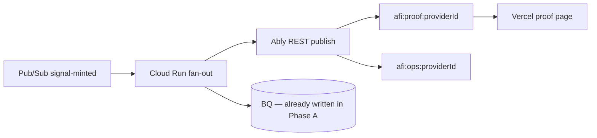

# AFI Base Sepolia — Testnet E2E Checklist (with references)

> **DEPRECATED / SUPERSEDED:** This document predates AFI Settlement v1 doctrine. It may describe v0 per-signal minting, ERC-1155 receipts, direct beneficiary payouts, stale ENS/Snapshot references, or missing vault architecture. See `afi-docs/specs/AFI_SETTLEMENT_V1_DOCTRINE.md` for canonical architecture.

**Workspace root:** `/home/user/AFI-Protocol/`  
**Chain:** Base Sepolia (chain ID `84532`)  
**Purpose:** Track what is needed to run the full signal → score → allocate → mint → vault loop on testnet, with **immediate links** to evidence and source files.

**Owner:** _________________________  
**Target date:** _________________________  
**Scope chosen:** [ ] MVP E2E  [ ] Protocol-complete

**Companion docs:** [`AFI_HUMAN_REVIEW_WORKSHEET.md`](./AFI_HUMAN_REVIEW_WORKSHEET.md) (Q1–Q7 decisions) · [`../AFI_ANALYST_SHOP_MVP.md`](../AFI_ANALYST_SHOP_MVP.md) (T1/T2 tiers, Ably storefront) · [`../AFI_ONCHAIN_ANCHOR_GAP_ANALYSIS.md`](../AFI_ONCHAIN_ANCHOR_GAP_ANALYSIS.md) (contract gap detail) · [`Mage And GCP Architecture Research.md`](../../../Mage%20And%20GCP%20Architecture%20Research.md) (winner architecture) · [`AFI_MAGE_PRO_PLAN_DECISION.md`](./AFI_MAGE_PRO_PLAN_DECISION.md) (OSS vs Pro) · [`AFI_FROGGY_MAGE_MIGRATION_MAP.md`](./AFI_FROGGY_MAGE_MIGRATION_MAP.md) (Froggy → Mage stage map)

---

## Reference map (bookmark this)

### Audit evidence

| Report | Path | Use for |
|--------|------|---------|
| On-chain gaps | [`../AFI_ONCHAIN_ANCHOR_GAP_ANALYSIS.md`](../AFI_ONCHAIN_ANCHOR_GAP_ANALYSIS.md) | Contract anchor, events, roles |
| Replay / lifecycle | [`../AFI_REPLAY_READINESS_MATRIX.md`](../AFI_REPLAY_READINESS_MATRIX.md) | RAW→MINTED vault stages |
| Emissions / mint | [`./themes/G-emissions-mint.json`](./themes/G-emissions-mint.json) | Allocation formula, single payee |
| On-chain theme | [`./themes/C-onchain-anchor.json`](./themes/C-onchain-anchor.json) | Breadcrumb vs intended anchor |
| Vault theme | [`./themes/D-evidence-vault.json`](./themes/D-evidence-vault.json) | Mongo, parallel scored store |
| Master blockers | [`../AFI_PROTOCOL_SURFACE_AUDIT.md`](../AFI_PROTOCOL_SURFACE_AUDIT.md) | §1.3, §6 roadmap |

### Testnet contracts (deployed)

| Contract | Address | Explorer |
|----------|---------|----------|
| `AFIToken` (tAFI) | `0x43DC488caF49495d6abC0eEe021B725be38E81bd` | [BaseScan](https://sepolia.basescan.org/address/0x43DC488caF49495d6abC0eEe021B725be38E81bd) |
| `AFISignalReceipt` | `0xD1aDC1Ca4A98B141D8f3a4fE2cb9638003E70e23` | [BaseScan](https://sepolia.basescan.org/address/0xD1aDC1Ca4A98B141D8f3a4fE2cb9638003E70e23) |
| `AFIMintCoordinator` | `0xDd825a05EFe22668Ffbd627C586f19D08d62eA5e` | [BaseScan](https://sepolia.basescan.org/address/0xDd825a05EFe22668Ffbd627C586f19D08d62eA5e) |

**Sanity script:** [`afi-token/script/afitoken_testnet_sanity_checks.sh`](../../../afi-token/script/afitoken_testnet_sanity_checks.sh)  
**Deploy runbook:** [`afi-token/docs/deployment-testnet.md`](../../../afi-token/docs/deployment-testnet.md)  
**Redeploy script:** [`afi-token/script/DeployAFITestnet.s.sol`](../../../afi-token/script/DeployAFITestnet.s.sol)

### Reference spine (GCP + Mage — active path)

| Stage | Component | Key refs |
|-------|-----------|----------|
| **Ingest** | `afi-gateway` or Cloud Run webhook | [`afi-gateway/src/http/app.ts`](../../../afi-gateway/src/http/app.ts) → publish to Pub/Sub |
| **Workflow bus** | **GCP Pub/Sub** (not Ably) | Topics: `signal-raw`, `signal-scored`, `signal-minted` — [exactly-once](https://docs.cloud.google.com/pubsub/docs/exactly-once-delivery) |
| **Scoring DAG** | Mage.ai streaming pipeline | [Pub/Sub loader](https://docs.mage.ai/guides/streaming/tutorials/streaming-pipeline) · UWR sidecar or Python block |
| **Evidence** | BigQuery append-only | `afi_evidence.signals_lifecycle` — see research DDL |
| **Analytics** *(defer)* | BQ `afi_analytics.*` | Separate plane; not evidence topics |
| **Mint** | `afi-mint` on Cloud Run | Pub/Sub **push** subscription → [`MintExecutor.ts`](../../../afi-mint/src/orchestrator/MintExecutor.ts) |
| **Commitment** | `afi-token` Base Sepolia | [`AFIMintCoordinator.sol`](../../../afi-token/src/AFIMintCoordinator.sol) |
| **Proof feed** *(Phase B)* | Ably optional | [`AFI_ANALYST_SHOP_MVP.md`](../AFI_ANALYST_SHOP_MVP.md) T2 — downstream of `signal-minted` only |

### Legacy spine (Mongo + reactor — deprecated for new work)

| Stage | Repo | Note |
|-------|------|------|
| Vault client | [`MongoTSSDVaultClient.ts`](../../../afi-infra/src/tssd/MongoTSSDVaultClient.ts) | Do not extend for testnet E2E |
| Scored store | [`tssdVaultService.ts`](../../../afi-reactor/src/services/tssdVaultService.ts) | Parallel store; use Mage + BQ instead |

### Shared protocol repos

| Stage | Repo | Key files |
|-------|------|-----------|
| Evidence types | `afi-infra` | [`src/tssd/types.ts`](../../../afi-infra/src/tssd/types.ts), [`docs/TSSD_VAULT_SPEC.md`](../../../afi-infra/docs/TSSD_VAULT_SPEC.md) |
| UWR math | `afi-core` | [`validators/UniversalWeightingRule.ts`](../../../afi-core/validators/UniversalWeightingRule.ts) |
| Mint coord | `afi-mint` | [`ValidatorDaemon.ts`](../../../afi-mint/src/orchestrator/ValidatorDaemon.ts), [`EmissionsMintDataProvider.ts`](../../../afi-mint/src/adapters/EmissionsMintDataProvider.ts) |
| Emissions math | `afi-math` | [`src/emissions/emissionsSchedule.ts`](../../../afi-math/src/emissions/emissionsSchedule.ts) |
| USS schemas | `afi-config` | [`schemas/usignal/v1_1/`](../../../afi-config/schemas/usignal/v1_1/) |

---

## Readiness tiers (pick your target)

| Tier | Question | Status today | Scope |
|------|----------|--------------|-------|
| **T1** | Can we mint manually on testnet? | **Yes** — contracts deployed; `mintForSignal` works with `EMISSIONS_ROLE` | Manual `cast` / script only |
| **T2** | Can we mint from a real scored signal? | **No** — pipeline not wired | **MVP E2E (Phase A)** |
| **T2b** | Can a pilot analyst show live proof to subscribers? | **No** | **Phase B** (Ably storefront, after T2) |
| **T3** | Can we test multi-role reward allocations? | **No** — gauge is research-only | Protocol-complete (or deferred) |
| **T4** | Can a third party verify mint from chain + rules? | **No** — no anchors, formula drift | Protocol-complete |

**This checklist is organized around reaching T2 (Phase A MVP E2E), then optional Phase B (Ably proof fan-out).**

### Messaging layer (do not conflate)

| Bus | Role | Use for pipeline? |
|-----|------|-------------------|
| **GCP Pub/Sub** | Internal workflow (`raw` → `scored` → `minted`) | **Yes — required** |
| **BigQuery** | Canonical append-only evidence | **Yes — required** |
| **Ably** | External live proof + dashboard (T2 tier) | **No for pipeline** — Phase B only |

---

## Scope decision (fill before building)

### MVP E2E (recommended first testnet dress rehearsal)

| In scope | Out of scope (defer) |
|----------|----------------------|
| **GCP Pub/Sub** evidence-plane topics | Kafka / self-managed message bus |
| **Mage** streaming scoring DAG | Full `afi-reactor` as mandatory orchestrator |
| **BigQuery** append-only `afi_evidence.signals_lifecycle` | Mongo TSSD vault path |
| Single beneficiary per signal | Multi-role gauge splits ([`gauge_v0.yaml`](../../../afi-econ/params/gauge_v0.yaml)) |
| Pub/Sub push → `afi-mint` → Base Sepolia | Ably in critical mint path |
| Proportional epoch-budget allocation (as implemented) | Goldpaper `clamp(B(t)…)` formula |
| Scored signal → mint via `afi-mint` | Full Snapshot challenge appeals (bypass OK) |
| `MintCoordinated` event as provenance | On-chain `contentHash` (nice-to-have) |
| **Phase B:** Ably proof fan-out after T2 | Analyst onboarding wizard (T1 product — separate track) |

**MVP allocation model (document explicitly):** one `beneficiary` per signal; amount = proportional share of epoch budget × `epochPulseFactor` (default 1.0).

- [ ] **Accepted** — proceed with MVP scope  
- [ ] **Rejected** — need: _________________________

### Protocol-complete (post-MVP)

| Item | Blocker IDs | Key evidence |
|------|-------------|--------------|
| `contentHash` + `rulesetVersion` on-chain | A1 | [`AFI_ONCHAIN_ANCHOR_GAP_ANALYSIS.md` §4.3](../AFI_ONCHAIN_ANCHOR_GAP_ANALYSIS.md) |
| Persisted provenance mapping | A2 | [`AFIMintCoordinator.sol:85`](../../../afi-token/src/AFIMintCoordinator.sol) |
| Multi-role gauge / splits | A4, C1 | [`gauge_v0.yaml`](../../../afi-econ/params/gauge_v0.yaml) |
| On-chain challenge registry | A7 | [`afi-mint/contracts/`](../../../afi-mint/contracts/) stubs |
| Canonical `stages.scored` in vault | D3 | [`tssdVaultService.ts`](../../../afi-reactor/src/services/tssdVaultService.ts) |
| Determinism pinning on records | D7 | [`types.ts:331`](../../../afi-infra/src/tssd/types.ts) |
| External validator replay | T4 | [`AFI_REPLAY_READINESS_MATRIX.md`](../AFI_REPLAY_READINESS_MATRIX.md) |

---

## Section 0 — Pre-flight (contracts & roles)

**Read:** [`deployment-testnet.md`](../../../afi-token/docs/deployment-testnet.md) · run [`afitoken_testnet_sanity_checks.sh`](../../../afi-token/script/afitoken_testnet_sanity_checks.sh)

| Done? | Check | How to verify |
|-------|-------|---------------|
| [ ] | `BASE_SEPOLIA_RPC_URL` set | `.env` in `afi-token` |
| [ ] | Contracts deployed (or redeployed) | Addresses match table above |
| [ ] | `AFIToken.TOTAL_SUPPLY_CAP` = 86B | Sanity script / `cast call` |
| [ ] | Coordinator wired to token + receipts | Sanity script `token()` / `receipts()` |
| [ ] | Coordinator has `EMISSIONS_ROLE` on `AFIToken` | Role check in sanity script |
| [ ] | Coordinator has `MINT_COORDINATOR_ROLE` on receipts | Role check in sanity script |
| [ ] | **Emissions agent** has `EMISSIONS_ROLE` on coordinator | Required to call `mintForSignal` — see [`DeployAFITestnet.s.sol:104-106`](../../../afi-token/script/DeployAFITestnet.s.sol) |
| [ ] | Emissions agent wallet funded (Sepolia ETH) | ~0.01 ETH minimum |
| [ ] | Manual mint smoke test | `cast send` or Foundry script — see §0.1 |

**Role holders (fill in):**

| Role | Address |
|------|---------|
| Treasury / admin Safe | `0x1Dd6705ff84Ecd5eaDc51A913Ad8e2c6C9E79aC4` (from sanity script) |
| Emissions agent (mint caller) | _________________________ |
| Test beneficiary | _________________________ |

### 0.1 Manual mint smoke test (T1 gate)

Proves T1 before wiring the pipeline. Open [`MintCoordinatorIntegration.t.sol`](../../../afi-token/test/MintCoordinatorIntegration.t.sol) for expected behavior.

```bash
# Example: build MintRequest fields off-chain, then:
# cast send $COORDINATOR "mintForSignal((address,uint256,uint256,uint256,bytes32,uint64,bytes))" \
#   "(BENEFICIARY,TOKEN_AMOUNT,RECEIPT_ID,RECEIPT_AMOUNT,SIGNAL_ID,EPOCH,0x)" \
#   --rpc-url $BASE_SEPOLIA_RPC_URL --private-key $EMISSIONS_AGENT_KEY
```

| Done? | Verify on BaseScan |
|-------|-------------------|
| [ ] | `MintCoordinated` event emitted |
| [ ] | `EmissionsMinted` on token |
| [ ] | `ReceiptMinted` on receipts (if receiptAmount > 0) |
| [ ] | Beneficiary `balanceOf` increased |

---

## Section 1 — Phase A: MVP E2E build checklist (GCP + Mage)

Work in this order. **Phase B (Ably) starts only after §1.7 passes.**

### 1.0 Mage platform & deployment (decide before §1.1)

Full rationale: [`AFI_MAGE_PRO_PLAN_DECISION.md`](./AFI_MAGE_PRO_PLAN_DECISION.md)

**Default for T2 testnet:** **Mage OSS self-hosted on GCP** (Terraform + Docker). AFI has **no Mage infra yet** — reuse patterns from your other ETL/ELT projects (commission sales tracking, etc.), not an existing AFI deploy. **Pro is fallback** only if you cannot own streaming uptime during testnet.

| Done? | Decision | Choice | Notes |
|-------|----------|--------|-------|
| [ ] | Platform | [ ] **OSS self-host**  [ ] Mage Pro Team  [ ] Plus | OSS = default when you have transferable Terraform/Docker/GCP skills |
| [ ] | AFI Mage status | [ ] **Net-new deploy**  [ ] Already running | Expected: net-new |
| [ ] | Mage UI | Cloud Run (Terraform) | Same pattern as other projects |
| [ ] | Streaming worker | [ ] **GCE**  [ ] GKE  [ ] Cloud Run only | **Reject Cloud Run only** for always-on Pub/Sub consumer |
| [ ] | GCP project | e.g. `afi-testnet` / `us-central1` | Pub/Sub + BQ + Mage in one region |
| [ ] | Pro fallback evaluated | [ ] N/A (OSS)  [ ] Quoted | Only if OSS ops blocked |

**Still outside Mage (OSS or Pro):** ingest webhook, Pub/Sub topics, BQ DDL, `afi-mint` Cloud Run, emissions key, Base Sepolia, AFI-specific pipeline blocks.

---

### 1.1 Shared testnet + GCP config

| Done? | Task | Create / edit | Acceptance |
|-------|------|---------------|------------|
| [ ] | GCP project + region (single-region MVP) | e.g. `afi-testnet` / `us-central1` | All services same region for Pub/Sub exactly-once |
| [ ] | Centralize contract addresses + chain ID | Env template for `afi-mint`, ingest, Mage | `COORDINATOR_ADDRESS`, `CHAIN_ID=84532` |
| [ ] | Create Pub/Sub topics | `signal-raw`, `signal-scored`, `signal-minted` | Topics exist; IAM bound to service accounts |
| [ ] | Create BQ dataset + evidence table | `afi_evidence.signals_lifecycle` | Append-only DDL per research report (use `event_id`, not PK on `signal_id+stage` alone) |
| [ ] | Document emissions-agent key | Secret Manager + `afi-mint` | Key never committed |
| [ ] | Deploy Mage OSS (Terraform + Docker) | Per §1.0 — adapt from other-project playbook; [GCP setup](https://docs.mage.ai/production/deploying-to-cloud/gcp/setup) | UI reachable; streaming worker on GCE/GKE consumes `signal-raw` |

**Gap ID:** B8 (no shared config)

---

### 1.2 Ingest → Pub/Sub `signal-raw` + BQ RAW row

| Done? | Task | Files / services | Acceptance |
|-------|------|------------------|------------|
| [ ] | USS/CPJ validate on ingest | [`afi-gateway`](../../../afi-gateway/src/http/app.ts) **or** new Cloud Run webhook | Invalid payloads rejected before Pub/Sub |
| [ ] | Publish to `signal-raw` | Gateway post-hook or Cloud Run publisher | Message visible in Pub/Sub |
| [ ] | Append BQ row `stage=RAW` | Mage loader side-effect or ingest publisher | Row in `afi_evidence.signals_lifecycle` |
| [ ] | *(Optional)* TradingView / Telegram template | See [`AFI_ANALYST_SHOP_MVP.md`](../AFI_ANALYST_SHOP_MVP.md) | Pilot analyst can ingest without custom code |

**Do not** use Mongo for new testnet path.

**Gap IDs:** D1, B6 (USS validation still required)

---

### 1.3 Mage scoring (Pub/Sub consumer → SCORED)

**Stage map:** [`AFI_FROGGY_MAGE_MIGRATION_MAP.md`](./AFI_FROGGY_MAGE_MIGRATION_MAP.md) · **Fixture:** [`fixtures/signal_scored_v1.example.json`](./fixtures/signal_scored_v1.example.json)

| Done? | Task | Files / services | Acceptance |
|-------|------|------------------|------------|
| [ ] | Mage streaming pipeline from `signal-raw` | Mage Pub/Sub loader | Pipeline runs on test message |
| [ ] | UWR scoring block | Port [`UniversalWeightingRule.ts`](../../../afi-core/validators/UniversalWeightingRule.ts) **or** HTTP sidecar to `afi-reactor` | Deterministic score for pinned config |
| [ ] | Pin `pipeline_uuid`, `git_sha`, ruleset version in `metadata` JSON | Mage exporter boilerplate | Reproducibility fields on every SCORED row |
| [ ] | Append BQ `stage=SCORED` + publish `signal-scored` | Dual exporter blocks | Mint path reads from Pub/Sub push payload (not BQ poll) |

**Gap IDs:** D3, B8

---

### 1.4 Mint orchestration (`afi-mint` on Cloud Run)

| Done? | Task | Files | Acceptance |
|-------|------|-------|------------|
| [ ] | **Pub/Sub push subscription** → `afi-mint` HTTP handler | **New:** Cloud Run service | Push from `signal-scored` delivers full payload |
| [ ] | **Implement `ethers`/`viem` coordinator client** | **New:** `afi-mint/src/adapters/OnChainMintCoordinator.ts` | `mintForSignal` returns real `txHash` |
| [ ] | **Idempotent mint** | Check coordinator / on-chain before re-minting same `signalId` | Duplicate push does not double-mint |
| [ ] | Build `MintRequest` from push payload | [`MintExecutor.ts`](../../../afi-mint/src/orchestrator/MintExecutor.ts) | beneficiary, amount, epoch, receiptId populated |
| [ ] | On success: publish `signal-minted` | Publisher in mint post-hook | Downstream BQ + optional Ably fan-out |
| [ ] | MVP: skip Snapshot challenges | [`SignalStateManager.ts`](../../../afi-mint/src/orchestrator/SignalStateManager.ts) | Fast-path qualify → mint |

**Rejected for mint path:** BQ poll, Mage HTTP callback, Ably as workflow bus.

**Gap IDs:** B1, B2, B6

---

### 1.5 Emissions amount (single payee)

| Done? | Task | Files | Acceptance |
|-------|------|-------|------------|
| [ ] | Confirm proportional epoch formula | [`EmissionsMintDataProvider.ts:255-287`](../../../afi-mint/src/adapters/EmissionsMintDataProvider.ts) | Test vectors match on-chain wei |
| [ ] | Set `epochPulseFactor = 1.0` | `DEFAULT_CONFIG` | No governance multiplier |
| [ ] | Set `reputationWeight = 1.0` in metadata | Scoring block output | No reputation scaling |

**Gap IDs:** C1–C7 (partially deferred)

---

### 1.6 Mint → BQ evidence write-back

| Done? | Task | Files | Acceptance |
|-------|------|-------|------------|
| [ ] | Consumer on `signal-minted` appends BQ row | Mage micro-batch or Cloud Run | `stage=MINTED`, `metadata.txHash`, `chainId=84532` |
| [ ] | Use Storage Write API for exactly-once | Not pandas `toPandas()` insert | No duplicate rows on retry |
| [ ] | Align with evidence model | [`MintSnapshot`](../../../afi-infra/src/tssd/types.ts), [`TSSD_VAULT_SPEC.md`](../../../afi-infra/docs/TSSD_VAULT_SPEC.md) | BQ row matches protocol shape |

**Gap IDs:** B7, D4

---

### 1.7 Phase A acceptance test (T2 gate)

Run once with a single test signal.

| Field | Value |
|-------|-------|
| `signalId` | _________________________ |
| `providerId` | _________________________ |
| Ingest time | _________________________ |
| BQ SCORED `event_id` | _________________________ |
| Mint `txHash` | _________________________ |
| Beneficiary | _________________________ |
| BQ MINTED `event_id` | _________________________ |

| Done? | Step | Verify |
|-------|------|--------|
| [ ] | 1. Ingest → `signal-raw` | Pub/Sub message + BQ RAW row |
| [ ] | 2. Mage scores | BQ SCORED row + `signal-scored` message |
| [ ] | 3. `afi-mint` push mint | `MintCoordinated` on [BaseScan](https://sepolia.basescan.org) |
| [ ] | 4. Token balance | `cast call` `balanceOf(beneficiary)` |
| [ ] | 5. BQ MINTED row | Append row with `txHash` |
| [ ] | 6. Receipt (if enabled) | `balanceOf(beneficiary, receiptId)` |

**Phase A complete = all six checked.** Proceed to Phase B only after this.

---

## Section 1B — Phase B: Optional proof fan-out (Ably storefront)

**Prerequisite:** §1.7 Phase A passed.  
**Product tier:** [T2 in Analyst Shop MVP](../AFI_ANALYST_SHOP_MVP.md) — *not* required for protocol testnet.

**Purpose:** Live proof channel for pilot analysts and Codex UI. Ably is a **read model**; BQ + chain remain source of truth.



### 1B.1 Scope (Phase B in / out)

| In scope | Out of scope |
|----------|--------------|
| Fan-out service on `signal-minted` | Ably between Mage and `afi-mint` |
| `afi:proof:{providerId}` public surface only | `proprietaryDetail` on Ably |
| Read-only proof page (Vercel) | Full analyst onboarding wizard (T1) |
| Optional `afi:ops:{providerId}` for operator | Telegram mirror bot (stretch) |

- [ ] **Phase B authorized** — pilot analyst: _________________________  
- [ ] **Deferred** — ship Phase A only first

---

### 1B.2 Build checklist

| Done? | Task | Acceptance |
|-------|------|------------|
| [ ] | Ably app + API key in Secret Manager | Key not in repo |
| [ ] | **Cloud Run `afi-fanout`** subscribes to `signal-minted` (pull or push) | Service receives mint events |
| [ ] | Map payload → Ably message (`publicSurface` only) | No proprietary fields |
| [ ] | Channel naming: `afi:proof:{providerId}` | Scoped per analyst |
| [ ] | Token auth: read-only capability tokens for subscribers | Clients cannot publish |
| [ ] | Vercel proof page subscribes to channel | Live update < 5s after mint |
| [ ] | *(Optional)* `afi:ops:{providerId}` for operator dashboard | Errors + epoch budget |

---

### 1B.3 Phase B acceptance test

| Done? | Step | Verify |
|-------|------|--------|
| [ ] | Complete Phase A mint for pilot `providerId` | §1.7 still passes |
| [ ] | Ably channel receives `stage=MINTED` event | Message includes `signalId`, `txHash`, `publicSurface` |
| [ ] | Proof page updates without refresh | Browser shows mint within seconds |
| [ ] | BQ still authoritative | Ably outage does not block mint; BQ row exists |

**Phase B complete = all four checked.**

---

### 1B.4 Environment additions (Phase B)

```bash
# --- Ably (Phase B only) ---
ABLY_API_KEY=...                    # Secret Manager
ABLY_CHANNEL_PREFIX=afi:proof
ABLY_OPS_CHANNEL_PREFIX=afi:ops

# Fan-out service
PUBSUB_SUBSCRIPTION_MINTED=signal-minted-fanout-sub
```

---

## Section 2 — Contract gaps (reference for MVP vs later)

Use when deciding whether MVP needs a contract change before first E2E.

| ID | Gap | MVP blocker? | Files | Fix phase |
|----|-----|--------------|-------|-----------|
| A1 | No `contentHash` / `rulesetVersion` | No (defer) | [`AFIMintCoordinator.sol`](../../../afi-token/src/AFIMintCoordinator.sol) | Protocol-complete |
| A2 | Provenance log-only | No (defer) | Same | Protocol-complete |
| A3 | No on-chain score/epoch enforcement | No — trust emissions agent for testnet | [`AFIToken.sol`](../../../afi-token/src/AFIToken.sol) | Protocol-complete |
| A4 | Single beneficiary only | **Yes if you need gauge splits**; No for MVP | [`AFIMintCoordinator.sol:76`](../../../afi-token/src/AFIMintCoordinator.sol) | T3 |
| A5 | Placeholder receipt URI | No for MVP | [`DeployAFITestnet.s.sol:75`](../../../afi-token/script/DeployAFITestnet.s.sol) | Before mainnet |
| A6 | Receipt schema mismatch | No for MVP | [`mint_receipt_schema.json`](../../../afi-mint/codex/mint_receipt_schema.json) | Protocol-complete |
| A7 | `afi-mint` Solidity stubs | No for MVP (off-chain challenges) | [`contracts/MintManager.sol`](../../../afi-mint/contracts/MintManager.sol) | T3+ |
| A8 | xERC20 bridge | No | [`afi-xerc20/`](../../../afi-xerc20/) | Future |

---

## Section 3 — Vault routing gaps (lifecycle)

**Read:** [`AFI_REPLAY_READINESS_MATRIX.md` §2](../AFI_REPLAY_READINESS_MATRIX.md)

| Stage | Written today? | Phase A (GCP) | Protocol-complete |
|-------|----------------|---------------|-------------------|
| RAW | Partial (gateway only) | Pub/Sub + BQ append | + USS validation, `payloadHash` |
| ENRICHED | No | Mage block (optional passthrough) | Pinned enrichment snapshot in BQ |
| ANALYZED | No | Defer | BQ append |
| SCORED | Reactor parallel store (legacy) | **Mage → BQ append + `signal-scored`** | + determinism pins |
| MINTED | On-chain logs only | **BQ append via `signal-minted`** | + on-chain anchor |
| REPLAYED | No | Defer | Replay runner |

---

## Section 4 — Reward allocation gaps

**Read:** [`themes/G-emissions-mint.json`](./themes/G-emissions-mint.json) · [`AFI_HUMAN_REVIEW_WORKSHEET.md` §Q3](./AFI_HUMAN_REVIEW_WORKSHEET.md)

| Model | Where defined | On-chain? | MVP? |
|-------|---------------|-----------|------|
| Single beneficiary | [`MintRequest.beneficiary`](../../../afi-token/src/AFIMintCoordinator.sol) | Yes | **Use this** |
| Proportional epoch budget | [`EmissionsMintDataProvider`](../../../afi-mint/src/adapters/EmissionsMintDataProvider.ts) | No (off-chain calc) | **Use this** |
| Gauge splits (55/25/10/10) | [`gauge_v0.yaml`](../../../afi-econ/params/gauge_v0.yaml) | No | Defer |
| Goldpaper `clamp(B(t)…)` | Docstring only | No | Defer |
| Governance challenge flip | [`SignalStateManager.ts:284`](../../../afi-mint/src/orchestrator/SignalStateManager.ts) | No | Bypass for MVP |
| `epochPulseFactor` / `reputationWeight` | [`EmissionsMintDataProvider.ts:272`](../../../afi-mint/src/adapters/EmissionsMintDataProvider.ts) | No | Set to 1.0 for MVP |

---

## Section 5 — Protocol-complete backlog (post-MVP)

Track after T2 passes. Ordered roughly by audit roadmap Phase 2–4.

| Done? | Item | Primary repos | Audit ref |
|-------|------|---------------|-----------|
| [ ] | Add `contentHash` + `rulesetVersion` to `MintRequest` | `afi-token`, `afi-mint` | [`AFI_ONCHAIN_ANCHOR_GAP_ANALYSIS.md` §8.1](../AFI_ONCHAIN_ANCHOR_GAP_ANALYSIS.md) |
| [ ] | Persist minimal `signalId → anchor` mapping | `afi-token` | §8.2 |
| [ ] | Import `afi-math` schedule; pin version in receipt | `afi-mint`, `afi-math` | theme G#0 |
| [ ] | Reconcile mint formula docs vs code | `afi-mint` | theme G#1 |
| [ ] | Write SCORED to canonical vault | `afi-reactor`, `afi-infra` | theme D#1 |
| [ ] | Record-level determinism pinning | `afi-infra`, `afi-config` | theme A#3, D#0 |
| [ ] | Gateway USS validation | `afi-gateway` | theme A#1 |
| [ ] | Normative commitment + lifecycle schemas | `afi-config` | Master B3, B5 |
| [ ] | Decide gauge splits (Q3) | `afi-econ`, `afi-token` | Worksheet Q3 |
| [ ] | On-chain challenge registry (if desired) | `afi-mint/contracts` | A7 |
| [ ] | Real `TSSDReplayRunner` | `afi-infra` | [`TSSDReplayRunner.ts`](../../../afi-infra/src/tssd/TSSDReplayRunner.ts) |
| [ ] | External validator surface | `afi-gateway` | Master B1 |

---

## Section 6 — Environment template (copy to `.env`)

```bash
# --- Base Sepolia ---
BASE_SEPOLIA_RPC_URL=https://sepolia.base.org
CHAIN_ID=84532

# --- Deployed contracts (testnet) ---
AFI_TOKEN_ADDRESS=0x43DC488caF49495d6abC0eEe021B725be38E81bd
AFI_RECEIPTS_ADDRESS=0xD1aDC1Ca4A98B141D8f3a4fE2cb9638003E70e23
AFI_COORDINATOR_ADDRESS=0xDd825a05EFe22668Ffbd627C586f19D08d62eA5e

# --- Mint caller (EMISSIONS_ROLE on coordinator) ---
EMISSIONS_AGENT_PRIVATE_KEY=...   # Secret Manager — NEVER COMMIT

# --- GCP (Phase A) ---
GCP_PROJECT_ID=afi-testnet
GCP_REGION=us-central1
PUBSUB_TOPIC_RAW=signal-raw
PUBSUB_TOPIC_SCORED=signal-scored
PUBSUB_TOPIC_MINTED=signal-minted
BQ_DATASET_EVIDENCE=afi_evidence
BQ_TABLE_LIFECYCLE=signals_lifecycle

# --- Mage ---
MAGE_REPO_URL=...
MAGE_PIPELINE_UUID=...

# --- MVP tuning ---
EPOCH_PULSE_FACTOR=1.0
SKIP_CHALLENGE_WINDOW=true

# --- Ably (Phase B only — see §1B.4) ---
# ABLY_API_KEY=...
# ABLY_CHANNEL_PREFIX=afi:proof
```

---

## Section 7 — Sign-off

| Done? | Milestone |
|-------|-----------|
| [ ] | T1 manual mint smoke test (§0.1) |
| [ ] | MVP scope accepted (§ Scope decision) |
| [ ] | GCP topics + BQ table (§1.1) |
| [ ] | **Phase A:** ingest → score → mint → BQ (§1.7) |
| [ ] | **Phase B** *(optional)*: Ably proof fan-out (§1B.3) |
| [ ] | Pilot analyst T2 demo ([`AFI_ANALYST_SHOP_MVP.md`](../AFI_ANALYST_SHOP_MVP.md)) |
| [ ] | Worksheet Q5 (vault engine = BQ/GCP) answered |

| Role | Name | Date |
|------|------|------|
| Engineering lead | | |
| Protocol / product | | |
| Security review (mint path) | | |

**Notes / blockers:**  
_________________________________________________________  
_________________________________________________________

---

## Quick gap ID index

| ID | Summary | MVP? |
|----|---------|------|
| A1–A3 | On-chain anchor / policy | Defer |
| A4 | Single payee | OK for MVP |
| A5–A8 | URI, stubs, bridge | Defer |
| B1–B6 | Mint orchestration wiring | **Required** |
| B7–B8 | Vault write-back, config | **Required** |
| C1–C7 | Allocation model | Partial (single payee + proportional) |
| D1–D7 | Vault lifecycle | D3, D4 critical for E2E |
| E1–E3 | Governance challenges | Bypass for MVP |
| F1–F5 | Testnet ops | §0 |

---

*Save completed checklist in `afi-docs/specs/audit/`. Paths assume monorepo at `/home/user/AFI-Protocol/`.*
